# 第2章　非線形方程式

## 2.1 非線形方程式

### 2.1.1 線形方程式と非線形方程式

$x$ についての方程式

$$
f \left( x \right) = 0 \tag{2.1}
$$

において、　$f(x)$ が1次式 $f(x) = ax + b (a \neq 0)$ ならば、 $(2.1)$ を1次方程式または線形方程式という。
$f(x)$ が1次式でないとき、 $(2.1)$ を非線形方程式という。
線形方程式の解は $x = −b/a$ であり、とくにここでは取り上げる必要はなかろう。
非線形方程式のうちで、とくに $f(x)$ が $n$ 次多項式のとき、 $(2.1)$ を $n$ 次代数方程式という。
1次代数方程式は線形方程式であるが、$n > 1$ のときは非線形方程式である。
無限次代数方程式 $(n = \infty)$ とみなされる非線形方程式は、超越方程式という。

たとえば、$\sin x$ は無限べき級数

$$
\sin x = x - \frac{x^3}{3!} + \frac{x^5}{5!} - \cdots 
+ {(-1)}^n \frac{x^{2n+1}}{(2n+1)!} + \cdots
$$

で表されるから

$$
x − \sin x = 0
$$

は超越方程式である。

この章では、非線形方程式の数値解法について述べる。
次の2.2節では、非線形方程式の実数解を求める数値解法を述べよう。
2.3節では、代数方程式の複素解を求める数値解法について述べよう。

## 2.2 ニュートン法

### 2.2.1 ニュートン法の公式

$f(x)$ を $x$ の関数とするとき、$f(x) = 0$ の解 $\alpha$ を求めるためのニュ－トン法は、
初期値 $x^{(0)}$ をあたえて、順に $x^{(1)}, x^{(2)}, x^{(3)}, ...$ を

$$
\text{ニュートンの公式} \\
x^{(k+1)} = x^{(k)} - \frac{f \left( x^{(k)} \right) }{f' \left( x^{(k)} \right) }
\tag{2.2}
$$

によって求め、次第に解 $\alpha$ に収束させる方法である。
$x^{(k+1)}$ が $x^{(k)}$ にほとんど等しくなったとき、$x^{(k+1)}$ を解 $\alpha$ の近似値として、反復を停止する。

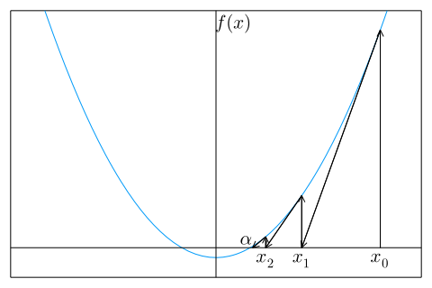  
図 2.1: ニュートン法

この公式は $x^{(k)}$ が $x^{(k+1)}$ の近くにあり、かつ、$x^{(k+1)}$ が解 $\alpha$ の近くにある、すなわち

$ \left| x^{(k+1)} − x^{(k)} \right| \ll 1$　かつ　$f \left( x^{(k+1)} \right) \simeq f(\alpha) = 0$

として、

$$
f(x^{(k)}) + (x^{(k+1)} − x^{(k)})f'(x^{(k)}) + \cdots \simeq  0
$$

を $x^{(k+1)}$ について解いて得られる。
$(2.2)$ のグラフ (図 2.1) の上での意味は、 $k = 0, 1, 2, \cdots$ の順に、点 $(x^{(k)}, f(x^{(k)}))$ における $y = f(x)$ の接線と $x$ 軸との交点の $x$座標を求めることになっている。
このことは、この接線の勾配は

$$
f'(x^{(k)}) = \frac{f(x^{(k)})}{x^{(k)} − x^{(k+1)}}
$$

であることからもわかる。
<!-- ニュ－トン法の手順を表す PAD を図 2.2 に示す。 -->

### 2.2.2 ニュートン法の収束性

解の近傍での収束性は、誤差

$$
\varepsilon_k = x^{(k)} - \alpha \tag{2.3}
$$

が小さくなっていく様子を調べればわかる。
$f(x^{(k)})$ と $f'(x^{(k)})$ を $x^{(k)} = \alpha$ のまわりにテ－ラ－展開して

$$
f(x^{(k)}) = f(\alpha) + \frac{1}{1!} \varepsilon_k f'(\alpha) + \frac{1}{2!} \varepsilon_k^2 f''(\alpha) + \cdots \tag{2.4}
$$
$$
f'(x^{(k)}) = f'(\alpha) + \frac{1}{1!} \varepsilon_k f''(\alpha) + \frac{1}{2!} \varepsilon_k^2 f'''(\alpha) + \cdots \tag{2.5}
$$

とし、これを $(2.2)$ に代入すれば

$$
\varepsilon_{k + 1} = \frac{f''(\alpha)}{2f'(\alpha)} \varepsilon_k^2 + \cdots \tag{2.6}
$$

を得る。
$k + 1$ 回目の誤差 $\varepsilon_{k + 1}$ が $k$ 回目の誤差 $\varepsilon_k$ の2乗に比例することを2次収束 (または2乗収束) という。
すなわち、ニュ－トン法は2次収束する。

ただし、2次収束は、$f'(\alpha) \neq 0$ の場合、すなわち $\alpha$ が単根の場合である。
一般に $m$ 重解の場合は、$f'(\alpha) = f''(\alpha) = \cdots = f^{(m−1)}(\alpha) = 0$ である (何故か) から、

$$
f(x^{(k)}) = \frac{1}{m!} \varepsilon_k^m f^{(m)}(\alpha) + \frac{1}{(m+1)!} \varepsilon_k^{m+1} f^{(m+1)}(\alpha) + \cdots \tag{2.7}
$$
$$
f'(x^{(k)}) = \frac{1}{(m-1)!} \varepsilon_k^{m-1} f^{(m)}(\alpha) + \frac{1}{m!} \varepsilon_k^m f^{(m+1)}(\alpha) + \cdots \tag{2.8}
$$

を $(2.2)$ に代入して、

$$
\varepsilon_{k + 1} = \frac{m-1}{m} \varepsilon_k + \frac{f^{(m+1)}(\alpha) / f^{(m)}(\alpha)}{m^2 (m+1)} \varepsilon_k^2 \tag{2.9}
$$

であり、$\varepsilon_{k + 1}$ は $\varepsilon_k$ に比例するから1次収束である。

> ### ［例 2.1］
> 
> $a > 0$ の平方根は $f(x) = x^2 − a = 0$ の解である。
> 故にニュ－トン法の公式 $(2.2)$ は、$f'(x) = 2x$ であるから、
> 
> $$
> x^{(k+1)} = x^{(k)} − \frac{x^{(k)2} − a}{2x^{(k)}} 
> = \frac{1}{2} \left( x^{(k)} + \frac{a}{x^{(k)}} \right)
> \tag{2.10}
> $$
> 
> 初期値を $x^{(0)} = (a + 1)/2$ とすれば、
> 
> $$
> x^{(0)} > x^{(1)} > x^{(2)} > · · · > \sqrt{a}
> $$
> 
> であることが証明できる (読者自ら証明して見よ。また \[例 2.4\] 参照)。
> いま $a = 2$ として、実際に有効数字10桁の精度で $\sqrt{2}$ を求めてみると、
> 
> $$
> \begin{aligned}
> x^{(0)} &= 1.\underline{5} &\varepsilon_0 = x^{(0)} − \sqrt{2} = 0.0\underline{85786438}\\
> x^{(1)} &= 1.41\underline{6666667} &\varepsilon_1 = x^{(1)} − \sqrt{2} = 0.00\underline{2453105}\\
> x^{(2)} &= 1.41421\underline{5687} &\varepsilon_2 = x^{(2)} − \sqrt{2} = 0.00000\underline{2125}\\
> x^{(3)} &= 1.41421356\underline{3} &\varepsilon_3 = x^{(3)} − \sqrt{2} = 0.00000000\underline{1}\\
> x^{(4)} &= 1.414213562 &\varepsilon_4 = x^{(4)} − \sqrt{2} = 0.000000000\\
> \end{aligned}
> $$
> 
> が得られ、たった4回で収束する。
> 収束の仕方は2次収束であることが確かめられる。

***

#### 例題 2.1
ニュ－トン法 $(2.2)$ は、単根に対しては2次収束するが、2重根以上の多重解に対しては、1 次収束をする。
$(2.2)$ の代わりに

$$
x^{(k+1)} = x^{(k)} − m \frac{f(x^{(k)})}{f'(x^{(k)})} \tag{2.11}
$$

を用いれば $m$ 重解に対して2次収束することを証明せよ。

***

#### ［解］
$(2.7)$ と $(2.8)$ を $(2.11)$ に代入すれば

$$
\varepsilon_{k+1} = \frac{f^{(m+1)}(\alpha)}{f^{(m)}(\alpha)} \varepsilon_k^2 + \cdots \tag{2.12}
$$

が得られる。
$\varepsilon_k$ の最低次の項は $\varepsilon_k^2$ であるから2次収束する。

***

> ### ［例 2.2］
> $(x − 1)^2 x = 0$ を $x = 1.3$ を初期値として、 $(2.2)$ と $(2.11)$ の2つの方法で解き、収束性を調べよう。
> $(2.2)$ を用いたときは、有効数字11桁収束する $(\varepsilon_k < 10^{−10})$ には、32回の反復が必要であった。
> 以下の結果の数値から誤差は各回ごとに半分になっていることがわかる。
> すなわち $\varepsilon_{k+1} \simeq [(m − 1)/m] \varepsilon_k = 0.5 \varepsilon_k$ 。
> 
> $$
> \begin{aligned}
> x^{(0) } &= 1.\underline{3} & ~ & ~ & ~ & \\
> x^{(1) } &= 1.\underline{1655172413} & x^{(11)} &= 1.000\underline{1871253} & x^{(21)} &= 1.000000\underline{1827} \\
> x^{(2) } &= 1.0\underline{882453800} & x^{(12)} &= 1.0000\underline{935714} & x^{(22)} &= 1.0000000\underline{913} \\
> x^{(3) } &= 1.0\underline{458419294} & x^{(13)} &= 1.0000\underline{467879} & x^{(23)} &= 1.0000000\underline{456} \\
> x^{(4) } &= 1.0\underline{234125336} & x^{(14)} &= 1.0000\underline{233944} & x^{(24)} &= 1.0000000\underline{228} \\
> x^{(5) } &= 1.0\underline{118386542} & x^{(15)} &= 1.0000\underline{116973} & x^{(25)} &= 1.0000000\underline{114} \\
> x^{(6) } &= 1.00\underline{59537541} & x^{(16)} &= 1.00000\underline{58487} & x^{(26)} &= 1.00000000\underline{57} \\
> x^{(7) } &= 1.00\underline{29856604} & x^{(17)} &= 1.00000\underline{29243} & x^{(27)} &= 1.00000000\underline{28} \\
> x^{(8) } &= 1.00\underline{14950488} & x^{(18)} &= 1.00000\underline{14621} & x^{(28)} &= 1.00000000\underline{14} \\
> x^{(9) } &= 1.000\underline{7480819} & x^{(19)} &= 1.000000\underline{7310} & x^{(29)} &= 1.000000000\underline{7} \\
> x^{(10)} &= 1.000\underline{3741807} & x^{(20)} &= 1.000000\underline{3655} & x^{(30)} &= 1.000000000\underline{3} \\
> & ~ & & & x^{(31)} &= 1.000000000\underline{1} \\
> & ~ & & & x^{(32)} &= 1.0000000000
> \end{aligned}
> $$
> 
> 一方、$m = 2$ として $(2.11)$ を用いたときは、以下の結果のように4回で収束す
> る。
> この収束は2次収束である。
> 
> 
> $$
> \begin{aligned}
> x^{(0)} &= 1.\underline{3} & & \\
> x^{(1)} &= 1.0\underline{310344828} & x^{(3)} &= 1.000000\underline{1058} \\
> x^{(2)} &= 1.000\underline{4601488} & x^{(4)} &= 1.0000000000 \\
> \end{aligned}
> $$
> 
> このように $(2.11)$ は重解に対しては、非常に強力である。
> ただし、求める解が何重解か、 $m$ がわかっている必要がある。
> ( $m$ の推定法については 問題 2-3 参照)

### 2.2.3 ニュ－ト ン法の収束判定

適当な $x^{(0)}$ から出発して、 $(2.2)$ により $x^{(1)}, x^{(2)} \cdots$ を求め、 $(1.10)$ を参照して

$$
|x^{(k+1)} − x^{(k)}| < \varepsilon_A + \varepsilon_R (|x^{(k)}| + |x^{(k+1)}|) \tag{2.13}
$$

が成立したら、 $x^{(k+1)}$ を解 $\alpha$ の近似値とするのがもっとも汎用性に富んだ収束判定であろう。
ここに $\varepsilon_A$ は許容絶対誤差、$\varepsilon_R$ は許容相対誤差である。
$\varepsilon_A$ や $\varepsilon_R$ が小さすぎると丸めの誤差のため収束しにくくなる。
収束性が悪いときには、途中経過の $x^{(k)}$ をプ リントしてみるとなぜ収束しないかの見当がつく。

初期値 $x^{(0)}$ を $\alpha$ に向かって一様収束するように選ぶときは、その一様性が破れたときを収束したと判定するのも1案である。
たとえば、ある正の数 $a > 0$ の平方根を求める問題では、$f(x) = x^2 − a = 0$ を解けばよい。
このとき $x^{(0)} = (a + 1)/2 $ととれば、$x(0) > x(1) > x(2) > \cdots > \sqrt{a}$ である。
したがって、 $x^{(k)} \leqq x^{(k+1)}$ のときは、すでに収束したか、丸めの誤差で一様収束性が破れたかであるので、$x^{(k)} \leqq x^{(k+1)}$ となったら反復を停止するとよい。
\[例 2.1\] はその例であった。
なお、後述の \[例 2.4\] と 問題 2-2 を参照せよ。
収束性のよりくわしい議論は、次の縮小写像の原理で行う。

### 2.2.4 縮小写像の原理

一般に
$$
x^{(k+1)} = g(x^{(k)}) \tag{2.14}
$$

の形の公式を用いて $x^{(0)}$ からスタ－トする反復法を考えよう。
ニュ－トン法の公式 $(2.2)$ は、$g(x)$ を

$$
g(x) = x − \frac{f(x)}{f'(x)} \tag{2.15}
$$

とおいた場合にあたる。
$(2.14)$ による反復が収束したとすると、$x^{(k)} = x^{(k+1)}$ だから、収束した値は $x − g(x) = 0$ という方程式の解 $x = \alpha$ である。
この解 $x = \alpha$ は、

$$
直線： y = x~~~ \tag{2.16}
$$
$$
曲線： y = g(x) \tag{2.17}
$$

の交点の $x$ 座標である。
この交点の近傍の $x^{(0)}$ からスタ－トした $(2.14)$ の反復の様子は、図 2.3 に示したように、$x^{(0)}, x^{(1)}, x^{(2)}, \cdots$ が $\alpha$ に一様に近づく (単調収束)か、一様に遠ざかる (単調発散) か、振動しながら近づくか (くもの巣型収束) か、振動しながら遠ざかる (くもの巣型発散) かの4つのタイプがある。
さらによく見ると、それぞれの場合の曲線 $y = g(x)$ の勾配 $g'(x)$ は、

$$
\begin{aligned}
& 単調収束のとき        & 0 \leqq   & g'(x) < 1          & 図 2.3(a) \\
& くもの巣型収束のとき  & −1 <      & g'(x) \leqq 0      & 図 2.3(b) \\
& 単調発散のとき        & 1 \leqq   & g'(x)              & 図 2.3(c) \\
& くもの巣型発散のとき  &           & g'(x) \leqq − 1    & 図 2.3(d) \\
\end{aligned}
$$

である。
すなわち、収束のときは $−1 < g'(x) < 1$ 、 あるいは

$$
\text{縮小写像の原理} \\
|g'(x)| < 1 \tag{2.18}
$$

である。
$(2.18)$ が成立つような $g(x)$ を縮小写像という。
また $(2.18)$ を満たす区間を縮小写像区間ということにしよう。
以上の考察から次のことがわかる。

ある解が縮小写像区間内に存在するときには、その区間内にはその解以外の解は存在しない。
そして $(2.14)$ の反復はその解に収束する。

縮小写像区間の中にないときには、いずれはその区間から飛び出してしまう。
そして行く先がもし縮小写像区間の中であれば、その区間内のただ一つの解に必ず収束する。
もし行き先がまたもや縮小写像区間でなかったら、また飛び出す。
こうして縮小写像区間にはいるまで、反復は繰り返される。
いつまでたっても縮小写像区間にはいらないときは、収束しない。
また、縮小写像区間外の解は、かりに存在しても、反復 $(2.14)$ によっては求めることは不可能である。

>| (a) 単調収束 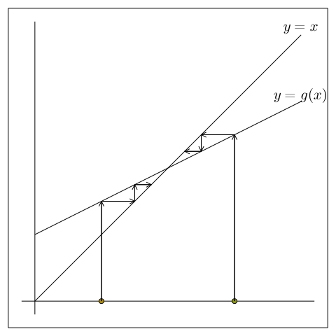 | (b) くものす型収束 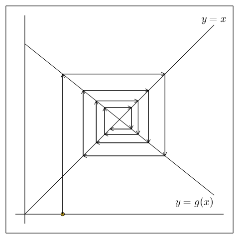 |
>| :---: | :---: |
>| (c) 単調発散 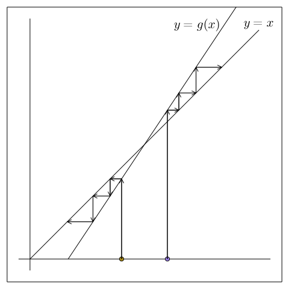 | (d) くものす型発散 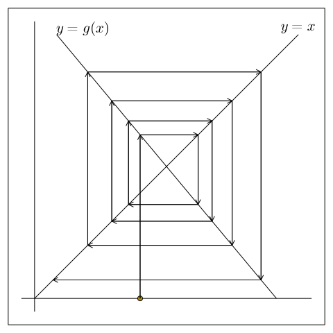 |
>
>図 2.3: 縮小写像の原理

縮小写像区間に入ってからの収束は、$|g'(x)|$ が小さいほど速い。
このことは、図2.3 の $y = x$ と $y = g(x)$ との交点での $g(x)$ の勾配が小さいほど、収束が速いことからわかる。

> ### [例 2.3］
> 
> 反復
> 
> $$
> x^{(k+1)} = 2x^{(k)}
> $$
> 
> は、$x = 2x$ すなわち $x = 0$ の解を期待したいが、$g'(x) = 2 > 1$ であるから、縮小写像区間は存在しないので、この反復によってはこの解を求めることはできない。
> また
> 
> $$
> x^{(k+1)} = x^{(k)}
> $$
> 
> も同様である。
> 一方、反復
> 
> $$
> x^{(k+1)} = 0.5x^{(k)}
> $$
> 
> は解 x = 0 に収束する。

ニュ－トン法に縮小写像の原理を応用する。
$g(x)$ は $(2.15)$ であるから、$(2.18)$ は

$$
\text{ニュ－トン法の縮小写像の原理}  \\
|g'(x)| = \frac{|f(x)f''(x)|}{f'(x)^2} < 1 \tag{2.19}
$$

である。
この関係が成り立っている区間の中の解 $\alpha$ では、$f(\alpha) = 0$ より $|g'(\alpha)| = 0$ であるから、ニュ－トン法の収束は速い。

> ### ［例 2.4］
> $f(x) = x^2 − a (a > 0)$ の解は $\alpha = \pm \sqrt{a}$ である。
> ニュ－トン法の公式
> 
> $$
> x^{(k+1)} 
> = x^{(k)} − \frac{x^{(k)2} − a}{2x^{(k)}} 
> = \frac{1}{2} \left( x^{(k)} + \frac{a}{x^{(k)}} \right)
> = g(x^{(k)})
> $$
> 
> より
> 
> $$
> g'(x) = \frac{1}{2} \left(1 − \frac{a}{x^2} \right)
> $$
> 
> したがって、縮小写像区間は2つあり、$x > \sqrt{a/3}$ および $x < −\sqrt{a/3}$ である。
> 縮小写像区間内から出発すれば外にでることなく収束するが、縮小写像区間外から出発すれば、一度この区間を飛び出して縮小写像区間の中に飛び込んでから収束する。
> 
> (図 2.4 参照。ただし、$x > 0$ なる縮小写像区間のみ示す。)

> | 縮小写像区間外より出発したニュ－トン法 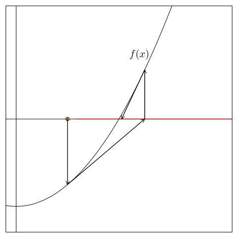 | 縮小写像区間内より出発したニュ－トン法 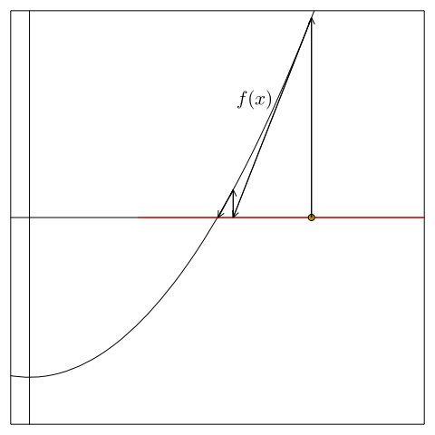 |
> | :---: | :---: |
> | 縮小写像区間外より出発した縮小写像 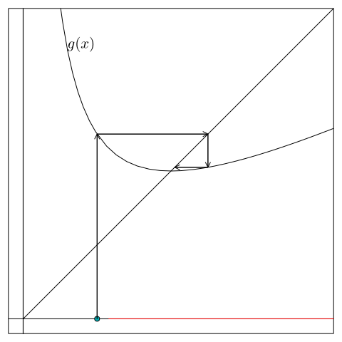 | 縮小写像区間内より出発した縮小写像 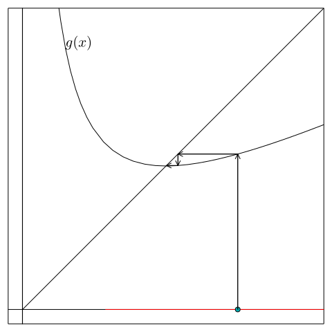 |
> 
> 図 2.4: $f(x) = x^2 − a = 0$ のニュ－トン法と縮小写像

> ### ［例 2.5］
> $f(x) = x^3 − x = 0$ の解は $\alpha_1 = −1, \alpha_2 = 0, \alpha_3 = 1$ である。
> ニュ－トン法の公式は
> 
> $$
> x^{(k+1)} = x^{(k)} − \frac{x^{(k)3} − x^{(k)}}{3x^{(k)2} − 1} 
> = \frac{2x^{(k)3}}{3x^{(k)2} − 1} = g(x^{(k)})
> $$
> 
> 故に
> 
> $$
> g'(x) = \frac{6x^2(x^2 − 1)}{(3x^2 − 1)^2}
> $$
> 
> 縮小写像区間は、 $|g'(x)| < 1$ より3つあり、それぞれ1つの解を含み、
> 
> $$
> \begin{aligned}
> x < −a, && −b < x < b, && a < x
> \end{aligned}
> $$
> 
> である。
> ただし、
> 
> $$
> \begin{aligned}
> a = \frac{\sqrt{6 + \sqrt{21}}}{\sqrt{15}} = 0.83994 \cdots, &&
> b = \frac{\sqrt{6 − \sqrt{21}}}{\sqrt{15}} = 0.30740 \cdots
> \end{aligned}
> $$
> 
> である。
> 図 2.5 には $x \geqq − b$ の2つの縮小写像区間のみ示す。
> 
> とくにこの例で注意したいのは、初期値が $x^{(0)} = \pm \sqrt{1/5}$ である最も右の例は、2つの非縮小写像区間内の点 (そこでは $g'(x) = −6$) を渉り歩いて、発散もしないし収束もしない (丸めの誤差の大きな精度の悪い計算をすると、偶然、縮小写像区間に飛び込み、収束してしまうこともある。
> その場合どの解に収束するかは保証の限
> りではない)。
> 収束も発散もしない初期値については、問題 2-6 を参照。
> 
> また、初期値が $x^{(0)} = −0.51$ である中央の例では、$x^{(0)}$ は解 $\alpha_1 = −1$ にもっとも近いが、実際はこれからもっとも遠い $\alpha_3 = 1$ に収束する。
> これは、初期値が縮小写像区間になく、飛び出し先が、 $\alpha_3$ の近傍の縮小写像区間であるためである。
> このように、初期値が縮小写像区間内にないときは、初期値に最も近い解に収束するとは、一概には言えない。
> 
> 最も左の例は縮小写像区間内に初期値がある例で、その区間内の解に収束する。

> | 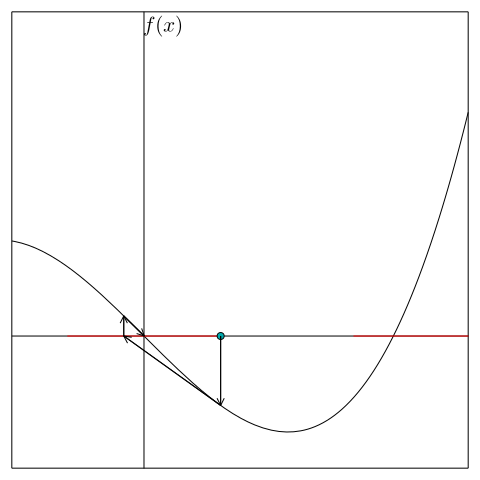 | 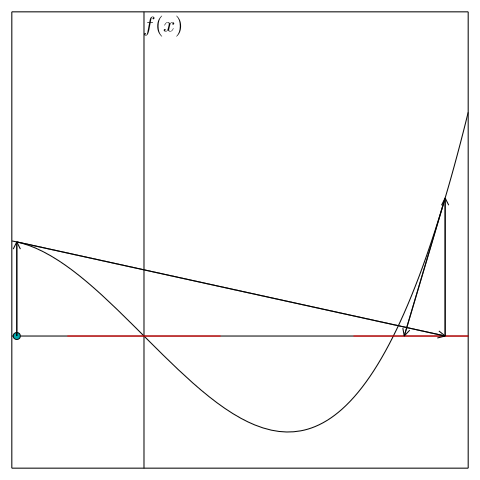 | 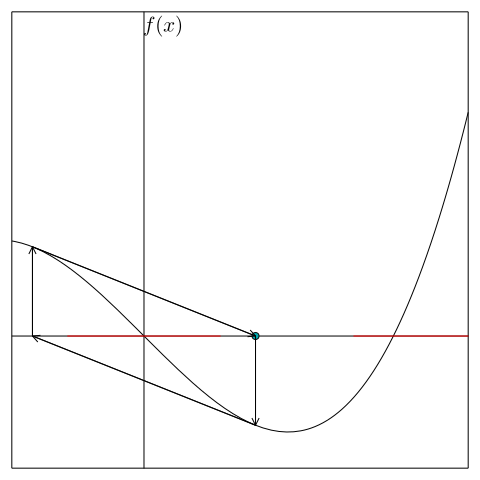 |
> | :---: | :---: | :---: |
> | 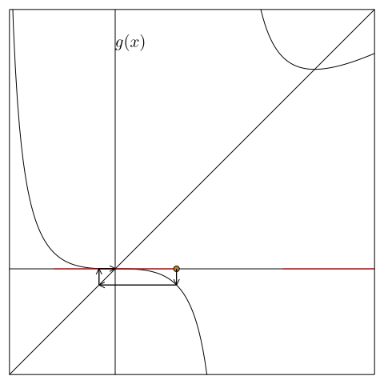 | 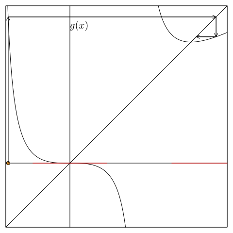 | 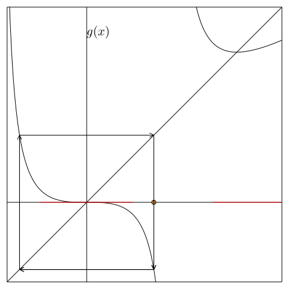 |
> 
> 図 2.5: $f(x) = x^3 − x = 0$ のニュ－トン法と縮小写像
