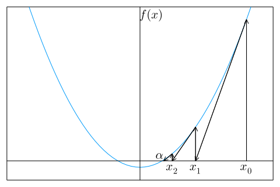

# 第2章　非線形方程式

## 2.1 非線形方程式

### 2.1.1 線形方程式と非線形方程式

$x$ についての方程式

$$
f \left( x \right) = 0 \tag{2.1}
$$

において、　$f(x)$ が1次式 $f(x) = ax + b (a \neq 0)$ ならば、 $(2.1)$ を1次方程式または線形方程式という。
$f(x)$ が1次式でないとき、 $(2.1)$ を非線形方程式という。
線形方程式の解は $x = -b/a$ であり、とくにここでは取り上げる必要はなかろう。
非線形方程式のうちで、とくに $f(x)$ が $n$ 次多項式のとき、 $(2.1)$ を $n$ 次代数方程式という。
1次代数方程式は線形方程式であるが、$n > 1$ のときは非線形方程式である。
無限次代数方程式 $(n = \infty)$ とみなされる非線形方程式は、超越方程式という。

たとえば、$\sin x$ は無限べき級数

$$
\sin x = x - \frac{x^3}{3!} + \frac{x^5}{5!} - \cdots 
+ {(-1)}^n \frac{x^{2n+1}}{(2n+1)!} + \cdots
$$

で表されるから

$$
x - \sin x = 0
$$

は超越方程式である。

この章では、非線形方程式の数値解法について述べる。
次の2.2節では、非線形方程式の実数解を求める数値解法を述べよう。
2.3節では、代数方程式の複素解を求める数値解法について述べよう。

## 2.2 ニュートン法

### 2.2.1 ニュートン法の公式

$f(x)$ を $x$ の関数とするとき、$f(x) = 0$ の解 $\alpha$ を求めるためのニュートン法は、
初期値 $x^{(0)}$ をあたえて、順に $x^{(1)}, x^{(2)}, x^{(3)}, ...$ を

$$
\begin{aligned}
\text{ニュートンの公式} \\
x^{(k+1)} = x^{(k)} - \frac{f \left( x^{(k)} \right) }{f' \left( x^{(k)} \right) }
\end{aligned}　\tag{2.2}
$$

によって求め、次第に解 $\alpha$ に収束させる方法である。
$x^{(k+1)}$ が $x^{(k)}$ にほとんど等しくなったとき、$x^{(k+1)}$ を解 $\alpha$ の近似値として、反復を停止する。

  
図 2.1: ニュートン法

この公式は $x^{(k)}$ が $x^{(k+1)}$ の近くにあり、かつ、$x^{(k+1)}$ が解 $\alpha$ の近くにある、すなわち

$ \left\vert x^{(k+1)} - x^{(k)} \right\vert \ll 1$　かつ　$f \left( x^{(k+1)} \right) \cong f(\alpha) = 0$

として、

$$
f(x^{(k)}) + (x^{(k+1)} - x^{(k)})f'(x^{(k)}) + \cdots \cong  0
$$

を $x^{(k+1)}$ について解いて得られる。
$(2.2)$ のグラフ (図 2.1) の上での意味は、 $k = 0, 1, 2, \cdots$ の順に、点 $(x^{(k)}, f(x^{(k)}))$ における $y = f(x)$ の接線と $x$ 軸との交点の $x$座標を求めることになっている。
このことは、この接線の勾配は

$$
f'(x^{(k)}) = \frac{f(x^{(k)})}{x^{(k)} - x^{(k+1)}}
$$

であることからもわかる。
<!-- ニュートン法の手順を表す PAD を図 2.2 に示す。 -->

### 2.2.2 ニュートン法の収束性

解の近傍での収束性は、誤差

$$
\varepsilon_k = x^{(k)} - \alpha \tag{2.3}
$$

が小さくなっていく様子を調べればわかる。
$f(x^{(k)})$ と $f'(x^{(k)})$ を $x^{(k)} = \alpha$ のまわりにテーラー展開して

$$
f(x^{(k)}) = f(\alpha) + \frac{1}{1!} \varepsilon_k f'(\alpha) + \frac{1}{2!} \varepsilon_k^2 f''(\alpha) + \cdots \tag{2.4}
$$

$$
f'(x^{(k)}) = f'(\alpha) + \frac{1}{1!} \varepsilon_k f''(\alpha) + \frac{1}{2!} \varepsilon_k^2 f'''(\alpha) + \cdots \tag{2.5}
$$

とし、これを $(2.2)$ に代入すれば

$$
\varepsilon_{k + 1} = \frac{f''(\alpha)}{2f'(\alpha)} \varepsilon_k^2 + \cdots \tag{2.6}
$$

を得る。
$k + 1$ 回目の誤差 $\varepsilon_{k + 1}$ が $k$ 回目の誤差 $\varepsilon_k$ の2乗に比例することを2次収束 (または2乗収束) という。
すなわち、ニュートン法は2次収束する。

ただし、2次収束は、$f'(\alpha) \neq 0$ の場合、すなわち $\alpha$ が単根の場合である。
一般に $m$ 重解の場合は、$f'(\alpha) = f''(\alpha) = \cdots = f^{(m-1)}(\alpha) = 0$ である (何故か) から、

$$
f(x^{(k)}) = \frac{1}{m!} \varepsilon_k^m f^{(m)}(\alpha) + \frac{1}{(m+1)!} \varepsilon_k^{m+1} f^{(m+1)}(\alpha) + \cdots \tag{2.7}
$$

$$
f'(x^{(k)}) = \frac{1}{(m-1)!} \varepsilon_k^{m-1} f^{(m)}(\alpha) + \frac{1}{m!} \varepsilon_k^m f^{(m+1)}(\alpha) + \cdots \tag{2.8}
$$

を $(2.2)$ に代入して、

$$
\varepsilon_{k + 1} = \frac{m-1}{m} \varepsilon_k + \frac{f^{(m+1)}(\alpha) / f^{(m)}(\alpha)}{m^2 (m+1)} \varepsilon_k^2 \tag{2.9}
$$

であり、$\varepsilon_{k + 1}$ は $\varepsilon_k$ に比例するから1次収束である。

> #### ［例 2.1］
> 
> $a > 0$ の平方根は $f(x) = x^2 - a = 0$ の解である。
> 故にニュートン法の公式 $(2.2)$ は、$f'(x) = 2x$ であるから、
> 
> $$
> x^{(k+1)} = x^{(k)} - \frac{x^{(k)2} - a}{2x^{(k)}} 
> = \frac{1}{2} \left( x^{(k)} + \frac{a}{x^{(k)}} \right)
> \tag{2.10}
> $$
> 
> 初期値を $x^{(0)} = (a + 1)/2$ とすれば、
> 
> $$
> x^{(0)} > x^{(1)} > x^{(2)} > \cdots > \sqrt{a}
> $$
> 
> であることが証明できる (読者自ら証明して見よ。また \[例 2.4\] 参照)。
> いま $a = 2$ として、実際に有効数字10桁の精度で $\sqrt{2}$ を求めてみると、
> 
> $$
> \begin{aligned}
> x^{(0)} &= 1.\underline{5} &\varepsilon_0 = x^{(0)} - \sqrt{2} = 0.0\underline{85786438}\\
> x^{(1)} &= 1.41\underline{6666667} &\varepsilon_1 = x^{(1)} - \sqrt{2} = 0.00\underline{2453105}\\
> x^{(2)} &= 1.41421\underline{5687} &\varepsilon_2 = x^{(2)} - \sqrt{2} = 0.00000\underline{2125}\\
> x^{(3)} &= 1.41421356\underline{3} &\varepsilon_3 = x^{(3)} - \sqrt{2} = 0.00000000\underline{1}\\
> x^{(4)} &= 1.414213562 &\varepsilon_4 = x^{(4)} - \sqrt{2} = 0.000000000\\
> \end{aligned}
> $$
> 
> が得られ、たった4回で収束する。
> 収束の仕方は2次収束であることが確かめられる。

***

#### 例題 2.1
ニュートン法 $(2.2)$ は、単根に対しては2次収束するが、2重根以上の多重解に対しては、1 次収束をする。
$(2.2)$ の代わりに

$$
x^{(k+1)} = x^{(k)} - m \frac{f(x^{(k)})}{f'(x^{(k)})} \tag{2.11}
$$

を用いれば $m$ 重解に対して2次収束することを証明せよ。

***

#### ［解］
$(2.7)$ と $(2.8)$ を $(2.11)$ に代入すれば

$$
\varepsilon_{k+1} = \frac{f^{(m+1)}(\alpha)}{f^{(m)}(\alpha)} \varepsilon_k^2 + \cdots \tag{2.12}
$$

が得られる。
$\varepsilon_k$ の最低次の項は $\varepsilon_k^2$ であるから2次収束する。

***

> #### ［例 2.2］
> $(x - 1)^2 x = 0$ を $x = 1.3$ を初期値として、 $(2.2)$ と $(2.11)$ の2つの方法で解き、収束性を調べよう。
> $(2.2)$ を用いたときは、有効数字11桁収束する $(\varepsilon_k < 10^{-10})$ には、32回の反復が必要であった。
> 以下の結果の数値から誤差は各回ごとに半分になっていることがわかる。
> すなわち $\varepsilon_{k+1} \cong [(m - 1)/m] \varepsilon_k = 0.5 \varepsilon_k$ 。
> 
> $$
> \begin{aligned}
> x^{(0) } &= 1.\underline{3} & ~ & ~ & ~ & \\
> x^{(1) } &= 1.\underline{1655172413} & x^{(11)} &= 1.000\underline{1871253} & x^{(21)} &= 1.000000\underline{1827} \\
> x^{(2) } &= 1.0\underline{882453800} & x^{(12)} &= 1.0000\underline{935714} & x^{(22)} &= 1.0000000\underline{913} \\
> x^{(3) } &= 1.0\underline{458419294} & x^{(13)} &= 1.0000\underline{467879} & x^{(23)} &= 1.0000000\underline{456} \\
> x^{(4) } &= 1.0\underline{234125336} & x^{(14)} &= 1.0000\underline{233944} & x^{(24)} &= 1.0000000\underline{228} \\
> x^{(5) } &= 1.0\underline{118386542} & x^{(15)} &= 1.0000\underline{116973} & x^{(25)} &= 1.0000000\underline{114} \\
> x^{(6) } &= 1.00\underline{59537541} & x^{(16)} &= 1.00000\underline{58487} & x^{(26)} &= 1.00000000\underline{57} \\
> x^{(7) } &= 1.00\underline{29856604} & x^{(17)} &= 1.00000\underline{29243} & x^{(27)} &= 1.00000000\underline{28} \\
> x^{(8) } &= 1.00\underline{14950488} & x^{(18)} &= 1.00000\underline{14621} & x^{(28)} &= 1.00000000\underline{14} \\
> x^{(9) } &= 1.000\underline{7480819} & x^{(19)} &= 1.000000\underline{7310} & x^{(29)} &= 1.000000000\underline{7} \\
> x^{(10)} &= 1.000\underline{3741807} & x^{(20)} &= 1.000000\underline{3655} & x^{(30)} &= 1.000000000\underline{3} \\
> & ~ & & & x^{(31)} &= 1.000000000\underline{1} \\
> & ~ & & & x^{(32)} &= 1.0000000000
> \end{aligned}
> $$
> 
> 一方、$m = 2$ として $(2.11)$ を用いたときは、以下の結果のように4回で収束す
> る。
> この収束は2次収束である。
> 
> 
> $$
> \begin{aligned}
> x^{(0)} &= 1.\underline{3} & & \\
> x^{(1)} &= 1.0\underline{310344828} & x^{(3)} &= 1.000000\underline{1058} \\
> x^{(2)} &= 1.000\underline{4601488} & x^{(4)} &= 1.0000000000 \\
> \end{aligned}
> $$
> 
> このように $(2.11)$ は重解に対しては、非常に強力である。
> ただし、求める解が何重解か、 $m$ がわかっている必要がある。
> ( $m$ の推定法については 問題 2-3 参照)

### 2.2.3 ニュートン法の収束判定

適当な $x^{(0)}$ から出発して、 $(2.2)$ により $x^{(1)}, x^{(2)} \cdots$ を求め、 $(1.10)$ を参照して

$$
\vert x^{(k+1)} - x^{(k)} \vert < \varepsilon_A + \varepsilon_R (\vert x^{(k)} \vert + \vert x^{(k+1)} \vert ) \tag{2.13}
$$

が成立したら、 $x^{(k+1)}$ を解 $\alpha$ の近似値とするのがもっとも汎用性に富んだ収束判定であろう。
ここに $\varepsilon_A$ は許容絶対誤差、$\varepsilon_R$ は許容相対誤差である。
$\varepsilon_A$ や $\varepsilon_R$ が小さすぎると丸めの誤差のため収束しにくくなる。
収束性が悪いときには、途中経過の $x^{(k)}$ をプリントしてみるとなぜ収束しないかの見当がつく。

初期値 $x^{(0)}$ を $\alpha$ に向かって一様収束するように選ぶときは、その一様性が破れたときを収束したと判定するのも1案である。
たとえば、ある正の数 $a > 0$ の平方根を求める問題では、$f(x) = x^2 - a = 0$ を解けばよい。
このとき $x^{(0)} = (a + 1)/2 $ととれば、$x(0) > x(1) > x(2) > \cdots > \sqrt{a}$ である。
したがって、 $x^{(k)} \leqq x^{(k+1)}$ のときは、すでに収束したか、丸めの誤差で一様収束性が破れたかであるので、$x^{(k)} \leqq x^{(k+1)}$ となったら反復を停止するとよい。
\[例 2.1\] はその例であった。
なお、後述の \[例 2.4\] と 問題 2-2 を参照せよ。
収束性のよりくわしい議論は、次の縮小写像の原理で行う。

### 2.2.4 縮小写像の原理

一般に

$$
x^{(k+1)} = g(x^{(k)}) \tag{2.14}
$$

の形の公式を用いて $x^{(0)}$ からスタートする反復法を考えよう。
ニュートン法の公式 $(2.2)$ は、$g(x)$ を

$$
g(x) = x - \frac{f(x)}{f'(x)} \tag{2.15}
$$

とおいた場合にあたる。
$(2.14)$ による反復が収束したとすると、$x^{(k)} = x^{(k+1)}$ だから、収束した値は $x - g(x) = 0$ という方程式の解 $x = \alpha$ である。
この解 $x = \alpha$ は、

$$
直線： y = x~~~ \tag{2.16}
$$

$$
曲線： y = g(x) \tag{2.17}
$$

の交点の $x$ 座標である。
この交点の近傍の $x^{(0)}$ からスタートした $(2.14)$ の反復の様子は、図 2.3 に示したように、$x^{(0)}, x^{(1)}, x^{(2)}, \cdots$ が $\alpha$ に一様に近づく (単調収束)か、一様に遠ざかる (単調発散) か、振動しながら近づくか (くもの巣型収束) か、振動しながら遠ざかる (くもの巣型発散) かの4つのタイプがある。
さらによく見ると、それぞれの場合の曲線 $y = g(x)$ の勾配 $g'(x)$ は、

$$
\begin{aligned}
& 単調収束のとき        & 0 \leqq   & g'(x) < 1          & 図 2.3(a) \\
& くもの巣型収束のとき  & -1 <      & g'(x) \leqq 0      & 図 2.3(b) \\
& 単調発散のとき        & 1 \leqq   & g'(x)              & 図 2.3(c) \\
& くもの巣型発散のとき  &           & g'(x) \leqq - 1    & 図 2.3(d) \\
\end{aligned}
$$

である。
すなわち、収束のときは $-1 < g'(x) < 1$ 、 あるいは

$$
\begin{aligned}
\text{縮小写像の原理} \\
\vert g'(x) \vert < 1
\end{aligned} \tag{2.18}
$$

である。
$(2.18)$ が成立つような $g(x)$ を縮小写像という。
また $(2.18)$ を満たす区間を縮小写像区間ということにしよう。
以上の考察から次のことがわかる。

ある解が縮小写像区間内に存在するときには、その区間内にはその解以外の解は存在しない。
そして $(2.14)$ の反復はその解に収束する。

縮小写像区間の中にないときには、いずれはその区間から飛び出してしまう。
そして行く先がもし縮小写像区間の中であれば、その区間内のただ一つの解に必ず収束する。
もし行き先がまたもや縮小写像区間でなかったら、また飛び出す。
こうして縮小写像区間にはいるまで、反復は繰り返される。
いつまでたっても縮小写像区間にはいらないときは、収束しない。
また、縮小写像区間外の解は、かりに存在しても、反復 $(2.14)$ によっては求めることは不可能である。

> | | |
> | :---: | :---: |
>| (a) 単調収束  | (b) くものす型収束  |
>| (c) 単調発散  | (d) くものす型発散  |
>
>図 2.3: 縮小写像の原理

縮小写像区間に入ってからの収束は、$\vert g'(x)\vert$ が小さいほど速い。
このことは、図2.3 の $y = x$ と $y = g(x)$ との交点での $g(x)$ の勾配が小さいほど、収束が速いことからわかる。

> ### [例 2.3］
> 
> 反復
> 
> $$
> x^{(k+1)} = 2x^{(k)}
> $$
> 
> は、$x = 2x$ すなわち $x = 0$ の解を期待したいが、$g'(x) = 2 > 1$ であるから、縮小写像区間は存在しないので、この反復によってはこの解を求めることはできない。
> また
> 
> $$
> x^{(k+1)} = x^{(k)}
> $$
> 
> も同様である。
> 一方、反復
> 
> $$
> x^{(k+1)} = 0.5x^{(k)}
> $$
> 
> は解 $x = 0$ に収束する。

ニュートン法に縮小写像の原理を応用する。
$g(x)$ は $(2.15)$ であるから、$(2.18)$ は

$$
\begin{aligned}
\text{ニュートン法の縮小写像の原理}  \\
\vert g'(x) \vert = \frac{ \vert f(x)f''(x) \vert }{f'(x)^2} < 1
\end{aligned} \tag{2.19}
$$

である。
この関係が成り立っている区間の中の解 $\alpha$ では、$f(\alpha) = 0$ より $ \vert g'(\alpha) \vert = 0$ であるから、ニュートン法の収束は速い。

> #### ［例 2.4］
> $f(x) = x^2 - a (a > 0)$ の解は $\alpha = \pm \sqrt{a}$ である。
> ニュートン法の公式
> 
> $$
> x^{(k+1)} 
> = x^{(k)} - \frac{x^{(k)2} - a}{2x^{(k)}} 
> = \frac{1}{2} \left( x^{(k)} + \frac{a}{x^{(k)}} \right)
> = g(x^{(k)})
> $$
> 
> より
> 
> $$
> g'(x) = \frac{1}{2} \left(1 - \frac{a}{x^2} \right)
> $$
> 
> したがって、縮小写像区間は2つあり、$x > \sqrt{a/3}$ および $x < -\sqrt{a/3}$ である。
> 縮小写像区間内から出発すれば外にでることなく収束するが、縮小写像区間外から出発すれば、一度この区間を飛び出して縮小写像区間の中に飛び込んでから収束する。
> 
> (図 2.4 参照。ただし、$x > 0$ なる縮小写像区間のみ示す。)

> | | |
> | :---: | :---: |
> | 縮小写像区間外より出発したニュートン法  | 縮小写像区間内より出発したニュートン法  |
> | 縮小写像区間外より出発した縮小写像  | 縮小写像区間内より出発した縮小写像  |
> 
> 図 2.4: $f(x) = x^2 - a = 0$ のニュートン法と縮小写像

> #### ［例 2.5］
> $f(x) = x^3 - x = 0$ の解は $\alpha_1 = -1, \alpha_2 = 0, \alpha_3 = 1$ である。
> ニュートン法の公式は
> 
> $$
> x^{(k+1)} = x^{(k)} - \frac{x^{(k)3} - x^{(k)}}{3x^{(k)2} - 1} 
> = \frac{2x^{(k)3}}{3x^{(k)2} - 1} = g(x^{(k)})
> $$
> 
> 故に
> 
> $$
> g'(x) = \frac{6x^2(x^2 - 1)}{(3x^2 - 1)^2}
> $$
> 
> 縮小写像区間は、 $ \vert g'(x) \vert < 1$ より3つあり、それぞれ1つの解を含み、
> 
> $$
> \begin{aligned}
> x < -a, && -b < x < b, && a < x
> \end{aligned}
> $$
> 
> である。
> ただし、
> 
> $$
> \begin{aligned}
> a = \frac{\sqrt{6 + \sqrt{21}}}{\sqrt{15}} = 0.83994 \cdots, &&
> b = \frac{\sqrt{6 - \sqrt{21}}}{\sqrt{15}} = 0.30740 \cdots
> \end{aligned}
> $$
> 
> である。
> 図 2.5 には $x \geqq - b$ の2つの縮小写像区間のみ示す。
> 
> とくにこの例で注意したいのは、初期値が $x^{(0)} = \pm \sqrt{1/5}$ である最も右の例は、2つの非縮小写像区間内の点 (そこでは $g'(x) = -6$) を渉り歩いて、発散もしないし収束もしない (丸めの誤差の大きな精度の悪い計算をすると、偶然、縮小写像区間に飛び込み、収束してしまうこともある。
> その場合どの解に収束するかは保証の限
> りではない)。
> 収束も発散もしない初期値については、問題 2-6 を参照。
> 
> また、初期値が $x^{(0)} = -0.51$ である中央の例では、$x^{(0)}$ は解 $\alpha_1 = -1$ にもっとも近いが、実際はこれからもっとも遠い $\alpha_3 = 1$ に収束する。
> これは、初期値が縮小写像区間になく、飛び出し先が、 $\alpha_3$ の近傍の縮小写像区間であるためである。
> このように、初期値が縮小写像区間内にないときは、初期値に最も近い解に収束するとは、一概には言えない。
> 
> 最も左の例は縮小写像区間内に初期値がある例で、その区間内の解に収束する。

> | | | |
> | :---: | :---: | :---: |
> |  |  |  |
> |  |  |  |
> 
> 図 2.5: $f(x) = x^3 - x = 0$ のニュートン法と縮小写像

### 2.2.5 ニュートン法の実際

以上の結果をまとめると、次のことが言える。
ニュートン法では、解の近傍には縮小写像区間が必ずある。
なぜなら、解 $\alpha$ では $g'(alpha) = 0$ であるからである。
しかも、その区間内には解は1つしかない。
したがって、この区間内に初期値をとれば、必ずその解に一様収束する。
縮小写像区間にない初期値から出発した場合には、どの解に収束するか、あるいは収束しないかはなんとも言えない (問題 2-6 参照)。
必要なことは、 $f(x)$ と $g(x)$ のグラフを描いて、解のおよその位置とその解の近傍の縮小写像区間の範囲の見当をつけてから、初期値を選ぶことである。
これが確かなニュートン法の使い方である。

### 2.2.6 連立非線形方程式のニュートン法

以上の単独非線形方程式の議論は、連立非線形方程式

$$
\left.
\begin{array}{}
f_1(x_1, x_2, \cdots x_n) = 0 \\
f_2(x_1, x_2, \cdots x_n) = 0 \\
······ \\
f_n(x_1, x_2, \cdots x_n) = 0 \\
\end{array}
\right\}
\tag{2.20}
$$

に一般化できる。
記号を簡単にするためにベクトル記号を用いて、$(2.20)$ を

$$
f (x) = 0 \tag{2.21}
$$

と書く。
ここに $x = (x_1, x_2, \cdots x_n)^\top、f (x) = (f_1(x), f_2(x), \cdots f_n(x))^\top$ はベクトルである。
$x^{(k)}$ を $k$ 回目の反復の結果得られた $x$ の近似値とする。
$x^{(k+1)}$ がほとんど 解 $\alpha$ に近い値になったとすると、$(2.21)$ より $f (x^{(k+1)}) \cong f (\alpha) = 0$ である。

一方、$f(x^{(k+1)})$ を $x^{(k)}$ のまわりにテーラー展開して（または、$(2.20)$ をテーラー展開した $n$ 個の式をベクトルの形式にまとめて ）、

$$
f (x^{(k+1)}) \cong f (x^{(k)}) + J_f (x^{(k)})(x^{(k+1)} - x^{(k)})
$$

であるから、

$$
f (x^{(k)}) + J_f (x^{(k)})(x^{(k+1)} - x^{(k)}) \cong 0 \tag{2.22}
$$

である。
ここに $J_f (x)$ は、$\partial f_i (x) / \partial x_j$ を $i$ 行 $j$ 列の要素とする行列 (関数行列またはヤコビ の行列) である。
$(2.22)$ を $x^{(k+1)}$ について解けば、

$$
\begin{aligned}
\text{連立非線形方程式のニュートン法} \\
x^{(k+1)} = x^{(k)} - J^{-1}_f (x^{(k)}) f (x^{(k)})
\end{aligned} \tag{2.23}
$$

が得られる。
ここに、$J^{-1}_f (x)$ は $J_f (x)$ の逆行列である。
この公式は逆行列を含むので、逆行列が簡単に求められる (次の 2.3 節のような) 場合を除く一般の実際の場合には適当でない。
一般の場合には、次のようにする。
まず、

$$
h = x^{(k+1)} - x^{(k)} \tag{2.24}
$$

とおけば、 $(2.23)$ (あるいは、もとの式 $(2.22)$) より

$$
J_f (x^{(k)}) h = -f(x^{(k)}) \tag{2.25}
$$

が得られるが、この式は $x^{(k)}$ が与えられたとき $h$ を未知数とする連立1次方程式であることに注目する。
この連立1次方程式を第3章の方法で解けば、

$$
x^{(k+1)} = x^{(k)} + h \tag{2.26}
$$

と、$x^{(k+1)}$ が求められる。

単独非線形方程式の縮小写像の原理を連立非線形方程式に拡張する。
まず

$$
x^{(k+1)} = g(x^{(k)}) \tag{2.27}
$$

という反復を考える。
ここに $g(x) = ( g_1(x), g_2(x), \cdots g_n(x) )^\top$ はベクトルで 、$x$の関数である。
ニュートン法 $(2.23)$ の場合

$$
g(x) = x - J^{-1}_f (x)f (x) \tag{2.28}
$$

である。
$J_g (x)$ を $\partial g_j (x) / \partial x_i$ を $i$ 行 $j$ 列の要素とするヤコビの行列とし、 $\rho_g$ を$J_g(x)$ のスペクトル半径 (固有値の最大絶対値、$(3.21)$ 参照) とすると、縮小写像の原理は、

$$
\rho_g < 1 　　(縮小写像の原理) \tag{2.29}
$$

と書ける。
$n = 1$ のとき、$\rho_g = \vert g' \vert$ ( $(2.19)$ 参照 ) である。

連立非線形方程式の縮小写像の原理 (2.29) は、次節の代数方程式の DKA 法に適用すれば、収束性についての知見が得られる (問題 2-8 参照)。

## 2.3 代数方程式

### 2.3.1 代数方程式の基本的性質

この節では、非線形方程式のうちで特に大切な代数方程式について述べる。
$f(z)$ を $(2.30)$ のような $z$ の $n$ 次多項式とする。

$$
f(z) = a_0 z^n + a_1 z^{n-1} + \cdots + a_{n-1} z + a_n 　　(a_0 \neq 0) \tag{2.30}
$$

このとき方程式

$$
f(z) = 0 \tag{2.31}
$$

を $n$ 次代数方程式という。
$n$ 次代数方程式は、等根も別々に数えれば、$n$ 個の解をもつ。
$n$ 個の解は一般には複素数である。
複素数であることを強調するために、未知数 $x$ の代わりに $z$ と書いておく。
たとえば5次代数方程式

$$
f(z) = z^5 - 4z^4 + 7z^3 - 10z^2 + 10z - 4 = 0
$$

は、

$$
f(z) = (z - 1)^2 (z - 2) (z^2 + 2)
$$

より、$\alpha_1 = 1, \alpha_2 = 1, \alpha_3 = 2, \alpha_4 = \sqrt{2} i, \alpha_5 = - \sqrt{2} i$ (ただし、$i = \sqrt{-1}$ は虚数単位) の5つの解がある。
この場合、$\alpha_1 = \alpha_2 = 1$ は等根で2重解である。
また、この例のように係数がすべて実数 $(a_0 = 1, a_1 = -4, a_2 = 7, a_3 = -10, a_4 = 10, a_5 = -4)$ であるときには、1つの解が複素数ならば $(\alpha_4 = \sqrt{2}i)$ 、その複素共役な解 $(\alpha_5 = - \sqrt{2}i)$ が存在する ( $\alpha_5 = \alpha^∗_4$ 、ただし $^∗$ は複素共役を表す)。

$n$ 次方程式の $n$ 個の解を $\alpha_1, \alpha_2, \cdots , \alpha_n$ とする。
解を使って、$f(z)$ は

$$
f(z) = a_0(z - \alpha_1)(z - \alpha_2) \cdots (z - \alpha_n) \tag{2.32}
$$

と書ける。
$a_0$ は $f(z)$ の $z^n$ の係数である。

> #### ［例 2.6］
> 
> $n = 2$ のとき、
> 
> $$
> f(z) = a z^2 + bz + c = a(z - \alpha)(z - \beta)
> $$
> 
> と書ける。
> ここに
> 
> $$
> \begin{aligned}
> \alpha = \frac{1}{2a} \left( -b + \sqrt{D} \right), &&
> \beta = \frac{1}{2a} \left( -b - \sqrt{D} \right), && D = b^2 - 4ac
> \end{aligned}
> $$
> 
> である。

***

#### 例題 2.2 

実数係数の $n$ 次代数方程式の1つの解を $\alpha$ とするとき、 $\alpha$ の複素共役$\alpha^∗$ もまたこの代数方程式の解であることを証明せよ。

***

#### ［ 解］

$\alpha$ が一つの解であるとすると

$$
f(\alpha) = a_0 \alpha^n + a_1 \alpha^{n-1} + \cdots + a_{n-1} \alpha + a_n = 0 　　(a_0 \neq 0)
$$

この方程式の複素共役を取ると、$a_0, a_1, \cdots a_{n-1}, a_n$ は実数であるから

$$
f^∗ (\alpha^∗) = f(\alpha^∗) = a_0 \alpha^{∗n} + a_1 \alpha^{∗n-1} + \cdots + a_{n-1} \alpha^∗ + a_n = 0
$$

である。
すなわち、$\alpha^∗$ も解である。

***

$n$ 次代数方程式の解と係数の関係を導こう。
2次方程式の解と係数の関係は、

$$
\begin{aligned}
a (x - \alpha) (x - \beta) & = a x^2 - a (\alpha + \beta) x + a \alpha \beta \\
 & = a x^2 + b x + c
\end{aligned}
$$

より

$$
\begin{aligned}
\alpha + \beta = - \frac{b}{a}, && \alpha \beta = \frac{c}{a}
\end{aligned}
$$

である。
同様のことを $n$ 次方程式について行う。
$(2.32)$ より

$$
\begin{aligned}
f(z) = & a_0 z^n - a_0 (\alpha_1 + \alpha_2 + \cdots + \alpha_n) z^{n-1} \\
       & + a_0 (\alpha_1 \alpha_2 + \alpha_1 \alpha_3 + \cdots + \alpha_1 \alpha_n + \alpha_2 \alpha_3 + \cdots + \alpha_2 \alpha_n \\
       & + \alpha_3 \alpha_4 + \cdots + \alpha_3 \alpha_n + \cdots + \alpha_{n-1} \alpha_n)z^{n-2} \\
       & \cdots \\
       & +(-1)^n a_0 \alpha_1 \alpha_2 \cdots \alpha_n \\
     = & a_0 z^n - a_0 s_1 z^{n-1} + \cdots + a_0 s_k (-1)^k z^{n-k} + \cdots + (-1)^n a_0 s_n
\end{aligned} \tag{2.33}
$$

ここで $s_k (k = 1, 2, \cdots , n)$ は、$n$ 個の $\alpha$ の中から $k$ 個とり出した積の和である。
すなわち

$$
\begin{aligned}
    s_1 = & \alpha_1 + \alpha_2 + \alpha_3 + \alpha_4 + \cdots + \alpha_n &&
    \begin{pmatrix}
      n \\
      1 \\
    \end{pmatrix} = n 項の和 \\

s_2 = & \alpha_1 \alpha_2 + \alpha_1 \alpha_3 + \alpha_1 \alpha_4 + \cdots + \alpha_1 \alpha_n & & \\
    & \qquad + \alpha_2 \alpha_3 + \alpha_2 \alpha_4 + \cdots + \alpha_2 \alpha_n &\\
    & \qquad \qquad \quad + \alpha_3 \alpha_4 + \cdots + \alpha_3 \alpha_n &\\
    & \qquad \qquad \qquad \qquad \quad \cdots \qquad \cdots & \\
    & \qquad \qquad \qquad \qquad \qquad \quad+ \alpha_{n-1} \alpha_n & & 
    \begin{pmatrix}
      n \\
      2 \\
    \end{pmatrix} = \frac{n(n - 1)}{2} 項の和 \\
     \cdots & \qquad \qquad \qquad \qquad \qquad \qquad \cdots & & \qquad \cdots \\
    s_n = & \alpha_1 \alpha_2 \cdots \alpha_n & & 
    \begin{pmatrix}
      n \\
      n \\
    \end{pmatrix} = 1 項のみ
\end{aligned}
$$

(2.32) と (2.33) の z の各指数の係数を等しいと置くと

$$
\begin{aligned}
& z^n の係数 & a_0 = & a_0 \\
& z^{n-1} の係数 & a_1 = & -a_0 s_1 \\
& z^{n-2} の係数 & a_2 = & a_0 s_2 \\
& ~~ \cdots \, \cdots & \cdots \\
& z^{n-k} の係数 & a_k = & (-1)^k a_0 s_k \\
& ~~ \cdots \, \cdots & \cdots \\
& z^0 の係数 & a_n = & (-1)^n a_0 s_n \\
\end{aligned}
$$

$s_k$ は $n$ 次代数方程式の解 $\alpha_1, \alpha_2, \cdots , \alpha_n$ の $k$ 個の積和であるから

$$
\begin{aligned}
& \text{解と係数の関係} \\
& a_0 (-1)^k s_k = a_k 　(1 \leqq k \leqq n)
\end{aligned} \tag{2.34}
$$

は解と係数との $n$ 個の関係を与える。

> #### ［例 2.7］
> 3次方程式 $a_0 x^3 + a_1 x^2 + a_2 x + a_3 = 0$ の3つの解を $\alpha, \beta, \gamma$ とすれば
> 
> $$
> \begin{aligned}
>  & \alpha + \beta + \gamma = - \frac{a_1}{a_0} \\
>  & \alpha \beta + \beta \gamma + \gamma \alpha = \frac{a_2}{a_0} \\
>  & \alpha \beta \gamma = - \frac{a_3}{a_0}
> \end{aligned}
> $$
> 
> これが、$n = 3$ のときの $(2.34)$ である。

### 2.3.2 多項式とその導関数の値

代数方程式を解くときに限ったことではないが、多項式の $x = x_0$ のときの数値

$$
f(x_0) = a_0 x^n_0 + a_1 x^{n-1}_0 + \cdots + a_{n-1} x_0 + a_n
$$

を求めることがよくある。
これをバカ正直に計算すれば、第1項の乗算が $n$ 回、第2項の乗算が $(n - 1)$ 回、 $\cdots$ 、結局全部で

$$
n + (n - 1) + \cdots + 2 + 1 = \frac{n(n + 1)}{2} 回
$$

の乗算と、 $n$ 回の加算が行われて $f(x_0)$ が求まる。
しかしこれを

$$
f(x_0) = ( \cdots ((a_0) x_0 + a_1) x_0 + a_2) x_0 + \cdots ) x_0 + a_n
$$

とカッコでくくって考えて、中のカッコから順に

$$
\begin{aligned}
& b_0 = a_0 \\
& b_1 = b_0 x_0 + a_1 \\
& b_2 = b_1 x_0 + a_2 \\
& \qquad \cdots \\
& b_n = b_{n-1} x_0 + a_n \\
\end{aligned}
$$

と次々に $b_0, b_1, b_2, \cdots b_n$ をつくりだして行くと、$n$ 回の乗算と $n$ 回の加算で $b_n = f(x_0)$ が求められる。
演算回数の減少は、計算速度を上げると同時に、丸めの誤差の減少につながる。
特に $x_0$ が $f(x_0) = 0$ の解の近傍にあるとき起こり易い桁落ちを抑える。
何故なら、 $n$ 次多項式を $n + 1$ 項の和とし て計算すれば、 $f(x_0) = 0$ のときは、この $n + 1$ 項の間の打ち消しのとき桁落ちが起こるからである。

<!-- 図 2.6: ホーナー法（組立除法）(PAD)多項式の値 -->

上の方法は、次のように考えても導ける。
まず、$n$ 次多項式 $f(x)$ を $(x - x_0)$ で割った余りを $b_n$ とすると、商 $g(x)$ は $n - 1$ 次の多項式であるから

$$
\begin{aligned}
f(x) & = (x - x_0) g(x) + b_n \\
     & = (x - x_0) (b_0 x^{n-1} + b_1 x^{n-2} + \cdots + b_{n-2} x + b_{n-1}) + b_n
\end{aligned}
$$

と書ける。
この余り $b_n$ は求める $b_n = f(x_0)$ である。
この式ともとの $f(x)$ の式の$x$ の各べき乗の係数を比べると、 $b_k (0 \leqq k \leqq n)$ は

$$
\begin{aligned}
& x_n の係数      && a_0 = b_0                        && \therefore b0 = a0 \\
& x_{n-1} の係数  && a_1 = b_1 - b_0 x_0              && \therefore b1 = b0x0 + a1 \\
& \quad \cdots && \qquad \cdots && \qquad \cdots  \\
& x の係数        && a_{n-1} = b_{n-1} - b_{n-2} x_0  && \therefore bn-1 = bn-2x0 + an-1 \\
& 定数項          && a_n = b_n - b_{n-1} x_0          && \therefore bn = bn-1x0 + an \\
\end{aligned}
$$

と、順に $a_k (0 \leqq k \leqq n)$ によって決められる。
故に $b_n = f(x_0)$ を求めるには $b_0 = a_0$ と置いて、以下 $k = 1, 2, \cdots , n$ の順に

$$
\begin{aligned}
& \text{ホーナー法} \\
& b_k = b_{k-1} x_0 + a_k \qquad(1 \leqq k \leqq n) 
\end{aligned} \tag{2.35}
$$

を計算すると、 $b_n = f(x_0)$ が得られる。
この手順を組立除法またはホーナー (Horner)法という。
<!-- ホーナー法の PAD を 図 2.6 に示した。 -->
なお、 $b_{k-1}$ は $b_k$ を求めるときに使えばもうあとでは使わないので、 $b_0, b_1, b_2, \cdots , b_n$ は同じ記憶場所 $b$ に上書きすればよい。
手順終了時には $b = f(x_0)$ となる。

$n$ 次多項式 $f(x)$ の $x = x_0$ における導関数は、上の方法を繰り返すことによって求めることができる。
それには、 $f(x)$ の $x_0$ のまわりのテーラー展開

$$
\begin{aligned}
f(x) = f(x_0) &+ (x - x_0) f' (x_0) + \frac{1}{2!} (x - x_0)^2 f''(x_0) + \cdots \\
& \cdots + \frac{(x - x_0)^{n-1}}{(n - 1)!} f^{(n-1)} (x_0) + \frac{(x - x_0)^n}{n!} f^{(n)} (x_0)
\end{aligned}
$$

より $f(x)$ は $(x - x_0)$ の多項式であり、係数は $f(x_0)$ およびその導関数であることに注意する。
$f(x)$ は $n$ 次式なので、 $n$ 次より高い導関数は $0$ である。
まず

$$
g_0(x) = f(x) = b^{(0)}_0 x^n + b^{(0)}_1 x^{n-1} + \cdots + b^{(0)}_{n-1} x + b^{(0)}_n
$$

と置く。
ここで

$$
b^{(0)}_k = a_k \qquad (0 \leqq k \leqq n) \tag{2.36}
$$

である。
そして、テーラー展開を参照すると、 $(x - x_0)$ による商 $g_l(x)$ と剰余 $b^{(l)}_kの以下の関係が成立していることがわかる。

$$
\begin{aligned}
& g_0(x) = (x - x_0) g_1(x) + b^{(1)}_n && b^{(1)}_n = g_0(x_0) = f(x_0) \\
& g_1(x) = (x - x_0) g_2(x) + b^{(2)}_{n-1} && b^{(2)}_{n-1} = g_1(x_0) = f'(x_0) \\
& g_2(x) = (x - x_0) g_3(x) + b^{(3)}_{n-2} && b^{(3)}_{n-2} = g_2(x_0) = \frac{f''(x_0)}{2!} \\
& \cdots && \cdots \\
& g_l(x) = (x - x_0) g_{l+1}(x) + b^{(l+1)}{n-l} && b^{(l+1)}_{n-l} = g_l(x_0) = \frac{f^{(l)} (x_0)}{l!}  \\
& \cdots && \cdots \\
& g_{n-1}(x) = (x - x_0) g_n(x) + b^{(n)}_1 && b^{(n)}_1 = g_{n-1}(x_0) = \frac{f^{(n-1)}(x_0)}{(n - 1)!} \\
& g_n(x) = b^{(n+1)}_0 && b^{(n+1)}_{0} = g_n(x_0) = \frac{f^{(n)} (x_0)}{n!} = a_0
\end{aligned} \tag{2.37}
$$

ここに $g_l(x) (0 \leqq l \leqq n)$ は $x$ についての $(n - l)$ 次式であるから、

$$
g_l(x) = b^{(l)}_0 x^{n-l} + b^{(l)}_1 x^{n-l-1} + \cdots + b^{(l)}_{n-l} \tag{2.38}
$$

と書く。
そうすると $g_{l+1}(x)$ はこの式の $l$ を $l + 1$ で置き換えた $(n - l - 1)$ 次式であり、その係数は $b^{(l+1)}_k (0 \leqq k \leqq n - l - 1)$ である。
この $b^{(l)}_k$ と $b^{(l+1)}_k$ の関係は、$(2.37)$ の両辺にこれらの $g_l(x)$ と $g_{l+1}(x)$ を代入して $x4 の各べき乗の係数を比較すると決めることができる。
$l = 0$ のときは $(2.36)$ に与えられている (下表の $l = 0$の列)。
$l > 0$ の時の $g_l(x)$ の $x$ の最高次 $x^{n-l}$ の係数は $(2.37)$ より $b^{(l+1)}_0 = b^{(l)}_0$ 、すなわち $b^{(l)}_0$ は $l$ によらないで $b^{(l)}_0 = b^{(0)}_0 = a_0 (1 \leqq l \leqq n)$ である (下表の $k = 0$の行)。
その他の $b^{(l)}_k (k, l > 0)$ は、 $(2.37)4 の両辺の $x^{n-l-k}$ の係数を比べて

$$
b^{(l+1)}_k = b^{(l+1)}_{k-1} x_0 + b^{(l)}_k (1 \leqq l + 1 \leqq n, 1 \leqq k \leqq n - l)
$$

こうして、次の手順によってすべての係数 $b^{(l)}_k$ を $a_k$ によって定めることができる。

$$
\begin{aligned}
& b^{(0)}_k = a_k && (l = 0, 0 \leqq k \leqq n) \\
& b^{(l)}_0 = a_0 && (1 \leqq l \leqq n, k = 0) \\
& b^{(l)}_k = b^{(l)}_{k-1} x_0 + b^{(l-1)}_k && (1 \leqq l \leqq n, 1 \leqq k \leqq n - l + 1)
\end{aligned} \tag{2.39}
$$

この関係を $n = 5$ の場合について示すと表のようになる。

> |         | $ l=0 $ | $  1  $       | $  2  $       | $  3  $         | $  4  $              | $  5  $              | $  6  $              |
> |   ---:  |  :---:  |  :---:        |  :---:        |  :---:          |  :---:               |  :---:               |  :---:               |
> | $k = 0$ | $ a_0 $ | $ a_0 $       | $ a_0 $       | $ a_0 $         | $ a_0 $              | $ a_0 $              | $ f^{(5)} (x_0)/5! $ |
> | $    1$ | $ a_1 $ | $ b^{(1)}_1 $ | $ b^{(2)}_1 $ | $ b^{(3)}_1 $   | $ b^{(4)}_1 $        | $ f^{(4)} (x_0)/4! $ |                      |
> | $    2$ | $ a_2 $ | $ b^{(1)}_2 $ | $ b^{(2)}_2 $ | $ b^{(3)}_2 $   | $ f^{(3)} (x_0)/3! $ |                      |                      |
> | $    3$ | $ a_3 $ | $ b^{(1)}_3 $ | $ b^{(2)}_3 $ | $ f''(x_0)/2! $ |                      |                      |                      |
> | $    4$ | $ a_4 $ | $ b^{(1)}_4 $ | $ f'(x_0) $   |                 |                      |                      |                      |
> | $    5$ | $ a_5 $ | $ f(x_0) $    |               |                 |                      |                      |                      |

<!-- 図 2.7: ホーナー法（組立除法）(PAD) 多項式とその導関数の $(1/n!)$ 倍の値 -->

<!-- 図 2.8: ホーナー法（組立除法）(PAD) 多項式とその導関数の値 -->

ただし、各行右端の $b^{(l)}_{n-l+1}$ の項には $b^{(l)}_{n-l+1} = f^{(l-1)} (x0) / (l - 1)!$ と記入してある。
この表の $k > 0$ かつ $l > 0$ の項は、すぐ上の項に $x_0$ を掛けて左隣の項を加えて求める。
<!-- 手順を PAD で書くと 図 2.7 となる。 -->
ただし、必要な結果は、表の各行の右端の値であるから、 $k$ が同じ $b^{(0)}_k , b^{(1)}_k , b^{(2)}_k \cdots$ は同一記憶場所 $b_k$ <!-- (PAD では `b(k)`) --> に上書きしてよい。<!-- 図 2.7 の PAD の --> 
手順がすべて完了したときには、$b^{(k+1)}_{n-k}$ <!-- = `b(n - k)` --> 
には $f^{(k)}(x0)/k!$ が求められている。
なお、 $b^{(n+1)}_0 = f^{(n)}(x_0)/n! = a_0$ は、 $b^{(n)}_0 = a_0$ で与えられているから、あらためて計算の必要はない。

<!-- 
図 2.8 は導関数を求める PAD を示す。
この PAD は、前の 図 2.7 の PAD の `b(n-k)` に $k!$ を乗ずる部分がつけ加わっただけの違いである。
図 2.8 の PAD の手順がすべて完了したときには、`b(n-k)` $= f^{(k)}(x_0)$ が求められている。
-->

### 2.3.3 代数方程式のニュートン法

代数方程式のニュートン法による解を考える。
代数方程式の解は、係数 $a_0, a_1, \cdots , a_n$ が実数であろうと複素数であろうと、解は一般には複素数である。
ことのついでに $a_0, a_1, \cdots , a_n$ も複素数と考えよう。
そして、解は複素数であることを強調するために $x$ と書かずに $z$ と書く。
ニュートン法の公式は

$$
z^{(k+1)} = z^{(k)} - \frac{f(z^{(k)})}{f'(z^{(k)})} \tag{2.40}
$$

である。
これまでのやり方と同じように、 $f' (z)$  は $(2.30)$ を微分してもよいが、これから導出する方法は、 $(2.32)$ から $f'(z)$ を求めて、かつ少し工夫をこらす。
まず $f(z)$ を解 $\alpha_j$ を使って

$$
f(z) = a_0 (z - \alpha_1)(z - \alpha_2) \cdots (z - \alpha_n) 
= a_0 \prod^n_{j=1} (z - \alpha_j )
$$

ここで、 $\prod^n_{j=1}$ は、 $j = 1$ から $n$ までの積を表す。
これを $z$ で微分すると

$$
f'(z) = a_0 \prod^n_{j = 2} (z - \alpha_j) + a_0 \prod^n_{\substack{j = 1 \\ j \neq 2}} (z - \alpha_j) + \cdots + a_0 \prod^{n-1}_{j=1} (z - \alpha_j)
$$

$f'(z)$ は $(n - 1)$ 個の $(z - \alpha_j)$ の積が、 $n$ 項集まった和である。
もし、 $z$ がある解 $\alpha_i$ に等しい $(z = \alpha_i)$ ときには、 $(n - 1)$ 項は $(z - \alpha_i)$ なる因子を含むため $0$ になり、1項だけ残り、

$$
f'(\alpha_i) = a_0 \prod^n_{\substack{j=1 \\ j\neq i}} (\alpha_i - \alpha_j ) \tag{2.41}
$$

となる。
$\alpha_i$ の近似値を $z_i$ として、 $f'(z_i)$ は

$$
f'(z_i) = a_0 \prod^n_{\substack{j=1 \\ j \neq i}}(z_i - z_j) \qquad (1 \leqq i \leqq n) \tag{2.42}
$$

と近似する。
従ってニュートン法の公式はこの近似を行って $(k + 1)$ 回目のくり返しでは、 $n$ 個のそれぞれの解に対して

$$
\begin{aligned}
 & \text{デュラン・カーナーの公式} \\
 & z^{(k+1)}_i = z^{(k)}_i - \frac{f(z^{(k)}_i)}
 {
   a_0 \prod\limits^n_{\substack{j=1 \\ j \neq i}}　(z^{(k)}_i - z^{(k)}_j)
 }
\qquad (1 \leqq i \leqq n) 
\end{aligned} \tag{2.43}
$$

とする。
これをデュラン・カーナーの公式と呼ぶ。

この公式を導く途中で、 $\alpha_i$ を $z_i$ で ($(2.41)$ を $(2.42)$ で) おきかえるというトリックを使った。
デュラン (Durand)、カーナー (Kerner) その他の人々は、解と係数の関係 $(2.34)$ を $n$ 個の解 $\alpha_i (i = 1, 2, \cdots , n)$ に対する連立方程式と見なして、これに連立非線形方程式のニュートン法を適用して $(2.43)$ を得た。
次の [例 2.8 ] では、 $n = 2$ の場合について、解と係数の関係からデュラン・カーナーの公式を導く。
一般の $n$ の場合の公式 $(2.43)$ の導出は 問題 2-8 で行なう。

未知数の数は $(2.40)$ の1つから $(2.43)$ の $n$ 個にふえている。
すなわち、 $(2.40)$ は異なった初期値から出発して、1つづつ解を求める公式であるが、公式 $(2.43)$ は、 $n$ 個の解を $n$ 個の連立方程式の解として、一気に求める公式である。

#### ［例 2.8］

2次方程式 $f(x) = a x^2 + b x + c = 0$ の2つの解を $\alpha$ 、 $\beta$ とすると、 $n = 2$の場合の解と係数の関係は、 $(2.34)$ より

$$
\begin{aligned}
f_1(\alpha, \beta) & = a_0 s_1 + a_1 = a (\alpha + \beta) + b = 0 \\
f_2(\alpha, \beta) & = a_0 s_2 - a_2 = a \alpha \beta - c = 0
\end{aligned}
$$

である。
この解と係数の関係にニュートン法を適用すると

$$
\begin{aligned}
f_1(\alpha^{(k+1)}, \beta^{(k+1)}) = f_1(\alpha^{(k)}, \beta^{(k)}) & + \frac{\partial f_1}{\partial \alpha^{(k)}} (\alpha^{(k+1)} - \alpha^{(k)}) \\
& + \frac{\partial f_1}{\partial \beta^{(k)}} (\beta^{(k+1)} - \beta^{(k)}) = 0, \\
f_2(\alpha^{(k+1)}, \beta^{(k+1)}) = f_2(\alpha^{(k)}, \beta^{(k)}) & + \frac{\partial f_2}{\partial \alpha^{(k)}} (\alpha^{(k+1)} - \alpha^{(k)}) \\
& + \frac{\partial f_2}{\partial \beta^{(k)}} (\beta^{(k+1)} - \beta^{(k)}) = 0.
\end{aligned}
$$

が得られ、 $\partial f_1 / \partial \alpha^{(k)} = \partial f_1 / \partial \beta^{(k)} = a, \partial f_2 / \partial \alpha^{(k)} = a \beta^{(k)}, $ および $\partial f_2 / \partial \beta^{(k)} = a \alpha^{(k)}$ を代入して整理すると、

$$
\begin{aligned}
& a(\alpha^{(k+1)} + \beta^{(k+1)}) && = -b \\
& a(\beta^{(k)} \alpha^{(k+1)} + \alpha^{(k)} \beta^{(k+1)}) && = a \alpha^{(k)} \beta^{(k)} + c
\end{aligned}
$$

この2式を $\alpha^{(k+1)}$ と $\beta^{(k+1)}$ について解くと

$$
\begin{aligned}
\alpha^{(k+1)} = \alpha^{(k)} - \frac{a \alpha^{(k)2} + b \alpha^{(k)} + c}{a(\alpha^{(k)} - \beta^{(k)})} \\
\beta^{(k+1)} = \beta^{(k)} - \frac{a \beta^{(k)2} + b \beta^{(k)} + c}{a(\beta^{(k)} - \alpha^{(k)})}
\end{aligned} \tag{2.44}
$$

この2式は、DKA法の公式 $(2.43)$ の $n = 2$ の場合である。

一方、この問題に対する $(2.40)$ は

$$
z^{(k+1)} = z^{(k)} - \frac{a z^{(k)2} + b z^{(k)} + c}{2 a z^{(k)} + b}
$$

であり、明らかにこの公式は $(2.44)$ とは異なる。

### 2.3.4 アーバスの初期値

デュラン・カーナーの公式 $(2.43)$ は、 $z$ の初期値を $z^{(0)}$ としてくり返して使うことにより、代数方程式の $n$ 個の解 $\alpha_i (i = 1, 2, \cdots, n)$ をまとめて求める公式である。
(ニュートン法の公式 $(2.40)$ は、解を1個ずつ求めるものであったのと対照的である。) 初期値 $z^{(0)}_i$ は、ニュートン法の定石通り、解 $\alpha_i$ に近くえらぶ方がよい。
ところで、 $(2.43)$ の公式は1つの大きな特徴があり、

$$
z^{(k+1)}_1 + z^{(k+1)}_2 + \cdots + z^{(k+1)}_n = - \frac{a_1}{a_0} \tag{2.45}
$$

という関係を保ちながら収束する ($n = 2$ の場合については [例 2.9 ]、一般の場合は問題 2-9 参照)。
一方、解と係数の関係 $(2.34)$ の $k = 1$ のときには

$$
\alpha_1 + \alpha_2 + \cdots + \alpha_n = - a1
a0
\tag{2.46}
$$

である。
誤差を $\varepsilon^{(k+1)}_i = z^{(k+1)}_i - \alpha_i (1 \leqq i \leqq n)$ と置くと、二つの式 $(2.45)$ 、 $(2.46)$ の差をつくって

$$
\varepsilon^{(k+1)}_1 + \varepsilon^{(k+1)}_2 + \cdots + \varepsilon^{(k+1)}_n = 0 \tag{2.47}
$$

が得られる。
この式の意味は、ある一つの解の誤差が特に大きいと、他の解の誤差はこの式を満たすように収束がおくれて、全体として収束するまで待たされてしまうことを示している。
したがって、どの解も”公平に”収束しようとすることになる。

初期値も $(2.45)$ の関係を満たすように定めた方がよい。
そこで $n$ 個の初期値 $z^{(0)}_i$ は、 $n$ 個の解 $\alpha_i$ の複素平面上の”重心”

$$
z_c = \frac{\alpha_1 + \alpha_2 + \cdots + \alpha_n}{n}
    = - \frac{a_1}{n a_0}
\tag{2.48}
$$

に中心があり、 $n$ 個の解 $\alpha_i$ をすべて含むような半径 $R$ の円周上に等間隔に配置
する：

$$
\begin{aligned}
& \text{アーバスの初期値} \\
& z^{(0)}_j = - \frac{a_1}{n a_0} + R \exp \left[ 
  i \frac{2 \pi}{n} \left(j - \frac{3}{4} \right) 
  \right]
  \qquad (1 \leqq j \leqq n) 
\end{aligned} \tag{2.49}
$$

$R$ は複素平面上の $n$ 個の解を包むような円の半径である。
この半径は次のようにして推定する。
まず、 $f(z)$ を円の中心 $z_c = - a_1 / n a_0$ のまわりに展開する。

$$
f(z) = b_0 (z - z_c)^n + b_1 (z - z_c)^{n-1} + \cdots + b_{n-1} (z - z_c) + b_n
$$

この展開係数は前に求めた $b_{n-l} = (1/l!) f^{(l)} (z_c)$ であるので、前の図 2.7 の PAD で求められる。
この $b_{n-l}$ を使って $f(z) = 0$ より得られる方程式

$$
h(r) = \vert b_0 \vert r^n - \vert b_1 \vert r^{n-1} - \cdots - \vert b_{n-1} \vert r - \vert b_n \vert \leqq 0 \tag{2.50}
$$

の解の最大値は $h(r) = 0$ の解であり、 $h(r) = 0$ は一つの正の実数解 $r$ をもち (問題
2-10)、解 $\alpha_j (1 \leqq j \leqq n)$ は $z_c$ を中心とし 、この $r$ を半径とする円の中に含まれる。

$R$ としては、この解 $r$ より大きな $R \geqq r$ を用いればよい。
$h(r) = 0$ の解を求めるには、実数のニュートン法が適用でき、そのニュートン法は2次収束する。
その初期値は

$$
r_0 = \max_k \left( n \left \vert \frac{b_k}{b_0} \right \vert \right)^{1/k} \tag{2.51}
$$

とする。
$r_0 \geqq r$ である (問題 2-10)。
実際上は、この初期値 $r_0$ を $R = r_0$ としてもよい。
$(2.51)$ の意味は、 $k = 1, 2, \cdots , n$ について $n$ 個の $k$ 乗根の中の最大値を $r_0$ とするということである。
そのときもし $r_0 = 0$ ならば $b_k = 0 (k > 0)$ だから、 $z_i = z_c$ は $f(z) = 0$ の $n$ 重根であり、反復は不要である。

$(2.49)$ の指数関数の中の $3/4$ は、 $\alpha_i$ が実数であっても $z^{(0)}_j$ が実数にならないように少しイジワルをしておくためのものである [$1)$](#note1) 。
こうすれば、実軸上の解が複素数の解より速く収束しようとして、全部の解の収束が遅れることが防がれる。
この初期値をアーバス (Aberth) の初期値という。

> <small id="note1">$^{1)}$ $3/4$ は教科書によっては $1 - 3/4 \pi$ としてあることもある。</small>

> #### ［例 2.9］
>  [例 2.8] の結果 $(2.44)$ を用いて、 $n = 2$ の場合 $(2.45)$ が成立することを示す。
> 
> $$
> \begin{aligned}
> \alpha^{(k+1)} + \beta^{(k+1)} & = \alpha^{(k)} + \beta^{(k)} - \frac{a (\alpha^{(k)2} - \beta^{(k)2}) + b(\alpha^{(k)} - \beta^{(k)})}{a (\alpha^{(k)} - \beta^{(k)})} \\
> & = \alpha^{(k)} + \beta^{(k)} - (\alpha^{(k)} + \beta^{(k)}) - \frac{b}{a} \\
> & = - \frac{b}{a}
> \end{aligned}
> $$
> 
> すなわち、近似値の和は $k$ によらずに一定で、 $- b / a$ に等しい。
> これは $(2.45)$ において $n = 2$ とした場合に一致する。

### 2.3.5 DKA法

ア－バスの初期値 $(2.49)$ からスタ－トし、デュラン・カ－ナ－の公式 $(2.45)$ を反復して代数方程式の $n$ 個の解を一挙に求める方法をデュラン・カ－ナ－・ア－バス法、略して DKA 法という、DKA 法の手順は次のようになる。

1. $a_i (0 \leqq i \leqq n)$ を与える。
ただし $a_0 \neq 0$ でなければならない。
$a_0 = 0$ なら $n$ の値を $1$ へらして、 $a_0 \neq 0$ になるまでこれをくり返す。
そして $n > 0$ を確認する。
$n = 1$ なら $z = - a_1 / a_0$ である。
$n > 1$ なら DKA 法の反復に移る。
2. $z_c = - a_1 / n a_0$ と $R$ を求め、ア－バスの初期値 $(2.49)$ を $z_i = z^{(0)}_i$ に与える。
3. 収束するまで $(2.43)$ をくり返す。

収束の様子は 図 2.9 のようになる。
<!-- この手順を 図 2.10 の PAD に示す。 -->

デュラン・カ－ナ－の公式 $(2.43)$ の分母は、2つの解の近似値の差の積になっている。
多重解や近接解がある場合には、 $(2.47)$ より、これらの解には反対側から近づき $(2.43)$ の分母は $0$ になりにくい。
それでも近似値の差は桁落ちが起こりやすい。
桁落ちを防ぐには、必要精度に見合った計算をすべきで、少なくとも倍精度複素数で計算すべきである。
なお、DKA 法はすべての解が単根なら2次収束する。
