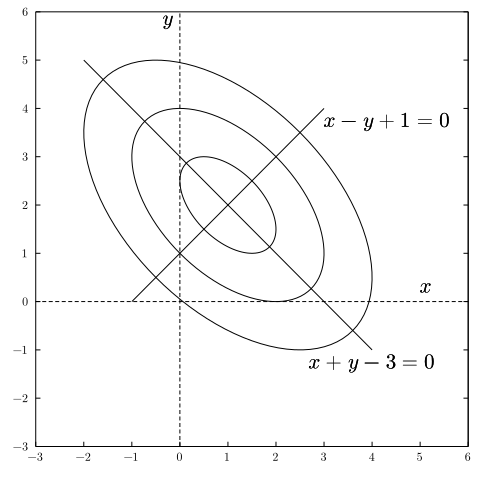

# 第3章 連立1次方程式

## 3.1 直接法と反復法

### 3.1.1 直接法・反復法

実数の係数をもつ $n$ 元連立1次方程式

$$
\begin{array}{ll}
    a_{11} x_1 + a_{12} x_2 + a_{13} x_3 + \cdots + a_{1n} x_n & = b_1 \quad (1) \\
    a_{21} x_1 + a_{22} x_2 + a_{23} x_3 + \cdots + a_{2n} x_n & = b_2 \quad (2) \\
    a_{31} x_1 + a_{32} x_2 + a_{33} x_3 + \cdots + a_{3n} x_n & = b_3 \quad (3) \\
    \cdots \, \cdots \\
    a_{i1} x_1 + a_{i2} x_2 + a_{i3} x_3 + \cdots + a_{in} x_n & = b_i \quad (\,i\,) \\
    \cdots \, \cdots \\
    a_{n1} x_1 + a_{n2} x_2 + a_{n3} x_3 + \cdots + a_{nn} x_n & = b_n \quad (n) \\
\end{array} \tag{3.1}
$$

の数値解法は、大きく分けて直接法と反復法の2つがある。
直接法は、手順を1回実行すれば解が求められる。
反復法は、必要な精度の近似値が得られるまで、手順を反復する。
直接法は、解を求めるまでの演算回数は少なくてよいが、とくに大型行列の連立1次方程式の場合、高い精度の近似解が得にくい。
それは、直接法では解を求める途中で係数を書き換えてしまうが、書き換えの過程で誤差が発生することによる。
反復法では最後まで係数はもとのままである。
したがって、小さな連立1次方程式は直接法によることが多く、大型の連立1次方程式は反復法によることが多い。

本章で取り上げる連立1次方程式の数値解法は、次の通りである。

$$
\begin{array}{clll}
1 & \text{ガウスの消去法} & \text{直接法} \\
2 & \text{LU分解法} & \text{直接法} \\
3 & \text{コレスキー分解法} & \text{直接法} & \text{対称行列} \\
4 & \text{ヤコビ法} & \text{反復法} \\
5 & \text{ガウス・ザイデル法} & \text{反復法} \\
6 & \text{SOR法} & \text{反復法} \\
7 & \text{共役勾配法} & \text{ベクトル反復法} & \text{対称行列 (非対称行列)} \\
\end{array}
$$

ガウスの消去法はもっとも基本的な直接法である。
$\text{LU}$ 分解法は、ガウスの消去法をやや一般化して使いやすくしたものである。
コレスキー分解法は、 $\text{LU}$ 分解法を対称行列用に改造して半分の演算量で解を求めることのできる方法である。

ヤコビ法はもっとも基本的な反復法である。
ガウス・ザイデル法はヤコビ法を簡単にした結果、収束が早くなり、かつ記憶容量も少なくなっている。
SOR 法はガウス・ザイデル法の収束を加速した方法である。

共役勾配法は、対称な大型行列用の方法であり、近年にわかに使用されるようになっている。
とくに収束を加速した共役勾配法 (ICCG 法など) は、大型対称行列に対する主流となっている。
そのほか、本章の問題中には、非対称行列用の共役残差法 (CR 法)、双共役勾配法 (BCG 法) および自乗共役勾配法 (CGS 法) についてふれる。
これらの方法はベクトル反復法と呼ばれている。

以上のように、ここで説明する7つの方法は、直接法と反復法の2つの系統に分類される。
解くべき連立1次方程式の性質によって、これらの方法を使いわける必要がある。

## 3.2 ガウスの消去法

### 3.2.1 ガウスの消去法

連立1次方程式 $(3.1)$ の数値解法の中でもっとも基本的な解法は、ここで述べるガウスの消去法である。
筆算による連立1次方程式の解法でもっともよく用いられる解法は、消去法によって未知数を消去し、最後に残った未知数を求め、以下代入法によって順次残りの未知数を求める方法であろう。
ガウスの消去法は、筆算における消去法と代入法を順序立てて手順にまとめあげたものでもある。

### 3.2.2 前進消去

$n$元連立1次方程式 $(3.1)$ において、まず未知数 $x_1$ を消去する。
それには、第1式 $(1)$ を $x_1$ の係数 $a_{11}$ で割って、

$$
x_1 + a_{12}^{(1)} x_2 + a_{13}^{(1)} x_3 + \cdots + a_{1n}^{(1)} x_n = b_{1}^{(1)} \quad (1^{\prime})
$$

とし 、次いで第2式 $(2)$ から $(1^{\prime})$ の $a_{21}$ 倍を引くと $x_1$ が消去される：

$$
a_{22}^{(1)} x_2 + a_{23}^{(1)} x_3 + \cdots + a_{2n}^{(1)} x_n = b_{2}^{(1)} \qquad (2^{\prime})
$$

一般に第 i 式 $(i)$ から $(1^{\prime})$ の $a_{i1}$ 倍を引くと、 $x_1$ が消去され

$$
a_{i2}^{(1)} x_2 + a_{i3}^{(1)} x_3 + \cdots + a_{in}^{(1)} x_n = b_{i }^{(1)} \qquad (i^{\prime})
$$

が得られる。
$i = 2, 3, \cdots, n$ の順に繰り返すと、第2式, $\cdots$ 第 $n$ 式から $x_1$ が消去される。
このとき、新しい係数 $a_{ij}^{(1)}$ 、 $b_i^{(1)}$ は、

$$
\begin{array}{lll}
\text{第1行} & a_{11}^{(1)} = 1 \\
           & a_{1j}^{(1)} = a_{1j} / a_{11} & j > 1 \\
           & b_1^{(1)} = b_1 / a_{11} \\

\text{第2行以下} & a_{i1}^{(1)} = 0 & i > 1 \\
           & a_{ij}^{(1)} = a_{ij} - a_{i1} a_{1j}^{(1)} & i > 1, \quad j > 1 \\
           & b_i^{(1)} = b_i - a_{i1} b_1^{(1)} & i > 1 \\
\end{array}
$$

である。
こうして、第2式以降から $x_1$ が消去された。

次ぎに、第3式以降から $x_2$ を消去するには、第2式 $(2^{\prime})$ を $a_{22}^{(1)}$ で割って、

$$
x_2 + a_{23}^{(2)} x_3 + \cdots + a_{2n}^{(2)} x_n = b_2^{(2)} \qquad (2^{\prime\prime})
$$

とし、第 $i$ 式 $(i^{\prime})$ (ただし $i > 2$ ) 以降から $(2^{\prime\prime})$ の $a_{i2}^{(1)}$ 倍を引けばよい：

$$
a_{i3}^{(2)} x_3 + a_{i4}^{(2)} x_4 + \cdots + a_{in}^{(2)} x_n = b_{i}^{(2)} \qquad (i^{\prime\prime})
$$

ただし 、

$$
\begin{array}{lll}
\text{第2行} & a_{22}^{(2)} = 1 \\
 & a_{2j}^{(2)} = a_{2j}^{(1)} /a_{22}^{(1)} & j > 2 \\
 & b_{2}^{(2)} = b_{2}^{(1)} / a_{22}^{(1)} \\
\text{第3行以下} & a_{i2}^{(2)} = 0 & i > 2 \\
 & a_{ij}^{(2)} = a_{ij}^{(1)} - a_{i2}^{(1)} a_{2j}^{(2)} & i > 2, \quad j > 2 \\
 & b_{i}^{(2)} = b_{i}^{(1)}- a_{i2}^{(1)} b_{2}^{(2)} & i > 2 \\
\end{array}
$$

いま第 $k$ 式以降の式の $x_1$ からまで $x_{k-1}$ までがすでに消去されているとき、第 $k + 1$ 式以降から $x_k$ を消去することを考える。
それには、第 $k$ 式を $a_{kk}^{(k-1)}$ で割り、第 $k + 1$ 式以降の第 $i$ 式 $(i > k)$ から、第 $k$ 式 $(a_{kk}^{(k)} = 1)$ の $a_{kj}^{(k-1)}$ 倍を引けばよい。
すなわち、 $k = 1, 2, \cdots, n$ の順に

$$
\begin{array}{ll}
\text{ガウスの消去法の前進消去} \\
\quad a_{kk}^{(k)} = 1 \\
\quad a_{kj}^{(k)} = a_{kj}^{(k-1)} / a_{kk}^{(k-1)} & j > k \\
\quad b_{k}^{(k)} = b_{k}^{(k-1)} / a_{kk}^{(k-1)} \\
\quad a_{ik}^{(k)} = 0 & i > k \\
\quad a_{ij}^{(k)} = a_{ij}^{(k-1)} - a_{ik}^{(k-1)} a_{kj}^{(k)} & i > k, j > k \\
\quad b_{i}^{(k)} = b_{i}^{(k-1)} - a_{ik}^{(k-1)} b_{k}^{(k)} & i > k \\
\end{array} \tag{3.2}
$$

と係数と定数項を変化させると、対角要素はすべて $1$ になり、対角要素の下の要素はすべて $0$ になり、係数行列は上三角行列になる。

$(3.2)$ を PAD で表したものが、図 3.1 の 前進消去の部分である。
この PAD では、 $a_{ij}^{(k)}$ はすべての $k$ に対して同じ配列要素 `a(i,j)` に次々と上書きしている。
それは、 $a_{ij}^{(k)}$ が求められた後では $a_{ij}^{(k-1)}$ 以前の配列要素 `a(i,j)` の値を再び参照することはないからである。
また、 PAD では、対角要素 $1$ と下三角行列の $0$ はわかりきっているので、 $1$ にしたり $0$ にしたりする演算は行なっていない[$1)$](#note1) 。

> <small id="note1">$^{1)}$ $e_{n-1}(z)$ は $n - 1$ 次のラグランジュ補間多項式による $z^s$ の近似の誤差である。 $(5.53)$ 、 $(5.57)$ 参照。</small>

$(3.2)$ の手順が完了したときには、連立1次方程式は、次の形に変形されている。

$$
\begin{aligned}
x_1 + a_{12}^{(1)} x_2 + a_{13}^{(1)} x_3 + \cdots + a_{1n-1}^{(1)} x_{n-1} + a_{1n}^{(1)} x_n & = b_1^{(1)} \\
x_2 + a_{23}^{(2)} x_3 + \cdots + a_{2n-1}^{(2)} x_{n-1} + a_{2n}^{(2)} x_n & = b_2^{(2)} \\
x_3 + \cdots + a_{3n-1}^{(3)} x_{n-1} + a_{3n}^{(3)} x_n & = b_3^{(3)} \\
\cdots \, \cdots \\
x_{n-1} + a_{n-1n}^{(n-1)} x_n & = b_{n-1}^{(n-1)} \\
x_n & = b_n^{(n)}
\end{aligned} \tag{3.2’}
$$

なお、 PAD では同じ 係数 $A$ を持つ $m$ 個の問題を一挙に解くことができるようにしてある。
そのために、定数項は係数の行列の $第 n + 1 列, n + 2 列, \cdots n + m
列$ に記憶させてある。
すなわち、第 $i$ 行は

$$
\begin{array}{}
a_{i\ n+1} = b_{i\ 1}, & a_{i\ n+2} = b_{i\ 2}, & \cdots & a_{i\ n+m} = b_{i\ m}
\end{array}
$$

である。
こうしておくと PAD 、したがって手順が簡単になる。
ピボット選択については後で述べる。

### 3.2.3 後退代入

前進消去の結果 $x_n$ は解けている。
$x_{n-1}$ は最後から2番目の式を用いて、

$$
x_{n-1} = b_{n-1}^{(n-1)} - a_{n-1n}^{(n-1)} x_n
$$

以下同じようにして $k = n - 1, n - 2, \cdots , 2, 1$ と逆順に代入を繰り返して行けば、 $x_k$ が

$$
\begin{array}{r}
\text{ガウスの消去法の後退代入} \\
x_k = b_k^{(k)} - \sum\limits_{j=k+1}^n a_{kj}^{(k)} x_j
\end{array} \tag{3.3}
$$

と求められる。
これを後退代入という。

図 3.1 の PAD における後退代入が $(3.3)$ の手順である。
ここでも、 $m$ 組の定数項は `a(i,j)` の $j = n + 1, n + 2, \cdots , n + m$ 列にあり、かつ、それぞれの定数項のところに解 $x_j$ が求められる。

### 3.2.4 ピボット 選択

$(3.2)$ では、対角要素 $a_{kk}^{(k-1)}$ で割算をしている。
もし対角要素が $0$ であればこの割算はできないし、 $0$ でなくても非常に (絶対値の) 小さな数であれば、 $a_{kj}^{(k)}$ および $b_k{(k)}$ が異常に大きくなり、その結果 $a_{ij}^{(k)}$ および $b_i^{(k)}$ の右辺の第1項と第2項の大きさが極端に違ってきて、小さい第1項は大きい第2項によって丸めの誤差として無視されてしまう。
この丸めの誤差を小さく抑えるためには、割算をする要素の値が大きいことが必要である。
この要素のことを、ピボット (pivot － 枢軸、<ruby>要<rp>(</rp><rt>かなめ</rt><rp>)</rp></ruby> ) という。
$(3.2)$ ではピボットとしては対角要素を選んだが、できるだけ大きい要素を選ぶことが必要である。
ピボットとしてできるだけ大きい要素を選ぶことをピボット選択 (pivotting) という。

すでに消去が終わっている未知数の係数をピボットとして選ぶことはできない。
ピボット選択の範囲は $x_{k-1}$ まで消去できているときは、 $a_{ij}^{(k-1)}$ のうち $i \geqq k,\ j \geqq k$ の範囲の中から選択することになる。
この $(n - k + 1)^2$ 個の要素の全範囲から選択することを完全ピボット選択 (complete pivotting) という。
これに対して第 $k$ 列の中、すなわち、 $i \geqq k,\ j = k$ の中から選択することを部分ピボット選択 (partial pivotting) という。

ピボットとして $a_{ij}^{(k-1)}$ を選択したとき、それが第 $k$ 列にあるとき $(j = k)$ 、第 $i$ 番目の方程式と第 $k$ 番目の方程式と入れ換えてやることが必要である。
方程式の順番の入れ換えによっては解は変わらないから、入れ換えた後の手順の変更はいらない。
一方 $j \neq k$ の時は、未知数 $x_k$ と $x_j$ との入れ換えが必要になる。
したがって、完全ピボット選択を行ったときは、解を求めた後、未知数の順番をもとに戻してやらねばならない。

完全ピボット選択の方が、解の精度がよいことは当然であるが、選択の範囲が広いために手数がかかり、また未知数の順番を戻す必要があるため、小さな連立1次方程式は部分ピボット選択で済ませる。
大きな連立1次方程式の場合は直接法は用いず、反復法を用いることにする。

## 3.3 $\text{LU}$ 分解法

### 3.3.1 $\text{LU}$ 分解法

$n$ 次連立1次方程式 $(3.1)$ は

$$
Ax = b \tag{3.4}
$$

と書ける。
ただし $A$ は $n$ 次正方行列で、

$$
A = \begin{pmatrix}
    a_{11} & a_{12} & a_{13} & \cdots & a_{1n} \\
    a_{21} & a_{22} & a_{23} & \cdots & a_{2n} \\
    a_{31} & a_{32} & a_{33} & \cdots & a_{2n} \\
    \vdots & \vdots & \vdots & \ddots & \vdots \\
    a_{n1} & a_{n2} & a_{n3} & \cdots & a_{nn} \\
\end{pmatrix}
$$

いま、 $A$ を

$$
A = LU \tag{3.5}
$$

と分解したとしよう。
ここに $L$ は下三角行列、 $U$ は対角要素が $1$ である上三角行列である：

$$
L = \begin{pmatrix}
    l_{11} \\
    l_{21} & l_{22} & & \large{0} \\
    l_{31} & l_{32} & l_{33} \\
    \vdots & \vdots & \vdots & \ddots \\
    l_{n1} & l_{n2} & l_{n3} & \cdots & l_{nn} \\
\end{pmatrix}, \quad
U = \begin{pmatrix}
    1 & u_{12} & u_{13} & \cdots & u_{1n} \\
    & 1 & u_{23} & \cdots & u_{2n} \\
    & & 1 & \cdots & u_{3n} \\
    & \large{0} & & \ddots & \vdots \\
    & & & & 1 \\
\end{pmatrix}
$$

この分解を $\text{LU}$ 分解という[$2)$](#note2) 。

> <small id="note1">$^{2)}$ このように $U$ の対角要素を $1$ とする方法をドウリトル (Doolittle) 法、 $L$ の対角要素を $1$ とする方法をクラウト (Crout) 法と呼ぶ。
> このどちらの方法も $\text{LU}$ 分解は一意的である。
> ガウスの消去法との関連が明らかなため、ここではドウリトル法について述べる。</small>

行列 $A$ を $\text{LU}$ 分解できたら、この2つの行列 $L$ と $U$ とを用いて、 $(3.4)$ と $(3.5)$から $x$ を簡単な手順によって求めることが出来る。
すなわち、 $y = U x$ と置くと、 $(3.4)$ は2つの連立1次方程式

$$
L y = b \tag{3.6}
$$

$$
U x = y \tag{3.7}
$$

に分けられる。
$(3.6)$ より $y$ を求め、この $y$ を $(3.7)$ に代入して $x$ を求めれば、 $(3.4)$ の解 $x$ が求められる。

$(3.6)$ と $(3.7)$ を解くことは、 $L$ と $U$ が三角行列であるために容易である。
実際 $(3.6)$ を要素ごとに第1式から第 $n$ 式の順に書くと

$$
\begin{array}{lll}
l_{11} y_1 = b_1 & \therefore & y_1 = b_1 / l_{11} \\
l_{21} y_1 + l_{22} y_2 = b_2 & \therefore & y_2 = (b_2 - l_{21} y_1) / l_{22} \\
\qquad \cdots & & \qquad \cdots \\
\sum\limits_{j=1}^{n-1} l_{nj} y_j + l_{nn} y_n = b_n & \therefore & y_n = \left(
b_n - \sum\limits_{j=1}^{n-1} l_{nj} y_j \right) / l_{nn} \\
\end{array}
$$

と $y_1, y_2, \cdots , y_n$ の順に次々と求めることが出来る。
これを、前進代入という。

次に、 $(3.7)$ を第 $n$ 式から第1式の順に書いて、 $x_n$ から $x_1$ を逆順に求めることが出来る。
すなわち

$$
\begin{array}{lll}
x_n = y_n & \therefore & x_n = y_n \\
x_{n-1} + u_{n-1n} x_n = y_{n-1} & \therefore & x_{n-1} = y_{n-1} - u_{n-1n} x_n \\
\qquad \cdots & & \qquad \cdots \\
x_1 + \sum\limits_{j=2}^n u_{1j} x_j = y_n & \therefore & x_1 = y_n - \sum\limits_{j=2}^n u_{1j} x_j \\
\end{array}
$$

である。
これを、後退代入という。

$A$ を $\text{LU}$ 分解し、前進代入と後退代入によって解 $x$ を求める解法を $\text{LU}$ 分解法という。

### 3.3.2 $\text{LU}$ 分解

$\text{LU}$ 分解の手順は、前節のガウスの消去法の前進消去の手順と同じであることを示す。
そのために、ガウスの消去法の前進消去の手順 $(3.2)$ を行列 $G$ で表すと、

$$
GA = U =
\begin{pmatrix}
 1 & a_{12}^{(1)} & a_{13}^{(1)} & \cdots & a_{1n}^{(1)} \\
 & 1 & a_{23}^{(2)} & \cdots & a_{2n}^{(2)} \\
 & & 1 & \cdots & a_{3n}^{(3)} \\
 & \large{0} & & \ddots & \vdots \\
 & & & & 1
\end{pmatrix}
$$

であり、 $U$ は対角要素が $1$ である上三角行列であることに注意する ($(3.2’)$ を参照）。
この式から $A = G^{-1} U$ であるから、 $L = G^{-1}$ と置くと、 $\text{LU}$ 分解 $A = LU$
が得られる。

まず、 $G = G_n G_{n-1} \cdots G_k \cdots G_2 G_1$ と置き、 $k$ 回目の前進消去 $(3.2)$ を

$$
a_{ij}^{(k)} =
\left\{
\begin{array}{lll}
    a_{kj}^{(k-1)} / a_{kk}^{(k-1)} & i = k, & j \geqq k \\
    a_{ij}^{(k-1)} - a_{ik}^{(k-1)} a_{kj}^{(k)} & i > k, & j \geqq k \\
\end{array}
\right.
$$

と書き、これを $G_k$ で表すと、

$$
G_k =
\begin{pmatrix}
    1 \\
    & \ddots & & & & \large{0} \\
    & & 1 \\
    & & & 1 \\
    & & & -a_{k+1k}^{(k-1)} & 1 \\
    & \large{0} & & \vdots & & \ddots \\
    & & & -a_{nk}^{(k-1)} & & & 1 \\
\end{pmatrix}
\begin{pmatrix}
    1 \\
    & \ddots & & & & \large{0} \\
    & & 1 \\
    & & & 1/a_{kk}^{(k-1)} \\
    & & & & 1 \\
    & \large{0} & & & & \ddots \\
    & & & & & & 1 \\
\end{pmatrix}
$$

である。したがって、 $G_k^{-1}$ は[$3)$](#note3)

$$
\begin{aligned}
G_k^{-1} & =
\begin{pmatrix}
    1 \\
    & \ddots & & & & \large{0} \\
    & & 1 \\
    & & & a_{kk}^{(k-1)} \\
    & & & & 1 \\
    & \large{0} & & & & \ddots \\
    & & & & & & 1 \\
\end{pmatrix}
\begin{pmatrix}
    1 \\
    & \ddots & & & & \large{0} \\
    & & 1 \\
    & & & 1 \\
    & & & a_{k+1k}^{(k-1)} & 1 \\
    & \large{0} & & \vdots & & \ddots \\
    & & & a_{nk}^{(k-1)} & & & 1 \\
\end{pmatrix} \\
& =
\begin{pmatrix}
    1 \\
    & \ddots & & & & \large{0} \\
    & & 1 \\
    & & & a_{kk}^{(k-1)} \\
    & & & a_{k+1k}^{(k-1)} & 1 \\
    & \large{0} & & \vdots & & \ddots \\
    & & & a_{nk}^{(k-1)} & & & 1 \\
\end{pmatrix}
\end{aligned}
$$

である。

> <small id="note3">$^{3)}$ $A, B$ を $n$ 次正方行列とすると、 $(AB)^{-1} = B^{-1} A^{-1}$。</small>

$L = G^{-1} = G_1^{-1} G_2^{-1} \cdots G_k^{-1} \cdots G_{n-1}^{-1} G_n^{-1}$ は $G_k^{-1} (k = 1, \cdots n)$ の積であるから、

$$
\begin{aligned}
G_n^{-1} & =
\begin{pmatrix}
    1 \\
    & \ddots & & & \large{0} \\
    & & 1 \\
    & & & 1 \\
    & \large{0} & & & 1 \\
    & & & & & a_{nn}^{(n-1)} \\
\end{pmatrix}
\\ \\
G_{n-1}^{-1} G_n^{-1} & =
\begin{pmatrix}
    1 \\
    & \ddots & & & \large{0} \\
    & & 1 \\
    & & & 1 \\
    & \large{0} & & & a_{n-1n-1}^{(n-2)} \\
    & & & & a_{nn-1}^{(n-2)} & 1 \\
\end{pmatrix} G_n^{-1} \\
& =
\begin{pmatrix}
    1 \\
    & \ddots & & & \large{0} \\
    & & 1 \\
    & & & 1 \\
    & \large{0} & & & a_{n-1n-1}^{(n-2)} \\
    & & & & a_{nn-1}^{(n-2)} & a_{nn}^{(n-1)} \\
\end{pmatrix}
\\ \\
G_{n-2}^{-1} ( G_{n-1}^{-1} G_{n}^{-1} ) & =
\begin{pmatrix}
    1 \\
    & \ddots & & & \large{0} \\
    & & 1 \\
    & & & a_{n-2n-2}^{(n-3)} \\
    & \large{0} & &a_{n-1n-2}^{(n-3)} & 1 \\
    & & & a_{nn-2}^{(n-3)} & & 1 \\
\end{pmatrix}
\begin{pmatrix}
    1 \\
    & \ddots & & & \large{0} \\
    & & 1 \\
    & & & 1 \\
    & \large{0} & & & a_{n-1n-1}^{(n-2)} \\
    & & & & a_{nn-1}^{(n-2)} & a_{nn}^{(n-1)} \\
\end{pmatrix} \\
& =
\begin{pmatrix}
    1 \\
    & \ddots & & & \large{0} \\
    & & 1 \\
    & & & a_{n-2n-2}^{(n-3)} \\
    & \large{0} & &a_{n-1n-2}^{(n-3)} & a_{n-1n-1}^{(n-2)} \\
    & & & a_{nn-2}^{(n-3)} & a_{nn-1}^{(n-2)} & a_{nn}^{(n-1)} \\
\end{pmatrix} \\ \\
& \qquad \cdots \, \cdots \, \cdots \, \cdots
\end{aligned}
$$

と繰り返していけば

$$
\begin{aligned}
L & = G^{-1} = G_1^{-1} ( G_2^{-1} \cdots G_k^{-1} \cdots G_{n-1}^{-1} G_n^{-1} ) \\
& =
\begin{pmatrix}
    a_{11} \\
    a_{21} & 1 & & & \large{0} \\
    a_{31} & & 1 \\
    \vdots & & & \ddots \\
    \vdots & & & & \ddots \\
    a_{n1} & & & & & 1 \\
\end{pmatrix}
\begin{pmatrix}
    1 \\
    & a_{22}^{(1)} & & & \large{0} \\
    & a_{32}^{(1)} & a_{33}^{(2)} \\
    & \vdots & & \ddots \\
    & \vdots & & & \ddots \\
    & a_{n2}^{(1)} & a_{n3}^{(2)} & \cdots & \cdots & a_{nn}^{(n-1)} \\
\end{pmatrix} \\
& =
\begin{pmatrix}
    a_{11} \\
    a_{21} &　a_{22}^{(1)} & & & \large{0} \\
    a_{31} &　a_{32}^{(1)} & a_{33}^{(2)} \\
    \vdots &　\vdots & & \ddots \\
    a_{n1} &　a_{n2}^{(1)} & a_{n3}^{(2)} & \cdots & a_{nn}^{(n-1)} \\
\end{pmatrix}
\end{aligned}
$$

が得られる。
$L = G^{-1} (l_{ij} = a_{ij}^{(j-1)} )$ は求める下三角行列である。

$L$ の各要素は、 $(3.2)$ において $a_{kk}^{(k)} = 1, a_{ik}^{(k)} = 0 (i > k)$ とする直前の値である。

図 3.1 のガウスの消去法の PAD の［前進消去］の手順では $1$ あるいは $0$ にする演算はしていないから、この値は保存されている。
すなわち、ガウスの消去法の PAD 図 3.1 の ［前進消去］ の手順が完了したときには、行列 $A$ は次のようになっている：

$$
\begin{pmatrix}
    a_{11} & a_{12}^{(1)} & a_{13}^{(1)} & \cdots & a_{1n}^{(1)} \\
    a_{21} & a_{22}^{(1)} & a_{23}^{(2)} & \cdots & a_{2n}^{(2)} \\
    a_{31} & a_{32}^{(1)} & a_{33}^{(2)} & \cdots & a_{3n}^{(3)} \\
    \vdots & \vdots & \vdots & \ddots & \vdots \\
    a_{n1} & a_{n2}^{(1)} & a_{n3}^{(2)} & \cdots & a_{nn}^{(n-1)} \\
\end{pmatrix}
=
\begin{pmatrix}
l_{11} & u_{12} & u_{13} & \cdots & u_{1n} \\
l_{21} & l_{22} & u_{23} & \cdots & u_{2n} \\
l_{31} & l_{32} & l_{33} & \cdots & u_{3n} \\
\vdots & \vdots & \vdots & \ddots & \vdots \\
l_{n1} & l_{n2} & l_{n3} & \cdots & l_{nn} \\
\end{pmatrix}
$$

ガウスの消去法においては、このうち $u_{ij}$ を用いて後退代入を行って解 $x$ を求めた。
一方、 $\text{LU}$ 分解法においては、 $l_{ij}$ を用いて前進代入を行い、 $u_{ij}$ を用いて後退代入を行って解 $x$ を求めるのである。

以上の $\text{LU}$ 分解の手順を PAD 図 3.2 の［ $\text{LU}$ 分解］に示す。
この手順は、ガウスの消去法の［前進消去］の手順と同じである。
したがって、係数行列 $A$ は上のように変換されている。

### 3.3.3 ピボット選択

上述の $\text{LU}$ 分解の段階で、対角要素 $l_{kk} = a_{kk}^{(k-1)}$ で割算が必要である。
割算をするこの除数はガウスの消去法の前進消去のときのピボットと同じものである。
したがってピボット選択もガウスの消去法のときと同じ理由から必要である。

ガウスの消去法のときと異なるのは、ガウスの消去法の前進消去では右辺の定数項も対象になったが、 $\text{LU}$ 分解のときには係数行列だけが対象になっている。
だから、 $\text{LU}$ 分解のピボット選択で方程式の入れ換えを行ったら、その順番を記憶しておいて、前進代入にはいる前に、定数項の順番の入れ換えを行う必要がある。
そのためには、 $\text{LU}$ 分解前に $m_i$ <!-- ( PAD では配列 `mm(i)` ) --> に $m_i = i$ <!-- ( `mm(i)=i` ) --> としておいて、ピボット選択のため $k$ 行と $l$ 行を入れ換えるときには、 $m_k$ と $m_l$ の値も入れ換える。
こうすれば、 $\text{LU}$ 分解後の $i$ 行は $\text{LU}$ 分解前の $m_i$ 行であったことが記憶される。
こうして、前進代入では、まず $Ly = b$ の第 $k$ 行の $b_k$ としては $m_k$ を使って並べ変えた値 $b_{m_k}$ <!-- (`b(mm(k))`) --> を用いるわけである。

### 3.3.4 $\text{LU}$ 分解法の手順

以上の手順を PAD で表すと図 3.2 のようになる。
この PAD と図 3.1 とくらべると、［ $\text{LU}$ 分解］は、ガウスの消去法の［前進消去］において `m=0` と置いて得られるものと同じである。
また、［後退代入］は、 `m = 1` とすれば、二つの方法の後退代入は同じになる。
したがって、前進消去は $\text{LU}$ 分解と前進代入に分離されている。
$\text{LU}$ 分解は定数項 $b$ とは独立に行われるから、一度 $\text{LU}$ 分解を行っておけば、異なった $b$ に対してはそれぞれ前進代入と後退代入だけを行なって解 $x$ を求めることができる。

なお、 $l_{ij}$ と $u_{ij}$ はもとの行列要素 $a_{ij}$ に代入されているから、 $L$ と $U$ のために $A$ とは別の配列を用意しておく必要はない。
( 対角要素 $u_{ii}$ は $1$ であることがわかっているので、 $a_{ii}$ には $l_{ii}$ を記憶する。)
また、補助的に導入されたベクトル $y$ は不要で、 $y$ の代わりにいきなり $x$ を用いればよい。
( $y$ は $x$ に上書きされる。)

## 3.4 コレスキー分解法

### 3.4.1 コレスキー分解

実対称行列に対する $\text{LU}$ 分解法においては、$A = LU$ ( $L$ も $U$ も対角要素は $1$ とは限らない) と置くと、 $A^\top = A$ より

$$
(LU)^\top = U^\top L^\top = LU
$$

したがって $L = U^\top$ (同じことだが $U = L^\top$ ) であればよい。
ここでは $U = L^\top$ と置くと、実対称行列の分解は

$$
A = LL^\top \tag{3.8}
$$

となり、 $L$ を見いだす手順が決まると $U = L^\top$ は自動的に決まり、非対称行列の $\text{LU}$ 分解に比べて約半分の手順をふめば分解が出来上がることになる。
$A$ の要素を $a_{ii}$ 、 $L$ の要素を $l_{ij} (i \geqq j)$ と書く。
このとき $a_{ij} = a_{ji}$ であり、また $l_{ij} = 0 (i < j)$ である。

$(3.8)$ を要素ごとに書くと、 $l_{ij}$ を決めるには、 $i \geqq j$ の場合だけについて考えればよい。
すなわち

$$
\begin{aligned}
a_{jj} & = \sum\limits_{k=1}^{j-1} l_{jk}^2 + l_{jj}^2 \\
a_{ij} & = \sum\limits_{k=1}^{j-1} l_{ik} l_{jk} + l_{ij} l_{jj} & (i > j)
\end{aligned}
$$

故に、 $j = 1, 2, \cdots, n$ の順に、第 $j$ 列は

$$
\begin{array}{l}
\text{コレスキー分解 (平方根法)} \\
\begin{aligned}
l_{jj} & = \sqrt{ a_{jj} - \sum\limits_{k=1}^{j-1} l_{jk}^2 } \\
l_{ij} & = \left. \left( a_{ij} - \sum\limits_{k=1}^{j-1} l_{ik} l_{jk} \right) \right/ l_{jj} & (i > j)
\end{aligned} \end{array} \tag{3.9}
$$

と $l_{ij} (i \geqq j)$ を決定できる。
この分解はコレスキー (Cholesky) 分解と呼ばれている。
対角要素 $l_{jj}$ を決めるのに平方根を必要とするので、平方根法とも呼ばれる。

コレスキー分解がすんだら、 $Ly = b$ を前進代入で解き、次いで $L^\top x = y$ を後退代入で解く。

この方法は、平方根の中が負になったら実数計算の範囲では計算が出来ない。
また平方根の中が $0$ になったら、対角要素 $l_{jj}$ が $0$ になり、以後の計算は $l_{jj}$ による割り算があるため不可能になる。
係数行列 $A$ が対称正定値行列のときには $0$ や負になることはないが、正定値でない対称行列でも使えるというので、次に述べる改訂コレスキー法の方がよく使われる。

3.4.2 改訂コレスキー分解
実対称行列 $A$ を $A = LU = LDL^\top$ すなわち

$$
U = DL^\top \tag{3.10}
$$

と分解して、連立1次方程式を解く方法を、修正コレスキー法または改訂コレスキー法 (modified Cholesky method) と呼ぶ。
ここに、 $L$ は対角要素が $1$ である下三角行列、 $D$ は対角行列である。
$(3.10)$ の分解の手順を見出そう。

$U$ の $i$ 行 $j$ 列の要素を $u_{ij}$ と書く。
すなわち

$$
U =
\begin{pmatrix}
    u_{11} & u_{12} & u_{13} & \cdots & u_{1n} \\
    & u_{22} & u_{23} & \cdots & u_{2n} \\
    & & u_{33} & \cdots & u_{3n} \\
    & \Large{0} & & \ddots & \vdots \\
    & & & & u_{nn} \\
\end{pmatrix}
$$

一方、

$$
\begin{aligned}
DL^\top & =
\begin{pmatrix}
    d_1 \\
    & d_2 & & \Large{0} \\
    & & \ddots \\
    & \Large{0} & & \ddots \\
    & & & & d_n \\
\end{pmatrix}
\begin{pmatrix}
    1 & l_{21} & l_{31} & \cdots & l_{n1} \\
    & 1 & l_{32} & \cdots & l_{n2} \\
    & & 1 & \cdots & l_{n3} \\
    & \Large{0} & & \ddots & \vdots \\
    & & & & 1 \\
\end{pmatrix} \\
& =
\begin{pmatrix}
    d_1 & l_{21} d_1 & l_{31} d_1 & \cdots & l_{n1} d_1 \\
    & d_2 & l_{32} d_2 & \cdots & l_{n2} d_2 \\
    & & d_3 & \cdots & l_{n3} d_3 \\
    & \Large{0} & & \ddots & \vdots \\
    & & & & d_n \\
\end{pmatrix}
\end{aligned}
$$

であるから

$$
u_{ii} = d_i, \quad u_{ij} = l_{ji}d_i (i < j) \tag{3.11}
$$

である。
そうして、

$$
A = LU =
\begin{pmatrix}
    1 \\
    l_{21} & 1 \\
    l_{31} & l_{32} & 1 \\
    \vdots & \vdots & \vdots & \ddots \\
    l_{n1} & l_{n2} & l_{n3} & \cdots & 1 \\
\end{pmatrix}
\begin{pmatrix}
    d_1 & u_{12} & u_{13} & \cdots & u_{1n} \\
    & d_2 & u_{23} & \cdots & u_{2n} \\
    & & d_3 & \cdots & u_{3n} \\
    & & & \ddots & \vdots \\
    & & & & d_n \\
\end{pmatrix}
$$

より、各要素を 行順 $k = 1, 2, \cdots , n$ に書き下す。
$k$ 行は、

$$
\begin{matrix}
i < k & a_{ki} = \sum\limits_{j=1}^{i-1} l_{kj} u_{ji} + u_{ik} & \therefore u_{ik} = a_{ki} - \sum\limits_{j=1}^{i-1} l_{kj} u_{ji}, & l_{ki} = u_{ik} / d_i \\
i = k & a_{kk} = \sum\limits_{j=1}^{k-1} l_{kj} u_{jk} + d_k & \therefore d_k = a_{kk} - \sum\limits_{j=1}^{k-1} l_{kj} u_{jk} &
\end{matrix}
$$

この第１式 $(i < k)$ の形は、両辺の $u_{ik}$ と $u_{ji}$ の決まる順が見にくいので、

$$
l_{kj} u_{ji} = ( l_{ij} d_j ) l_{kj} = l_{ij} ( l_{kj} d_j ) = l_{ij} u_{jk}
$$

と添え字の $i$ と $k$ の付け替えて、

$$
u_{ik} = a_{ki} - \sum\limits_{j=1}^{i-1} l_{ij} u_{jk}, \quad \therefore l_{ki} = u_{ik}/d_i
$$

とする。
明らかに、 $j < i$ であるから、右辺の $u_{jk}$ は左辺の $u_{ik}$ より先に決まる。

こうして、改訂コレスキー分解は $k = 1, 2, \cdots , n$ の順に

$$
\begin{array}{}
\text{改訂コレスキー分解} \\
\begin{array}{l}
u_{ik} = a_{ki} - \sum\limits_{j=1}^{i-1} l_{ij} u_{jk} \\
l_{ki} = u_{ik} / d_i
\end{array} & (i < k) \\
d_k = a_{kk} - \sum\limits_{j=1}^{k-1} l_{kj} u_{jk}
\end{array} \tag{3.12}
$$

となる。

ここで最終的に必要なのは $l_{ki}$ と $d_k$ であるから、 $u_{ik}$ は作業用の配列であると見なせる。
この配列は、ある $k$ で用いたらその値は他の $k$ では使わないから、 $u_{ik}$ は $u_i$ と書いてよい。

対角要素 $d_k$ は、負になってもかまわないが、 $0$ になったら困る。
$d_k$ はガウスの消去法や\text{LU}分解法のピボットと同じものである。
そこでピボット選択が必要となる。
ただし、対称性をこわさないためには、行の入れ替えだけではなく、列の入れ替えも行なう必要がある。

改訂コレスキー分解法の手順を図 3.3 の PAD に示す。
改訂コレスキー分解の結果は元の行列 $A$ の配列を用いることが出来る。
すなわち、 $l_{ij}$ は $a_{ij}$ に、 $d_j$ は $a_{jj}$ に記憶させればよい。
PAD 中で `D(j)` は $a_{jj}$ 、 `L(i,j)` は $a_{ij}$ である。
このときも `L` の対角要素 $l_{ii} = 1$ は記憶する必要はない。
$A$ の非対角要素の上半分の $a_{ij} (i < j)$ は、元の値がそのまま保存されている。
また、 $k = 1$ のときは $a_{11} = d_1$ なので、 $k = 2$ から始める。
言うまでもなく、 `x(i), y(i), b(i)` は同一記憶領域に格納することができる。

## 3.5 ベクト ルのノルム、行列のノルム、条件数

### 3.5.1 ベクトルのノルム

連立1次方程式の反復解法にはいる前に、ベクトルおよび行列のノルムについて述べよう。
ノルム (norm) とはベクトルや行列の「大きさ」を表す量のことである。

スカラーの場合は、絶対値で大きさを言い表すことができる。
しかし、ベクトルと行列は、複数の成分や要素を持つ。
これら複数の量をまとめた一つの量で大きさを言い表そうというわけである。

まず、ベクトルのノルムについて考える。
ベクトル $x$ のノルムを $\Vert x \Vert$ と書く。
ベクトルのノルムは次の3つの条件を満たすものなら何でもよい。

$$
\begin{aligned}
(\text{i}) & \quad x \neq 0 ならば常に \Vert x \Vert > 0、x = 0 のときにかぎり \Vert x \Vert = 0 \\
(\text{ii}) & \quad \Vert \alpha x \Vert = \vert \alpha \vert \Vert x \Vert \quad (ただし \alpha は複素数) \\
(\text{iii}) & \quad \Vert x + y \Vert \leqq \Vert x \Vert + \Vert y \Vert \\
\end{aligned}
$$

このようなノルムとして、 $n$ 次元ベクトル $x = (x_1 x_2 \cdots x_n)^\top$ のとき

$$
\Vert x \Vert p \equiv \left( \sum_{i=1}^n \vert x_i \vert ^p \right)^{1/p} \quad (p ノルム) \tag{3.13}
$$

がある。
これを $p$ ノルムという。
$n = 1$ の場合はスカラーの絶対値に対応する。
よく用いられるのは $1$ ノルム

$$
 \Vert x \Vert _1 = \sum_{i=1}^n \vert x_i \vert \qquad (1 ノルム) \tag{3.14}
$$

であり、マンハッタン ノルム (Manhattan norm) ともいう。
また $2$ ノルム

$$
\Vert x \Vert _2 = \left( \sum_{i=1}^n \vert x_i \vert ^2 \right) ^{1/2} \qquad (ユークリッド ノルム) \tag{3.15}
$$

はピタゴラスの定理に出てくるベクトルの長さで、ベクトルのユークリッド ノルム (Euclid norm) という。
$p \to \infty$ の極限値を考えて、無限大ノルムである

$$
\Vert x \Vert ∞ = \lim_{p \to \infty} \left( \sum_{i=1}^n \vert x_i \vert ^p \right) ^{1/p} = \max_i \vert x_i \vert (最大ノルム) \tag{3.16}
$$

を最大ノルムまたは最大値ノルム (maximum norm) という。
よく使われるのは、以上の $\Vert x \Vert _1, \Vert x \Vert _2, \Vert x \Vert _\infty$ の3つである。
とくに $\Vert x \Vert _\infty$ は数値計算が簡単なのでよく用いられる。

> #### ［例 3.1］ ベクトルのノルムの簡単な例
> 
> $x = (\ 1 \quad 3 \quad 4 \quad 5 \ )^\top$ のとき
> 
> $$
> \begin{array}{ll}
> (1) & \Vert x \Vert _1 = 1 + 3 + 4 + 5 = 13 \\
> (2) & \Vert x \Vert _2 = \sqrt{1^2 + 3^2 + 4^2 + 5^2} = 7.141428 \cdots \\
> (3) & \Vert x \Vert _\infty = \max(1, 3, 4, 5) = 5 \\
> \end{array}
> $$

3.5.2 行列のノルム
行列 $A$ のノルム $ \Vert A \Vert $ は、ベクトルのノルム $ \Vert Ax \Vert $ と $ \Vert x \Vert $ を用いて、

$$
 \Vert A \Vert \equiv \max_x \frac{\Vert Ax \Vert}{\Vert x \Vert} \qquad \text{(自然な行列ノルム)} \tag{3.17}
$$

として定義しよう。
この式の右辺の意味は、　$x \neq 0$ であるようなあらゆる $x$ を用いて右辺の分数が最大になったときの値をノルム $ \Vert A \Vert $ とするということである。
この定義から、ノルム $ \Vert A \Vert $ はつぎの性質がある (何故か)。
ただし、 $A$ と $B$ はともに行列である。

$$
\begin{array}{rl}
(\text{iv}) & \Vert Ax \Vert \leqq \Vert A \Vert \Vert x \Vert \\
(\text{v}) & \Vert AB \Vert \leqq \Vert A \Vert \Vert B \Vert \\
(\text{vi}) & \Vert A + B \Vert \leqq \Vert A \Vert + \Vert B \Vert \\
\end{array}
$$

行列のノルム $ \Vert A \Vert $ は、 $(3.17)$ の右辺のベクトルのノルムの選び方によって、$\Vert A \Vert _1$ 、 $\Vert A \Vert _2$ 、 $\Vert A \Vert_\infty$ などの異なった値を持つ。
たとえば $A$ の要素を $a_{ij}$ とすれば、ベクトルのノルムを1ノルム、ユークリッド ノルム、最大ノルムにとれば

$$
\Vert A \Vert _1 = \max_j \left\{ \sum_{i=1}^n \vert a_{ij} \vert \right\} \qquad (絶対値の列和の最大) \tag{3.18}
$$

$$
\Vert A \Vert _2 = \sqrt{ \rho(A^\top A)} \qquad ( A^\top A のスペクトル半径の平方根) \tag{3.19}
$$

$$
\Vert A \Vert _\infty = \max_i \left\{ \sum_{j=1}^n \vert a_{ij} \vert \right\} \qquad (絶対値の行和の最大) \tag{3.20}
$$

が得られる (証明は 問題 3-2 参照)。
ここに、 $\rho(A^\top A)$ は非負定値対称行列である $A^\top A$ のスペクトル半径である。
一般に $n$ 次正方行列のスペクトル半径 $\rho$ とは、固有値の絶対値の最大値で

$$
\rho \equiv \max \left\{ \vert \lambda_1 \vert , \vert \lambda_2 \vert , \cdots , \vert \lambda_n \vert \right\} \tag{3.21}
$$

と定義される。
この意味で、上の $ \Vert A \Vert _2$ を $A$ のスペクトル ノルムともいう。
特に、 $A$ が実対称行列 $(A^\top = A)$ であれば、

$$
\Vert A \Vert _2 = \rho(A) \qquad (実対称行列のスペクトル ノルム) \tag{3.22}
$$

である (問題 3-3 参照)。

以上の $(3.17)$ に属さない行列のノルムとしては、すべての要素の絶対値の2乗の和の平方根

$$
\Vert A \Vert _F = \Vert A \Vert _E \equiv \left( \sum_{i,j=1}^n \vert a_{ij} \vert ^2 \right)^{1/2} \tag{3.23}
$$

がある。
このノルムはフロベニウス (Frobenius) ノルムとよばれる。
ベクトルのユークリッド ノルム $(3.15)$ と似ているので、行列のユークリッド (Euclid) ノルムともよばれる。

> #### ［例 3.2］ 行列のノルムの簡単な例
>
> $A$ は単位行列 $I$ であるとき、自然な行列ノルムはすべて $1$ である。
>
> $$
> \Vert I \Vert = \max_x \frac{ \Vert Ix \Vert }{ \Vert x \Vert } = \max_x \frac{ \Vert x \Vert }{ \Vert x \Vert } = 1 \tag{3.24}
> $$
>
> $ A = \begin{pmatrix} 3 & 5 & -4 \\ 2 & -1 & 8 \\ 6 & 7 & -9 \\ \end{pmatrix}$ とする。
> このとき、1ノルムと最大ノルムは
>
> $$
> \Vert A \Vert _1 = \max \{ 3 + 2 + 6, 5 + 1 + 7, 4 + 8 + 9 \} = \max \{ 11, 13, 21 \} = 21 \\ \\
> \Vert A \Vert _\infty = \max \{ 3 + 5 + 4, 2 + 1 + 8, 6 + 7 + 9 \} = \max \{ 12, 11, 22 \} = 22
> $$
>
> 次に
>
> $$
> A^\top A =
> \begin{pmatrix}
>  49 &  55 & -50 \\
>  55 &  75 & -91 \\
> -50 & -91 & 161 \\
> \end{pmatrix}
> $$
>
> の固有値は
>
> $$
> \det(\lambda I - A^\top A) = \lambda^3 - 285 \lambda^2 + 9833 \lambda - 11881 = 0
> $$
>
> の解
>
> $$
> \lambda_1 = 245.075, \quad \lambda_2 = 38.6709, \quad \lambda_3 = 1.25363
> $$
>
> であるから、スペクトル半径 $\rho(A^\top A)$ は
>
> $$
> \rho(A^\top A) = \max \{ \vert \lambda_1 \vert , \vert \lambda_2 \vert , \vert \lambda_3 \vert \} = 245.075
> $$
>
> 故に
>
> $$
> \Vert A \Vert _2 = \sqrt{ \rho(A^\top A) } = \sqrt{245.075} = 15.665
> $$
>
> また、フロベニウス ノルム (ユークリッド ノルム) は
>
> $$
> \Vert A \Vert _F = \Vert A \Vert _E = \left( \sum_{i,j=1}^3 \vert a_{ij} \vert ^2 \right)^{1/2} = \sqrt{285} = 16.882
> $$

***

#### 例題 3.1

行列 $A$ のスペクトル半径を $\rho$ とすれば、 $\rho \leqq \Vert A \Vert $ を示せ。

#### ［解］

$A$ の固有値と固有ベクトルをを $\lambda$ 、 $u$ とすれば、 $Au = \lambda u$ 。
行列のノルムの性質 $(\text{iv})$ から

$$
\Vert Au \Vert \leqq \Vert A \Vert \Vert u \Vert
$$

一方、ベクトルのノルムの性質 $(\text{ii})$ から

$$
\Vert \lambda u \Vert = \vert \lambda \vert \Vert u \Vert
$$

故に

$$
\vert \lambda \vert \leqq \Vert A \Vert
$$

これはすべての固有値に対して成り立つから、絶対値最大の固有値に対しても成り立ち、

$$
\rho \leqq \Vert A \Vert
$$

なお対称行列に対しては、ノルムとしてスペクトルノルムをとれば、等号が成り立つ。
(問題 3-3 参照)

***

#### 例題 3.2

$\Vert A \Vert < 1$ のとき、次の不等式が成り立つことを示せ。

$$
\frac{1}{1 + \Vert A \Vert} \leqq \Vert (I + A)^{-1} \Vert \leqq \frac{1}{1 - \Vert A \Vert} \tag{3.25}
$$

***

#### ［解］

$I = (I + A)^{-1} (I + A)$ より

$$
1 \leqq \Vert (I + A)^{-1} \Vert \cdot \Vert I + A \Vert \leqq \Vert (I + A)^{-1} \Vert (1 + \Vert A \Vert )
$$

故に

$$
\frac{1}{1 + \Vert A \Vert} \leqq \Vert (I + A)^{-1} \Vert 
$$

また、 $I = (I + A)(I + A)^{-1} = (I + A)^{-1} + A(I + A)^{-1}$ 、すなわち、 $(I + A)^{-1} = I - A(I + A)^{-1}$ より

$$
\Vert (I + A)^{-1} \Vert = \Vert I - A(I + A)^{-1} \Vert \leqq 1 + \Vert A \Vert \cdot \Vert (I + A)^{-1} \Vert 
$$

これを $\Vert (I + A)^{-1} \Vert$ について解けば

$$
\Vert (I + A)^{-1} \Vert \leqq \frac{1}{1 - \Vert A \Vert}
$$

***

### 3.5.3 条件数

$A$ を正則行列とする。2つのノルム $\Vert A \Vert$ と $\Vert A^{-1} \Vert$ の積を、行列 $A$ の条件数 (condition number) と呼び、

$$
\mathrm{cond}(A) \equiv \Vert A^{-1} \Vert \Vert A \Vert \tag{3.26}
$$

と書く。
$\mathrm{cond}(A)$ は、連立1次方程式の数値解の精度を推定する指標を与える重要な量である。
以下、このことを調べておこう。

連立1次方程式を $Ax = b$ とする。
実際の数値計算では、 $A$ にも $b$ にも誤差があるのが普通である。
$A$ の誤差を $\varDelta A$ 、 $b$ の誤差を $\varDelta b$ とする。
これらの誤差のため、実際に解いているのは、

$$
(A + \varDelta A)(x + \varDelta x) = b + \varDelta b \tag{3.27}
$$

なる方程式である。
ここに $\varDelta x$ は、 $\varDelta A$ や $\varDelta b$ のために生じる $x$ の誤差である。
これより、 $x$ の誤差のノルム $\Vert \varDelta x \Vert$ の限界を推定する。
$(3.27)$ より $\varDelta x$ を求めると、

$$
\varDelta x = (I + A^{-1} \varDelta A)^{-1} A^{-1}(\varDelta b - \varDelta A \cdot x)
$$

故に

$$
\begin{aligned}
\Vert \varDelta x \Vert & = \Vert (I + A^{-1} \varDelta A)^{-1} A^{-1} (\varDelta b - \varDelta A \cdot x) \Vert \\
& \leqq \Vert (I + A^{-1} \varDelta A)^{-1} \Vert \cdot \Vert A^{-1} \Vert ( \Vert \varDelta b \Vert + \Vert \varDelta A \Vert \cdot \Vert x \Vert )
\end{aligned}
$$

ここで、 $\Vert A^{-1} \varDelta A \Vert < 1$ とすると、 $(3.25)$ より

$$
\Vert(I + A^{-1} \varDelta A)^{-1} \Vert \leqq \frac{1}{1 - \Vert A^{-1} \varDelta A \Vert } \leqq \frac{1}{1 - \Vert A^{-1} \Vert \cdot \Vert \varDelta A \Vert }
$$

であり、また $\Vert b \Vert \leqq \Vert A \Vert \cdot \Vert x \Vert $ より

$$
\Vert \varDelta b \Vert + \Vert \varDelta A \Vert \cdot \Vert x \Vert \leqq
\left( \frac{\Vert \varDelta b \Vert }{ \Vert b \Vert } + \frac{\Vert \varDelta A \Vert }{ \Vert A \Vert } \right) \Vert A \Vert \cdot \Vert x \Vert
$$

これらを代入すると、

$$
\frac{\Vert \varDelta x \Vert}{\Vert x \Vert } \leqq \frac{ \mathrm{cond}(A) }
{1 - \mathrm{cond}(A) ( \Vert \varDelta A \Vert / \Vert A \Vert )}
\left( \frac{ \Vert \varDelta A \Vert }{ \Vert A \Vert } + \frac{ \Vert \varDelta b \Vert}{ \Vert b \Vert } \right)
\tag{3.28}
$$

である。
この式は、 $\mathrm{cond}(A)$ が大きい問題では、誤差が大きくなる可能性があることを示している。
$\mathrm{cond}(A)$ が大きい行列は悪条件 (ill-conditioned) の行列という。

## 3.6 ヤコビ法

### 3.6.1 ヤコビ 法の公式

まず、連立1次方程式 $(3.1)$ の第 $i$ 式を $x_i$ について解く。
そうして、右辺の $x_j$ の肩に添え字 $(k)$ 、左辺の $x_i$ の肩に添え字 $(k + 1)$ をつければ、次のヤコビ法の公式を得る。

$$
\begin{array}{l}
\text{ヤコビ法 (1)} \\
x_i^{(k+1)} = \left. \left( b_i - \sum\limits_{j=1}^{i-1} a_{ij} x_j^{(k)} - \sum\limits_{j=i+1}^n a_{ij} x_j^{(k)} \right) \right/ a_{ii} \qquad (1 \leqq i \leqq n)
\end{array} \tag{3.29}
$$

$k = 0$ として初期値 $x_1^{(0)} , x_2^{(0)} , x_3^{(0)} , \cdots , x_n^{(0)}$ を適当に (出来れば解に近い値を) 与え、公式 $(3.29)$ によって $x_1^{(1)} , x_2^{(1)} , x_3^{(1)} , \cdots , x_n^{(1)}$ を求める。
次いで $k = 1$ とし て、再び公式 $(3.29)$ によって、 $x_1^{(2)} , x_2^{(2)} , x_3^{(2)} , \cdots , x_n^{(2)}$ を求める。
以下 $k = 2, 3, \cdots $ と反復繰り返して、 $i = 1, 2, 3, \cdots , n$ のすべての $x_i$ について $x_i^{(k)}$ と $x_i^{(k+1)}$ が必要な精度一致したとき収束したとして、そのときの $x_i^{(k+1)}$ を $x_i$ の求める解とする。
これがヤコビ法である。

残差 $r = b - Ax$ を用いてヤコビ法の公式を書き変えると、ややすっきりした公式が得られる。

$$
\begin{array}{l}
ヤコビ法 (2) \\
\quad x_i^{(k+1)} = x_i^{(k)} + r_i^{(k)} / a_{ii} \qquad (1 \leqq i \leqq n) \\
\qquad ただし \quad r_i^{(k)} = b_i - \sum\limits_{j=1}^n a_{ij} x_j^{(k)}
\end{array} \tag{3.30}
$$

2つのヤコビ法の手順を図 3.4 の PAD に示す。
PAD においては、求められた $x_i^{(k)}$ を `x0(i)` 、これから求める $x_i^{(k+1)}$ を `x(i)` と書いてある。
$k$ を1増やすとき `x0(i)=x(i)` と代入して、ヤコビ法の公式 $(3.29)$ または $(3.30)$ を適用している。

### 3.6.2 ヤコビ 法の収束性

ヤコビ法はいつも収束するとは限らない。
ヤコビ法の収束性を調べよう。
行列 $A$ を下三角行列 $L$ 、対角行列 $D$ 、上三角行列 $U$ の和に分解して

$$
A = L + D + U
$$

と書く。
ただし

$$
A =
\begin{pmatrix}
    a_{11} & a_{12} & \cdots & a_{1n} \\
    a_{21} & a_{22} & \cdots & a_{2n} \\
    \vdots & \vdots &        & \vdots \\
    a_{n1} & a_{n2} & \cdots & a_{nn} \\
\end{pmatrix} , \quad
L =
\begin{pmatrix}
    0 & & & \Large{0} \\
    a_{21} & 0 \\
    \vdots & & \ddots \\
    a_{n1} & a_{n2} & \cdots & 0 \\
\end{pmatrix} \\ \quad \\
D =
\begin{pmatrix}
    a_{11} & & & \Large{0} \\
    & a_{22} \\
    & & \ddots \\
    \Large{0} & & & a_{nn} \\
\end{pmatrix} , \quad
U =
\begin{pmatrix}
    0 & a_{12} & \cdots & a_{1n} \\
    & 0 & \cdots & a_{2n} \\
    & & \ddots \\
    \Large{0} & & & 0 \\
\end{pmatrix}
$$

そうすると、 $(3.29)$ は

$$
\begin{aligned}
x^{(k+1)} & = D^{-1} [ b - (L + U )x^{(k)} ] \\
& = H_\text{J}x^{(k)} + c_\text{J} \tag{3.31}
\end{aligned}
$$

と表すことができる。
ここに

$$
\begin{aligned}
H_\text{J} & = -D^{-1}(L + U ) \qquad \text{(反復行列)} \\
c_\text{J} & = D^{-1}b
\end{aligned} \tag{3.32}
$$

であり、 $H_\text{J}$ はヤコビ法の反復行列と呼ばれる行列である。
ヤコビ法の収束性は反復行列 $H_\text{J}$ によって決まる。
いま $x^*$ に収束したとすると、 $(3.31)$ より

$$
\begin{aligned}
x^{(k+1)} - x^* = & H_\text{J} ( x^{(k)} - x^* ) \\
= & H_\text{J}^2 (x^{(k-1)} - x^*) \\
& \cdots \\
= & H_\text{J}^{k+1} (x^{(0)} - x^*) \\
\end{aligned} \tag{3.33}
$$

故に反復回数 $k$ が十分大きいときには、 $H_\text{J}$ のスペクトル半径 $\rho_\text{J}$ を使って、

$$
\Vert x^{(k+1)} - x^* \Vert \cong \rho_\text{J}^{k+1} \Vert x^{(0)} - x^* \Vert \tag{3.34}
$$

収束するためには $H_\text{J}$ のスペクトル半径 $\rho_\text{J}$ が

$$
\rho_\text{J} < 1 \tag{3.35}
$$

であることが必要十分である。
与えられた $H_\text{J}$ の $\rho_\text{J}$ を求めることは一般には困難であるが、

$$
\min_i \left\{ \sum\limits_{\substack{j = 1 \\ j \neq i}}^n \frac{ \vert a_{ij} \vert }{ \vert a_{ii} \vert } \right\}
\leqq \rho_\text{J} \leqq 
\max_i \left\{ \sum\limits_{\substack{j = 1 \\ j \neq i}}^n \frac{ \vert a_{ij} \vert }{ \vert a_{ii} \vert } \right\}
= \Vert H_\text{J} \Vert _\infty \tag{3.36}
$$

である程度の推定は出来る。
(この右辺は、すぐ後で示すように最大値ノルム $\Vert H_\text{J} \Vert_\infty$ である。) ここでは、 $\rho_\text{J}$ の代わりに $H_\text{J}$ のノルム $\Vert H_\text{J} \Vert$ を用いて収束するか否かの判定をしよう。
$\rho_\text{J}$ と $\Vert H_\text{J} \Vert$ は

$$
\rho_\text{J} \leqq \Vert H_\text{J} \Vert \tag{3.37}
$$

の関係にある。
ノルム $\Vert H_\text{J} \Vert$ にもいろいろあるが、その中でも最大値ノルムは容易に求められる。
$H_\text{J}$ の要素を $h_{ij}$ とすると、 $(3.32)$ より

$$
\begin{aligned}
& h_{ii} = 0, \\
& h_{ij} = -a_{ij} / a_{ii} \qquad (i \neq j)
\end{aligned}
$$

であるから、最大値ノルムは、定義により

$$
 \Vert H_\text{J} \Vert _\infty
 \equiv \max_i \left\{ \sum_{j=1}^n \vert h_{ij} \vert \right\}
= \max_i \left\{ \sum\limits_{\substack{j = 1 \\ j \neq i}}^n \frac{ \vert a_{ij} \vert }{ \vert a_{ii} \vert } \right\} \tag{3.38}
$$

この最大値ノルムをもちいて、収束条件は

$$
\begin{array}{l}
\text{反復法の収束十分条件} \\
\quad \max\limits_i \left\{ \sum\limits_{\substack{j = 1 \\ j \neq i}}^n \displaystyle\frac{ \vert a_{ij} \vert }{ \vert a_{ii} \vert } \right\} < 1
\end{array} \tag{3.39}
$$

と書ける。
$(3.39)$ を満足する行列 $A$ は、対角要素の絶対値は非対角要素の絶対値の和より大きいので、狭義優対角行列という。
$(3.39)$ の $<$ を $\leqq$ で置き換えたときの行列を (広義) 優対角行列という。
$(3.37)$ よりこの条件は十分条件であり、この条件を満たせば必ず収束する ( $\rho_\text{J} \leqq \Vert H_\text{J} \Vert < 1$ )。
しかし、この条件を満たさなくても収束することはある ($\rho_\text{J} \leqq 1 \leqq \Vert H_\text{J} \Vert$ )。
ただし、満たさないときには、収束するにしても反復回数は大きくなることが多い (例外はある)。

反復回数 $N$ は、許容相対誤差を $\varepsilon_R$ とすると $\Vert x^{(N)} - x^* \Vert \cong \varepsilon_R \Vert x^* \Vert$ なる $N$ である。
$\Vert x^{(0)} - x^* \Vert \cong \varepsilon_0 \Vert x^* \Vert \cong \Vert x^* \Vert$ とすると、 $(3.34)$ より $\varepsilon_R \cong \rho_\text{J}^N$ 、故に $N$ は

$$
\begin{array}{l}
推定反復回数 \\
\quad N = \displaystyle\frac{\log \varepsilon_R}{\log \rho_\text{J}}
\tag{3.40}
\end{array}
$$

と推定される。
$\rho_\text{J}$ を求めるのが困難な時には、最大反復回数 $N_\text{max}$ を

$$
\begin{array}{l}
最大反復回数 \\
\quad N_\text{max} = \displaystyle\frac{\log \varepsilon_R}{\log \Vert H_\text{J} \Vert } \tag{3.41}
\end{array}
$$

として、反復回数は $N_\text{max}$ 以下におさえる。
$(3.37)$ より $N \leqq N_\text{max}$ である。

ヤコビ法以外の反復法の多くは、反復行列やそのスペクトル半径は簡単に求められないので、 $(3.39)$ の判定は、ヤコビ法に限らず一般に反復法の収束十分条件として用いる。
推定反復回数と最大反復回数も同様である。

## 3.7 ガウス・ザイデル法

### 3.7.1 ガウス・ザイデル法の公式

ヤコビ法の公式 $(3.29)$ における右辺第1の総和 $(\sum)$ の $x_j^{(k)} (1 \leqq j \leqq i - 1)$ を、その段階ですでに求められている $x_j^{(k+1)} (1 \leqq j \leqq i - 1)$ で置き換えれば、次のガウス・ザイデル (Gauss-Seidel) 法の公式が得られる。

$$
\begin{array}{l}
\text{ガウス・ザイデル法 (1)} \\ \quad
x_i^{(k+1)} = \left( b_i - \sum\limits_{j=1}^{i-1} a_{ij} x_j^{(k+1)} - \sum\limits_{j=i+1}^na_{ij} x_j^{(k)} \right) / a_{ii} \qquad (1 \leqq i \leqq n)
\end{array} \tag{3.42}
$$

この公式は、右辺の $x_j$ はつねに最新の値を使っているから収束性の向上が期待され、古い値を使わないのでプログラムも書き易くなり、その結果効率もよくなる。

ガウス・ザイデル法の公式は次のようにも書ける：

$$
\begin{array}{l}
\text{ガウス・ザイデル法 (2)} \\
\quad x_i^{(k+1)} = x_i^{(k)} + r_i^{(k)} / a_{ii} \qquad (1 \leqq i \leqq n) \tag{3.43} \\
\quad \text{ただし} \quad r_i^{(k)} = b_i - \sum\limits_{j=1}^{i-1}a_{ij} x_j^{(k+1)} - \sum\limits_{j=i}^n a_{ij} x_j^{(k)}
\end{array}
$$

$r_i$ は残差である。
この形は、 $x_i^{(k)}$ を $r_i^{(k)} / a_{ii}$ だけ修正したものが $x_i^{(k+1)}$ であることを示し、次の SOR 法への準備であるが、実際にも効率のよい手順を与える。

図 3.5 に $(3.43)$ の手順の PAD を示す。

## 3.7.2 ガウス・ザイデル法の収束性

$(3.42)$ を前節の $L$ 、 $D$ 、 $U$ を用いて書き表すと

$$
\begin{aligned}
x^{(k+1)} = (D + L)^{-1} [ b - U x^{(k)} ]
= H_\text{GS}x^{(k)} + c_\text{GS}
\end{aligned} \tag{3.44}
$$

となる。
ここに

$$
\begin{align}
H_\text{GS} & = -(D + L)^{-1} U \qquad \text{(反復行列)} \tag{3.45} \\
c_\text{GS} & = (D + L)^{-1} b \tag{3.46} \\
\end{align}
$$

であり、 $H_\text{GS}$ はガウス・ザイデル法の反復行列である。
ヤコビ法と同様に、ガウス・ザイデル法の反復が収束するためには、 $H_\text{GS}$ のスペクトル半径 $\rho_\text{GS}$ が

$$
\rho_\text{GS} < 1
$$

であることが必要十分である。
このような行列 $A$ としては、 $(3.39)$ の収束条件を満足する狭義優対角行列と実対称正定値行列がある。
また、ヤコビ法の反復行列 $H_\text{J}$ が非負行列 (すべての要素が非負の行列) であるときには、 $H_\text{J}$ と $H_\text{GS}$ のスペクトル半径 $\rho_\text{J}$ と $\rho_\text{GS}$ の間には

$$
(1) \ \rho_\text{GS} = \rho_\text{J} = 0 \\
(2) \ \rho_\text{GS} = \rho_\text{J} = 1 \\
(3) \ \rho_\text{GS} < \rho_\text{J} < 1 \\
(4) \ \rho_\text{GS} > \rho_\text{J} > 1 \\
$$

のうちの1つの関係だけが成立している[$4)$](#note4) 。
このときにはヤコビ法が収束すればガウス・ザイデル法も収束し、ヤコビ法が収束しなければガウス・ザイデル法も収束しない。
かつ、収束する場合にはガウス・ザイデル法の方が早く収束する。

> <small id="note4">$^{4)}$ A. ラルストン, P. ラビノヴィッツ：数値解析の理論と応用, 下巻, 1986, ブレイン図書出版 (発売元 丸善)</small>

このことが、ヤコビ法よりガウス・ザイデル法がよく使われる根拠になっている。
したがって、ガウス・ザイデル法の収束条件は、ヤコビ法の収束条件 (十分条件) $(3.39)$
で見当をつけることでガマンする。

しかし、条件 $(3.39)$ はヤコビ法の十分条件であってガウス・ザイデル法の必要十分条件ではないから、この条件を満足しなくても収束することは有り得る。
またヤコビ法は収束するのにガウス・ザイデル法が収束しないこと $(\rho_\text{J} < 1 < \rho_\text{GS} )$ もある。
幸いにして、理工学に現れる多くの行列は $(3.39)$ の条件で見当をつけられる。

## 3.8 SOR 法

### 3.8.1 SOR 法

ガウス・ザイデル法 $(3.43)$ は、第 $k + 1$ 回目の $x_i^{(k+1)}$ は第 $k$ 回目の $x_i^{(k)}$ を $r_i^{(k)} / a_{ii}$ だけ補正して求める。
SOR(Successive Over-Relaxation — 逐次過緩和) 法はこの修正を少し大きめに行い、収束を加速しよういうもので、次の公式による。

$$
\begin{array}{l}
\text{SOR 法} \\
\quad x_i^{(k+1)} = x_i^{(k)} + \omega r_i^{(k)} / a_{ii} \qquad (1 \leqq i \leqq n) \\
\qquad ただし \quad r_i^{(k)} = b_i - \sum\limits_{j=1}^{i-1} a_{ij} x_j^{(k+1)} - \sum\limits_{j=i}^n a_{ij} x_j^{(k)}
\end{array} \tag{3.47}
$$

$\omega$ を緩和係数という。
加速というからには $\omega > 1$ でなければならないが、まれには $\omega < 1$ のこともある[$5)$](#note5) 。
$\omega = 1$ のときは、ガウス・ザイデル法に一致する。

> <small id="note5">$^{5)}$ このとき SUR(Successive Under-Relaxation) 法ということがある。</small>

### 3.8.2 SOR 法が収束するための必要条件

この手順を前節の $L$ 、 $D$ 、 $U$ で表わし、反復行列を求めると

$$
\begin{aligned}
x^{(k+1)} & = (D + \omega L)^{-1} [ (1 - \omega)D - \omega U ] x^{(k)} + \omega(D + \omega L)^{-1} b \\
& = H_\text{SOR} x^{(k)} + c_\text{SOR}
\end{aligned} \tag{3.48}
$$

ここに、

$$
\begin{align}
H_\text{SOR} & = (D + \omega L)^{-1} [ (1 - \omega)D - \omega U ] \qquad (反復行列) \tag{3.49} \\
c_\text{SOR} & = \omega(D + \omega L)^{-1}b \\
\end{align}
$$

SOR 法が収束するための必要条件を求める。
まず

$$
\vert \det H_\text{SOR} \vert = \vert \lambda_1 \lambda_2 \cdots \lambda_n \vert \leqq \rho_\text{SOR}^n
$$

であるであることに注意する。
ここに $\rho_\text{SOR}$ は $H_\text{SOR}$ のスペクトル半径である。
一方

$$
\begin{aligned}
\det H_\text{SOR} & = (\det (D + \omega_L))^{-1} \cdot \det [ (1 - \omega)D - \omega U ] \\
& = (\det D)^{-1} \cdot \det [ (1 - \omega)D ] \\
& = (\det D)^{-1} \cdot \det D \cdot (1 - \omega)^n \\
& = (1 - \omega)^n \\
\end{aligned}
$$

故に、緩和係数 $\omega$ と $\rho_\text{SOR}$ の間には

$$
\vert 1 - \omega \vert \leqq \rho_\text{SOR} \tag{3.50}
$$

の関係がある。
SOR 法の収束の必要十分条件は、言うまでもなく $ \rho_\text{SOR} < 1$ である。

故に、収束する $( \rho_\text{SOR} < 1)$ ための必要条件は、

$$
\vert 1 - \omega \vert < 1 すなわち 0 < \omega < 2 \tag{3.51}
$$

である。
ただし、これは十分条件ではない。
$\vert 1 - \omega \vert < 1$ であっても収束する $( \vert 1 - \omega \vert \leqq \rho_\text{SOR} < 1)$ こともあるし、収束しない $( \vert 1 - \omega \vert < 1 \leqq \rho_\text{SOR})$ こともある。
(例えば、 $\omega = 1$ のガウス・ザイデル法は収束することもあるし、収束しないこともある。) 言い方を変えれば、 $1 < \vert 1 - \omega \vert ( \leqq \rho_\text{SOR})$ ならば、収束することはない。

### 3.8.3 最適緩和係数

SOR 法の反復回数は $\omega$ の値に強く依存する。
収束を速くするには $\omega$ を適当に選んで、 $\rho_\text{SOR}$ を小さくすればよい。
$\rho_\text{SOR}$ を最も小さくするような $\omega$ を最適緩和係数と言い $\omega_\text{opt}$ と書けば、 $\omega_\text{opt}$ とその時の $\rho_\text{SOR}$ は

$$
\omega_\text{opt} = \frac{2}
{1 + \sqrt{1 - \rho_\text{J}^2}}, \qquad \rho_\text{SOR} = \omega_\text{opt} - 1 \tag{3.52}
$$

であることが知られている (ヤング (Young) の公式[$6)$](#note6) )。
ここに $\rho_\text{J}$ はヤコビ法の反復行列のスペクトル半径である。
$\rho_\text{J}$ のある程度の推定は $(3.36)$ で示したように行なわれる。
傾向として、行列の次数 $n$ が小さいときは $\omega_\text{opt}$ は $1$ に近く、大きいときには $2$ に近い。
すなわち、 $n$ が小さいときはガウス・ザイデル法はよい方法である。
$n$ が大きい時は、反復回数は緩和係数に敏感に依存する。

> <small id="note6">$^{6)}$ R.S. バーガ：計算機による大型行列の反復解法, サイエンス社, 1972年</small>

> #### ［例 3.3］
>
> $n = 2$ の係数行列が $\begin{pmatrix} 2 & 1 \\ 1 & 2 \end{pmatrix}$ のときは、 $\min \{ 0.5, 0.5 \} \leqq \rho_\text{J} \leqq \max \{ 0.5, 0.5 \}$ より $\rho_\text{J} = 0.5$ 、したがって、 $\omega_\text{opt} = 1.0718 \cong 1、\rho_\text{SOR} = 0.0718$ である。
> また、このときのガウス・ザイデル法の反復行列 $H_\text{GS} = -(D + L)^{-1} U = \begin{pmatrix} 0 & -0.5 \\ 0 & 0.25 \end{pmatrix}$ のスペクトル半径 $\rho_\text{GS}$ は $\rho_\text{GS} = 0.25$ 。
> 故に、 $\rho_\text{SOR} \cong \rho_\text{GS}^{1.9} \cong \rho_\text{J}^{3.8}$ 。
> すなわち、SOR 法の反復1回はガウス・ザイデル法のほぼ2回、ヤコビ法のほぼ4回に相当する。
> このように、最適緩和係数 $\omega_\text{opt}$ がわかっているときには、SOR 法は大変有利である。

> #### ［例 3.4］
>
> 一般に、 $n$ 次係数行列 $A$ の要素が $a_{ii} = 2$ 、$a_{ii+1} = a_{ii-1} = \pm1$ 、その他の $a_{ij} = 0$ である3重対角実対称行列の場合のヤコビ法の反復行列 $H_\text{J} = -D^{-1} (L+U)$ のスペクトル半径 $\rho_\text{J}$ (問題 4-15 参照。 $n = 2$ のときは [例 3.3]) は、
>
> $$
> \rho_\text{J} = \max_{1 \leqq j \leqq n} \left\{ \left\vert \cos \left( \frac{j \pi}{n + 1} \right) \right\vert \right\} = \cos \left( \frac{\pi}{n + 1} \right)
> $$
>
> したがって、 $n$ が大きくなると、 $\rho_\text{J} \to 1$ 、 $\omega_\text{opt} \to 2$ に近づく。
> 例えば
>
> $$
> \begin{array}{c}
>     n = 10 \text{では} & \rho_\text{J} = 0.9595, & \omega_\text{opt} = 1.5604, & \rho_\text{SOR} = 0.5604 \cong \rho_\text{J}^{14} \\
>     n = 20 \text{では} & \rho_\text{J} = 0.9888, & \omega_\text{opt} = 1.7406, & \rho_\text{SOR} = 0.7406 \cong \rho_\text{J}^{27} \\
>     n = 30 \text{では} & \rho_\text{J} = 0.9949, & \omega_\text{opt} = 1.8163, & \rho_\text{SOR} = 0.8163 \cong \rho_\text{J}^{39} \\
> \end{array}
> $$
>
> であるから、SOR 法の反復1回は、 $n = 10$ ではヤコビ法の約14回、 $n = 20$ では約27回、$n = 30$ では約39回に相当する。

### 3.8.4 SOR 法の手順

図 3.6 に SOR 法の手順を2つの PAD で示す。
一般的に言って、行列が大きいときは最適緩和係数 $\omega_\text{opt}$ がくわしくわかっていない限り、SOR 法は使用すべきでな
い。
参考のために2番目の PAD に、緩和係数がわかっていないときに、計算を進めながら、緩和係数を推定して使用する手順 (バーガ (Varga) の方法) を 図 3.6 に併せて示す。

## 3.9 共役勾配法

### 3.9.1 関数の最小値探索

連立1次方程式の数値解法の1つに共役勾配法 (conjugate gradient method、略して CG 法) と呼ばれている方法がある。
この方法は、 $A$ を対称行列とするとき、連立1次方程式

$$
A x = b \qquad \text{(} A \text{は対称行列)} \tag{3.53}
$$

の解 $x$ は、 $n$ 次元ベクトル $x$ の関数

$$
F (x) = \frac{1}{2} (x, Ax) - (b, x) \tag{3.54}
$$

を最小にする $x$ と同じであることを利用している。
まず、このことを示そう。
ここに、 $(∗, ∗)$ はベクトルのスカラー積を表し、

$$
(u, v) \equiv \sum_i u_i v_i = u^\top v = v^\top u = (v, u)
$$

とも書ける。
$F(x)$ は成分で書けば、

$$
F (x) = \frac{1}{2} \sum_{i,j} a_{ij} x_i x_j - \sum_i b_i x_i
$$

である。
$F(x)$ を $x_i$ で微分して $0$ と置くと、 $(3.53)$ が得られる：

$$
- \frac{\partial F(x)}{\partial x_i} = b_i - \sum_j a_{ij} x_j = 0 \qquad (1 \leqq i \leqq n) \tag{3.55}
$$

すなわち、 $F(x)$ が停留値 (極値) をもてば、その停留値を与える $x$ は $(3.53)$ の解であり、したがって、 $(3.53)$ を解くかわりに、 $F(x)$ が停留値をとる $x$ を求めてもよい。
共役勾配法は、関数 $F(x)$ が停留値、とくに最小値をとるような $x$ を効率よく求める巧妙な方法である。

しかし、 $(3.54)$ の関数 $F(x)$ は $x$ の2次式であるから、いつも最小値を持つとは限らず、また最小値を持っても、 $F(x)$ の最小値を与える $x$ はただ一つとは限らない。
そこで、まず、 $F(x)$ がただ一つの最小値を与える点 $x$ を持つためには、行列 $A$ が対称正定値でなければならないことを示す。
その後に、関数の最小値をあたえる $x$ の探索法を考えることにする。

### 3.9.2 対称行列の正定値性

$x$ の2次式 $F(x) = a x_2 + b x + c$ が最小値をもつためには、

$$
F(x) = a \left( x + \frac{b}{2a} \right)^2 - \frac{b^2 - 4ac}{4a}
$$

より、 $a > 0$ であればよい。
このとき、 $F(x)$ の最小値は $-(b^2 - 4ac) / 4a$ であり、 $F(x)$ がこの値を取るときの $x$ は $x = - b / 2a$ である。
もし、 $a = 0$ ならば、 $F(x)$ に最小値はない。
$a < 0$ ならば、 $F(x)$ は最大値を持つ。
このように、2次式においては、 $x_2$ の係数 $a$ の符号は重要な意味を持つ。

まず、 $(3.53)$ で与えられた $n$ 次元ベクトル $x$ の関数 $F(x)$ が最小値を持つためには、行列 $A$ が正定値でなければならないことを示そう。
実対称行列が正定値 (positive definite) とは $x \neq 0$ なる任意の実ベクトル $x$ に対して

$$
(x, Ax) > 0 \tag{3.56}
$$

であることである。
ここに、 $x$ についての2次式 $(x, Ax)$ は行列 $A$ の2次形式と呼ばれている。

実対称行列 $A$ が正定値であることと、 $A$ の固有値がすべて正であることとは、同じことである。
次の 例題 3.3 でこれを証明しよう。
そのあとで、正定値であれば、 $F(x)$ がただ1つの点 $x$ で最小値を持つことを示そう。

***

#### 例題 3.3

実対称行列 $A$ が正定値であることは、 $A$ の固有値 $\lambda$ がすべて正であることと同等であることを証明せよ。

#### ［解］

$A$ を $n$ 次実対称行列とする。
実対称行列は固有値も固有ベクトルもすべて実数であり、 $n$ 個の固有ベクトルはお互いに直交させることができる。
その固有値を $\lambda_1, \lambda_2, \cdots , \lambda_n$ とし、それぞれの固有値に属する規格化された固有ベクトルを $x_1, x_2, \cdots , x_n$ とする。
すなわち $(x_i, x_j) = x_i^\top x_j = \delta_{ij}$ (規格直交性) である。
これら固有ベクトルを用いてモード行列と呼ばれる $n$ 次正方行列

$$
R = ( \ x_1 \ x_2 \ \cdots \ x_n \ ) \tag{3.57}
$$

を作れば、 $R$ は直交行列 ( $R^\top R = R R^\top = I$ 、ただし $I$ は単位行列 ) である。
このモード行列によって対称行列 $A$ は固有値を対角要素とする対角行列 $D$ をつくることができる：

$$
\begin{matrix}
D = R^\top A R, & ただし & D = \text{diag} (\lambda_1, \lambda_2, \cdots , \lambda_n)
\end{matrix}
$$

したがって2次形式は

$$
\begin{aligned}
(x, Ax) & = (x, R D R^\top x) = (R^\top x, D(R^\top x)) \\
 & = (u, Du)
\end{aligned} \tag{3.58}
$$

と書ける。
ここに $u$ は $u = R^\top x$ である。
故に

$$
(x, Ax) = (u, Du) = \sum_k \lambda_k u_k^2 \tag{3.59}
$$

これより、正定値であるためには固有値 $\lambda_k$ はすべて正 ( $\lambda_k > 0$ ) でなければならない。
また、すべて正ならば正定値である。

***

> #### ［例 3.5］
> 
> 2行2列の行列の例を示す。
> 
> $(1)$ 対称正定値行列の例
> 
> $$
> \begin{array}{l}
> A = \begin{pmatrix}
>     2 & 1 \\
>     1 & 2 \\
> \end{pmatrix}
> \quad \text{とすれば} \quad \lambda_1 = 3, \lambda_2 = 1, R = ( \ x_1 \ x_2 \ ) = \displaystyle\frac{1}{\sqrt{2}} \begin{pmatrix}
>     1 &  1 \\
>     1 & -1 \\
> \end{pmatrix} \\
> \quad (x, Ax) = 3 u_1^2 + u_2^2 = \displaystyle\frac{3}{2} (x + y)^2 + \frac{1}{2} (x - y)^2 > 0
> \end{array}
> $$
> 
> $(2)$ 対称非定値行列の例
> 
> $$
> \begin{array}{l}
> A = \begin{pmatrix}
>     1 & 2 \\
>     2 & 1 \\
> \end{pmatrix}
> \quad \text{とすれば} \quad \lambda_1 = 3, \lambda_2 = -1, R = ( \ x_1 \ x_2 \ ) = \displaystyle\frac{1}{\sqrt{2}} \begin{pmatrix}
>     1 &  1 \\
>     1 & -1 \\
> \end{pmatrix} \\
> \quad (x, Ax) = 3 u_1^2 - u_2^2 = \displaystyle\frac{3}{2} (x + y)^2 - \frac{1}{2} (x - y)^2
> \end{array}
> $$
> 
> $(3)$ 対称非負定値行列 (対称半正定値行列ともいう) の例
> 
> $$
> \begin{array}{l}
> A = \begin{pmatrix}
>     1 & 1 \\
>     1 & 1 \\
> \end{pmatrix}
> \quad \text{とすれば} \quad \lambda_1 = 2, \lambda_2 = 0, R = ( \ x_1 \ x_2 \ ) = \displaystyle\frac{1}{\sqrt{2}} \begin{pmatrix}
>     1 &  1 \\
>     1 & -1 \\
> \end{pmatrix} \\
> \quad (x, Ax) = 2 u_1^2 = (x + y)^2 \geqq 0
> \end{array}
> $$

***

#### 例題 3.4

実対称行列 $A$ が正定値なら、 $F(x)$ は $Ax = b$ を満足する $x$ のとき最小値を取ることを示せ。

#### ［解］

$$
u = R^\top x \tag{3.60}
$$

と置くと、 $Ax = b$ は

$$
Du = R^\top b \tag{3.61}
$$

この連立1次方程式の解は

$$
u = D^{-1} R^\top b \tag{3.62}
$$

いま、

$$
v \equiv u - D^{-1} R^\top b \tag{3.63}
$$

なるベクトルを導入して、 $F(x)$ を $v$ で表すと

$$
F (x) = \frac{1}{2} (u, Du) - (u, R^\top b) = \frac{1}{2} (v, Dv) - \frac{1}{2} (R^\top b, D^{-1} R^\top b) \tag{3.64}
$$

$D$ は正定値だから、 $F(x)$ は $v = 0$ で最小となる。
$x$ を $v$ で表わすと、

$$
x = Ru = R(v + D^{-1} R^\top b) \tag{3.65}
$$

であり、最小値を取る $v = 0$ のときは

$$
x = R D^{-1} R^\top b = (R D R^\top)^{-1} b = A^{-1} b \tag{3.66}
$$

である。
$x = A^{-1}b$ は $Ax = b$ の解にほかならない。

例題 3.3 と本例題は、 $F(x) =$ 一定の $n$ 次元等高面が、 $n$ 次元楕円体をなしており、楕円体の主軸は $v = 0$ で、連立1次方程式 $v = 0$ の解が楕円体の中心の座標を与えることを示している。
また、固有値の比は楕円体の主軸の長さの平方根の比であり、固有値の比が大きい楕円体は偏平である。
固有値の絶対値の比の最大値は、スペクトルノルムをとったときの行列 $A$ の条件数である。
また、次の [例 3.6] を見よ。

***

> #### ［例 3.6］
> 
> 2次元の例である [例 3.5] の $(1)$ の場合において、さらに定数項 $b$ を $b =
> \begin{pmatrix} 4 \\ 5\end{pmatrix}$ とすれば、 $u$ と $v$ は $(3.60)$ と $(3.63)$ より
> 
> $$
> u = \sqrt{\frac{1}{2}} \begin{pmatrix}
>     x + y \\
>     x - y \\
> \end{pmatrix} , \quad v = \sqrt{\frac{1}{2}} \begin{pmatrix}
>     x + y - 3 \\
>     x - y + 1 \\
> \end{pmatrix} \equiv \sqrt{\frac{1}{2}} \begin{pmatrix}
>     X \\
>     Y \\
> \end{pmatrix}
> $$
> 
> である。
> ここで $X = x + y - 3, \ Y = x - y + 1$ と置くと、 $(3.64)$ は
> 
> $$
> F(x) = \frac{3}{4} X^2 + \frac{1}{4} Y^2 - 7 \quad \text{したがって} \quad 3 X^2 + Y^2 = 4 (F(x) + 7) \equiv a^2
> $$
> 
> と書ける。
> 明きらかに、 $F(x) =$ 一定の2次元等高線は楕円である (図 3.7)。
> 楕円の主軸は、 $X = 0$ および $Y = 0$ (すなわち $v = 0$ ) なる直交する２直線、楕円の中心は２直線の交点 $x = 1, y = 2$ 、この点で $a = 0$ そして $F(x)$ は最小値 $F(x) = -7$ をとる。
> $x = 1, y = 2$ は $Ax = b$ の解である。
> 楕円の長半径は大きな固有値 ($\lambda_1 = 3$) に対応する主軸 ($X = x + y - 3 = 0$) の長さ $a$ 、短半径は小さな固有値 ($\lambda_2 = 1$) に対応する主軸 ($Y = x - y + 1 = 0$) の長さ $a / \sqrt{3}$ である。
> また条件数は固有値の比 $3$ である。
>
> |     |
> | :-: |
> ||
> 
> 図 3.7 $F(x) = \text{一定}$ の楕円

行列 $A$ が非定値または半正定値のときには、 $F(x) =$ 一定の等高線は楕円 (楕円体) ではなく、直線 (平面) または双曲線 (双曲面) となり、最小値を取る点は無限に存在するか、または存在しない。
(負定値のときはどうか。 問題 3-7 参照)

### 3.9.3 最急降下法

共役勾配法に入る前に、まず最急降下法について述べるのが、理解を容易にすることになろう。
ある $x = x_0$ から出発して、 $x$ を $x_1, x_2, \cdots$ と修正しつつ $F(x)$ が最小になる点に近づいて行く方法を考えよう。
いま $k$ 回目の修正の結果 $x = x_k$ に至ったとしよう。
次の $(k + 1)$ 回目の $x_{k+1}$ は $F(x)$ の勾配が最も急な方向を選ぶのが自然であろう。
( $F(x)$ が山の高さを表わすとき、登山者が暗闇で谷底に下ろうとするときの方法である。) $F(x)$ の最急降下方向の勾配の $i$ 成分は $- \partial F / \partial x_i$ であるから、 $(3.55)$ より、勾配ベクトルは残差ベクトル $r = b - Ax$ に等しい。
また、この方向は、 $F(x) = \text{一定}$ (等高面) である楕円体の面に垂直で楕円体の内側に向いている。
いま $x$ の修正を

$$
x_{k+1} = x_k + \varDelta x_k \tag{3.67}
$$

と表わす。
$\varDelta x_k$ は $k$ 回目の $x_k$ に対する修正ベクトルである。
最急降下法においては

$$
\varDelta x_k = \alpha_k r_k
\quad \text{ただし} \quad
r_k = b - A x_k \tag{3.68}
$$

と取る。
ここに $\alpha_k$ は修正ベクトルの大きさを決める値で、 $F(x_{k+1})$ が最も小さくなるように選ぼう。
$(3.67)$ と $(3.68)$ を $F(x_{k+1})$ に代入して、

$$
F(x_{k+1}) = \frac{1}{2} (x_k + \alpha_k r_k , A(x_k + \alpha_k r_k )) - (x_k + \alpha_k r_k, b) \\
= F(x_k) + \frac{1}{2} \alpha_k^2 (r_k , Ar_k ) - \alpha_k(r_k, r_k)
$$

この式を $\alpha_k$ で微分して $0$ とおけば、 $F(x_{k+1})$ を最小にする $\alpha_k$ が

$$
\alpha_k = \frac{(r_k, r_k)}{(r_k , A r_k)} > 0 \tag{3.69}
$$

と得られる。
なお、 $r_k$ は

$$
r_{k+1} = b - A x_{k+1} = b - A (x_k + \alpha_k r_k ) = r_k - \alpha_k A r_k \tag{3.70}
$$

として求める。
$A r_k$ は $\alpha_k$ を $(3.69)$ によって求めるときに計算した値を再利用する。

$(3.69)$ と $(3.70)$ から、相次ぐ2つの残差 $r_k$ と $r_{k+1}$ は直交することが導かれる：

$$
\begin{align}
(r_k , r_{k+1}) & = (r_k , r_k - \alpha_kAr_k) \\
& = (r_k , r_k) - \alpha_k (r_k, A r_k) \\
& = 0 \tag{3.71}
\end{align}
$$

こうして、最急降下法の手順は次のようにまとめられる：

$$
\begin{array}{ll}
(1) & x_0 を与える \\
 & \quad r_0 = b - A x_0 \\
(2) & k = 0, 1, 2, \cdots の順に \\
 & \quad w_k = A r_k \\
 & \quad \alpha_k = \displaystyle\frac{(r_k, r_k)}{(r_k , w_k)} \\
 & \quad x_{k+1} = x_k + \alpha_k r_k \\
 & \quad r_{k+1} = r_k - \alpha_k w_k \\
\end{array}
$$

収束判定条件は、いろいろな条件が考えられる。
詳細は、共役勾配法の収束判定条件のところで述べる。

### 3.9.4 共役勾配法

本題の共役勾配法においては、 $x_{k+1}$ の修正ベクトル $\varDelta x_k$ は過去のすべての残差の1次結合に選ぶ：

$$
\begin{align}
& p_0 = r_0 \\
& \varDelta x_k = \alpha_k p_k \\
& p_k = r_k + \beta_{k-1} p_{k-1} & k = 1, 2, \cdots \tag{3.72}
\end{align}
$$

この $\varDelta x_k$ が過去のすべての残差の1次結合であることは、次のようにしてわかる：

$$
\begin{align}
\varDelta x_k & = \alpha_k p_k \\
& = \alpha_k (r_k + \beta_{k-1} p_{k-1}) \\
& = \alpha_k (r_k + \beta_{k-1} (r_{k-1} + \beta_{k-2} p_{k-2})) \\
& \cdots \, \cdots \\
& = \alpha_k r_k + \alpha_k \beta_{k-1} r_{k-1} + \cdots \\
& \qquad +\alpha_k \beta_{k-1} \beta_{k-2} \cdots \beta_1 r_1 + \alpha_k \beta_{k-1} \beta_{k-2} \cdots \beta_0 r_0 \\
& \equiv \sum\limits_{j=0}^k a_{kj} r_j (a_{kk} = \alpha_k, a_{kj} = \alpha_k \beta_{k-1} \cdots \beta_j ) \tag{3.73}
\end{align}
$$

$p_k$ が決まった段階で $\alpha_k$ は $F(x_{k+1})$ が最小になるという条件から求められる。
前節の最急降下法の $(3.69)$ を求めたときと同じような手続きから、

$$
\alpha_k = \frac{(p_k , r_k)}{(p_k, A p_k)} \tag{3.74}
$$

が得られる。
また

$$
\begin{align}
r_{k+1} & = b - A x_{k+1} \\
 & = b - A(x_k + \alpha_k p_k) \\
 & = r_k - \alpha_k A p_k \tag{3.75}
\end{align}
$$

だから、最急降下法の $(3.71)$ に対応して、 $(3.74)$ 、 $(3.75)$ より

$$
\begin{align}
(p_k , r_{k+1}) & = (p_k, r_k - \alpha_k A p_k) \\
 & = (p_k, r_k) - \alpha_k(p_k , A p_k) = 0 \tag{3.76}
\end{align}
$$

が得られ、これを用いて

$$
\begin{align}
(p_k, r_k) & = (r_k + \beta_{k-1} p_{k-1}, r_k ) \\
 & = (r_k , r_k) + \beta_{k-1} (p_{k-1}, r_k) \\
 & = (r_k , r_k) \\
 & = \vert r_k \vert ^2 \tag{3.77} \\
\end{align}
$$

であるから、 $(3.74)$ は

$$
\alpha_k = \frac{\vert r_k \vert ^2}{(p_k , A p_k)} > 0 \tag{3.78}
$$

とも書ける。
この書き方の方が普通よく用いられている。

さて、 $\alpha_k$ は $p_k$ と $r_k$ を用いて決まったが、 $\beta_{k-1}$ を決めねばならない。
これは、やはり $(3.73)$ の修正を $F(x_{k+1})$ が最小になるように決める。
まず

$$
\begin{aligned}
F(x_{k+1}) & = \frac{1}{2} (x_k + \varDelta x_k, A (x_k + \varDelta x_k)) - (x_k + \varDelta x_k , b) \\
 & = F(x_k) + \frac{1}{2} (\varDelta x_k , A\varDelta x_k ) - (\varDelta x_k, r_k)
\end{aligned}
$$

に $(3.73)$ の $\varDelta x_k$ を代入して、

$$
F (x_{k+1}) = F(x_k) + \frac{1}{2} \sum_{i, j} a_{ki} a_{kj} (r_i, A r_j) - \sum_i a_{ki}(r_i, r_k)
$$

これを $a_{ki}$ で微分して $0$ と置くと、

$$
\begin{aligned}
\frac{\partial F(x_{k+1})}{\partial a_{ki}} & = -(r_i, r_k) + \sum_j a_{kj} (r_i, A r_j ) \\
 & = - (r_i, r_k ) + (r_i, A \varDelta x_k ) \\
 & = - (r_i, r_k - A \varDelta x_k) = 0 \\
\end{aligned}
$$

一方

$$
r_{k+1} = b - A(x_k + \varDelta x_k) = r_k - A \varDelta x_k \tag{3.79}
$$

より、 $0 \leqq i \leqq k $ に対して

$$
(r_i, r_{k+1}) = 0 \tag{3.80}
$$

というすばらしい結果がえられた。
つまり、 $F(x_{k+1})$ を最小にするように $\varDelta x_k$ を選べば、そのとき得られる残差 $r_{k+1}$ はそれまでの残差 $r_0, r_1, r_2, \cdots , r_k$ のすべてに直交しているというのである (図 3.8 参照)。
これから、共役勾配法は「 $n$ 回以内の反復で収束する」という結論が導かれる。
何故なら、 $n$ 次元空間の中には、互いに直交する (すなわち1次独立な) ベクトル $r_k$ はたかだか $n$ 個しかないからである。
あるベクトル $r_0$ から始まって、反復ごとに残差をつくりだして行けば、 $n$ 回以内のある $r_k$ は $r_k = 0$ になる (収束する)。

$i < k$ のとき、 $(3.80)$ から以下の性質が次々と簡単に導ける：

$$
\begin{aligned}
& (A \varDelta x_k, r_i) = -(r_k - r_{k+1}, r_i) = 0 \\
& (A \varDelta x_k, \varDelta x_i) = (A \varDelta x_k , \sum_{j=0}^i a_{ij} r_j ) = 0 \\
& (\varDelta x_k, r_i - r_{i+1}) = (\varDelta x_k , A \varDelta x_i) = (A \varDelta x_k , \varDelta x_i) = 0 \\
\therefore \quad & (\varDelta x_k , r_0) = (\varDelta x_k , r_1) = (\varDelta x_k , r_2) = \cdots = (\varDelta x_k , r_k ) \\
\end{aligned}
$$

この4つの中の第2の関係は、 $\varDelta x_k = \alpha_k p_k$ だから

$$
(p_k, A p_j) = 0 \tag{3.81}
$$

と書け、修正ベクトル $p_k$ と $p_j$ が行列 $A$ に関してお互いに共役直交していることを示す。
(共役勾配法の命名はこの共役直交性に由来する。
行列 $A$ を介して直交しているので、 $A$-直交とも言う。) 上の4つの関係式の最後の式と $(3.73)$ より、

$$
a_{k0} \vert r_0 \vert ^2 = a_{k1} \vert r_1 \vert ^2 = a_{k2} \vert r_2 \vert ^2 = \cdots = a_{kk} \vert r_k \vert ^2 = \alpha_k \vert r_k \vert ^2 \tag{3.82}
$$

故に、 $a_{kk} = \alpha_k$ に注意して、

$$
\begin{aligned}
\beta_{k-1} & = \frac{a_{kk-1}}{\alpha_k} = \frac{\vert r_k \vert ^2}{\vert r_{k-1} \vert ^2} \\
\beta_{k-2} & = \frac{a_{kk-2}}{a_{kk-1}} = \frac{\vert r_{k-1} \vert ^2}{\vert r_{k-2} \vert ^2} \\
 & \quad \cdots \, \cdots \\
\beta_1 & = \frac{a_{k1}}{a_{k2}} = \frac{\vert r_2 \vert ^2}{\vert r_1 \vert ^2} \\
\beta_0 & = \frac{a_{k0}}{a_{k1}} = \frac{\vert r_1 \vert ^2}{\vert r_0 \vert ^2}
\end{aligned} \tag{3.83}
$$

と求められる。
すなわち、 $\beta_k > 0$ である。
共役直交性 $(3.81)$ より

$$
\begin{aligned}
(p_{k-1}, A p_k) & = 0 \\
 & = (p_{k-1}, Ar_k) + \beta_{k-1} (p_{k-1}, Ap_{k-1}) \\
 & = (r_k, Ap_{k-1}) + \beta_{k-1} (p_{k-1}, Ap_{k-1}) \\
\end{aligned}
$$

故に

$$
\beta_{k-1} = - \frac{(r_k, Ap_{k-1})}{(p_{k-1}, Ap_{k-1})} \tag{3.84}
$$

とも表わされる。
$r_k$ を $(3.79)$ によって求めたときには丸めの誤差の集積のため精度が落ちやすいため、この形の方が精度がよいとされている。

### 3.9.5 共役勾配法の収束判定条件

収束判定条件としては、

$$
\begin{array}{ll}
(1) & F (x_{k+1}) \geqq F (x_k) \\
(2) & \vert x_{k+1} - x_k \vert < \varepsilon_R \vert b \vert \\
(3) & \vert r_{k+1} \vert < \varepsilon_R \vert b \vert \\
(4) & \vert x_{k+1} - x_k \vert < \varepsilon_A + \varepsilon_R ( \vert x_k \vert + \vert x_{k+1} \vert ) \\
\end{array}
$$

が考えられる[$7)$](#note7) 。
条件 $(1)$ は、理論的には $F(x)$ は減少する一方であるが、最小値に達したあたりで丸めの誤差のため大きくなることがあることを考慮して、 $F(x_{k+1})$ の方が $F(x_k)$ よりも大きくなるときとした。
もちろん、大きくなる場合にはこれ以上反復を続けることは意味がない。
各反復回ごとの $F(x_k)$ の値は、それまでに求めてある値を使ってできるだけ簡単に算出することが大切である。
一案として次のようにする。

$$
\begin{aligned}
F(x) & = \frac{1}{2} (x, A x) - (x, b) \\
 & = - \frac{1}{2} (x, b + r)
\end{aligned}
$$

であるから、 $(x, b + r)$ の最大値を検出するのである。
したがって判定条件は

$$
(x_{k+1}, b + r_{k+1}) \leqq (x_k, b + r_k ) \tag{3.85}
$$

とする。
条件 $(1)$ は共役勾配法のいわば理想的な判定条件であって、コンピュータの能力をいっぱいに利用している。
実際には、もっとゆるい条件でよいことが多い。

> <small id="note7">$^{7)}$ 最急降下法においても用いられる。</small>

条件 $(2)$ 以下は相対許容誤差 $\varepsilon_R$ を用いる収束判定条件である (第1章 $(1.7)$ および $(1.9)$ 参照)。
$\varepsilon_R$ は $10^{-5}$ (単精度) あるいは $10^{-15}$ (倍精度) の程度に取ればよかろう。
条件 $(4)$ は、 $\vert x_k \vert$ や $\vert x_{k+1} \vert$ が大きいときも $0$ に近いときも判定できるように許容相対誤差 $\varepsilon_R$ と許容絶対誤差 $\varepsilon_A$ の両方を用いて収束判定をしている。

なお、 $A$ は正定値だから、 $\alpha_k$ や $\beta_k$ の分母の $(p_{k-1}, A p_{k-1})$ が $0$ になったり、きわめて小さくなったときは、収束してしまった ( $p_{k-1} \cong 0$ ) と考えて反復を打ち切ってよい。

### 3.9.6 共役勾配法と条件数

共役勾配法は $n$ 回以内で収束することを上に示した。
しかし、これは理論上の話であって、丸めの誤差が存在する実際の計算では $n$ 回以上の反復が必要なことがある。
特に丸めの誤差は次元数 $n$ が大きいとき、また行列 $A$ の固有値が正であっても大きいものと小さいものが混じっていると丸めの誤差が大きくなり、やはり反復回数は大きくなる。

ノルムとしスペクトル ノルム $ \Vert A \Vert ^2$ および $ \Vert A^{-1} \Vert ^2$ を用いたとき、 $A$ は対称行列だから、条件数は固有値の絶対値の比の最大値である ($(3.22)$ および 問題 3-4 参照)：

$$
\text{cond}_2 (A) = \Vert A \Vert ^2 \Vert A^{-1} \Vert ^2 = \max_{i, j} \left( \frac{\vert \lambda_i \vert}{\vert \lambda_j \vert} \right) \tag{3.86}
$$

一般に、行列の数値計算において、条件数の大きな行列を含む計算は丸めの誤差に弱いことは、 $(3.28)$ に示した。
また、正定値実対称行列の条件数が大きいとは、 $F(x) = \text{一定}$ の面が偏平な楕円体であることであることは前に述べた (例題 3.4 以下および 図 3.8 を参照)。
条件数が $1$ なら 楕円体は $n$ 次元の球であり、共役勾配法は1回の反復で収束する。
逆に条件数が大きいときは楕円体は偏平であるため、修正ベクトル $p_k$ のわずかな誤差でも、見当違いの $x_{k+1}$ を與える可能性がある。
なお、条件数が無限大 (ある固有値が $0$ ) のときは ”圧しつぶされた” 楕円体で、行列は正
定値どころか非正則 $(\det A = 0)$ [$8)$](#note8) である。

> <small id="note8">$^{8)}$ 行列 $A$ の固有値を $\lambda_1, \lambda_2, \cdots , \lambda_n$ とすれば、 $A$ の行列式は $\det A = \lambda_1 \lambda_2 \cdots \lambda_n = 0$</small>

### 3.9.7 共役勾配法の手順

これですべての道具立てが揃った。
対称正定値行列 $A$ をもつ連立1次方程式を解く手順をまとめよう。

$$
\begin{array}{l}
(1) \quad x_0 \text{を与える} \\
\qquad \quad r_0 = b - A x_0 \\
\qquad \quad p_0 = r_0 \\
\qquad \quad c_2 = (x_0, b + r_0) \\
(2) \quad k = 0, 1, 2, \cdots \text{の順に収束判定条件} (c_1 \geqq c_2) \text{が満たされるまで反復} \\
\qquad \quad c_1 = c_2 \\
\qquad \quad q_k = A p_k \\
\qquad \quad \alpha_k = \displaystyle\frac{(p_k, r_k)}{(p_k, q_k)} \\
\qquad \quad x_{k+1} = x_k + \alpha_k p_k \\
\qquad \quad r_{k+1} = r_k - \alpha_k q_k \\
\qquad \quad \beta_k = - \displaystyle\frac{(r_{k+1}, q_k)}{(p_k, q_k)} \\
\qquad \quad c_2 = (x_k, b + r_{k+1}) \\
\qquad \quad p_{k+1} = r_{k+1} + \beta_k p_k \\
\end{array}
$$

(ただし $q_k$ は途中のベクトル量を一時的に記憶しておく作業用のベクトル。) この手順において、 $k$ 回目において求めたそれぞれの量の値は、 $(k + 1)$ 回目の値が求め終わっときには、不用になる。
したがって、上の手順において $k$ や $(k + 1)$ をはぶいてよい。

このことを考慮して上の手順を PAD で表わすと 図 3.9 のようになる。

この PAD において、すべては行列とベクトルの演算で表わされている。
このような型の反復法は、ベクトル反復法と呼ばれており、ベクトル演算が高速であるスーパーコンピュータ向きの方法である。

### 3.9.8 リスタート

残差は演算量を減らすために $r_{k+1} = r_k - \alpha_k q_k$ として計算している。
そのため誤差が累積して来て、正しい値 $r_{k+1} = b - A x_{k+1}$ からかけ離れてきて正しい修正がなされなくなる。
このような誤差を避けるには、 $n$ 回目の $x_n$ を初期値と考えて $x_0 = x_n$ とし、残差を $r_0 = b - A x_0$ と求めなおして、リスタート (再出発) する。
問題によっては、 $n$ 回目以前にリスタートした方が反復回数が少なく、全体の演算量が少なくなる。

### 3.9.9 非対称行列の共役勾配法

これまで述べてきた共役勾配法は、行列 $A$ が正定値対称行列でなければならないので、非対称行列にはそのままでは適用できない。
しかし、行列 $A$ が非対称でも、 $A$ とその転置行列 $A^\top$ との積 $A^\top A$ は対称である ( $(A^\top A)^\top = A^\top A$ ) ので、方程式を

$$
A^\top A x = A^\top b \tag{3.87}
$$

と変形し、これまでの式の $A$ を $A^\top A$ で、 $b$ を $A^\top b$ で置き換えてやる。
このとき、 $A$ が正則なら $A^\top A$ は正定値である (例題 3.5 参照)：

$$
(x, A^\top A x) = (A x, A x) = \vert A x \vert ^2 > 0 \qquad (\text{ただし} A x \neq 0 \text{のとき})
$$

したがって、これまでの議論は $A^\top A$ に対してはたいていそのまま成立する。
実際には、毎回 $A$ から $A^\top A$ を計算するのは $n^3$ 回の乗算を要するし、かといって $A^\top A$ のために記憶領域 (2 次元配列) を確保するのも無駄であるので、次のようにする。

まず残差ベクトル

$$
c_k = b - A x_k \tag{3.88}
$$

から、 $(3.87)$ の残差は

$$
r_k = A^\top b - A^\top A x_k = A^\top (b - A x_k) = A^\top c_k \tag{3.89}
$$

と書ける。
$(p_k, A^\top A p_k)$ は $q_k = A p_k$ によって次のように表わされる：

$$
(p_k, A^\top A p_k) = (A p_k, A p_k) = (q_k, q_k)
$$

こうして、すでに計算されている値を再利用するように心がければ、演算量も記憶容量も節約でき、かつ精度も損なわれることが少ない。

収束判定条件も本来の共役勾配法とほぼ同じであるが、関数 $F(x)$ の最小値を検出して収束判定とする場合は

$$
\begin{align}
F(x) & = \frac{1}{2} (x, A^\top A x) - (x, A^\top b) \\
 & = \frac{1}{2} (Ax, Ax) - (Ax, b) \\
 & = \frac{1}{2} (b - Ax, b - Ax) - \frac{1}{2} (b, b) \\
 & = \frac{1}{2} (c, c) - \frac{1}{2} (b, b) \\
 & = \frac{1}{2} \vert c \vert ^2 - \frac{1}{2} \vert b \vert ^2 \tag{3.90} \\
\end{align}
$$

より、収束判定条件は

$$
\vert c_{k+1} \vert ^2 \geqq \vert c_k \vert ^2 \tag{3.91}
$$

とすればよい。

$\vert c \vert ^2$ を最小とする $x$ を求める問題は最小2乗法の問題に外ならない。
したがって、非対称行列の共役勾配法による数値解法は、最小2乗法の1つの数値解法を与えたことになるのは興味深い。

非対称行列の共役勾配法の手順をまとめると次のようになる。

$$
\begin{array}{l}
(1) \quad x_0 \text{を与える} \\
\qquad \quad c_0 = b - A x_0 \\
\qquad \quad r_0 = A^\top c_0 \\
\qquad \quad p_0 = r_0 \\
\qquad \quad c_2 = (c_0, c_0) \\
(2) \quad k = 0, 1, 2, \cdots の順に収束判定条件 (c_1 \leqq c_2) が満たされるまで反復 \\
\qquad \quad c_1 = c_2 \\
\qquad \quad q_k = A p_k \\
\qquad \quad s_k = A^\top q_k \\
\qquad \quad \alpha_k = \displaystyle\frac{(p_k, r_k)}{(q_k, q_k)} \\
\qquad \quad x_{k+1} = x_k + \alpha_k p_k \\
\qquad \quad c_{k+1} = c_k - \alpha_k q_k \\
\qquad \quad r_{k+1} = r_k - \alpha_k s_k \\
\qquad \quad c_2 = (c_{k+1}, c_{k+1}) \\
\qquad \quad \beta_k = - \displaystyle\frac{(r_{k+1}, s_k)}{(q_k, q_k)} \\
\qquad \quad p_{k+1} = r_{k+1} + \beta_k p_k \\
\end{array}
$$

ここに、 $q_k$ と $s_k$ はベクトルを一時的に記憶しておく作業用ベクトルである。

この手順を記憶容量の節約を考慮して PAD に書くと 図 3.10 のようになる。

***

#### 例題 3.5

$A$ が正則ならば、 $A^\top A$ は正定値であることを示せ。
したがって、A が非
対称のとき A^\top A x = A^\top b に共役勾配法が適用できる。

#### ［解］

$A = (a_1 \ a_2 \ \cdots \ a_n)$ と置くと、行列 $A$ が正則ならば、 $a_1, a_2, \cdots , a_n$ は1次独立であるから、 $x = (x_1 \ x_2 \ \cdots \ x_n)^\top \neq 0$ である任意の $x$ に対して

$$
A x = x_1 a_1 + x_2 a_2 + \cdots + x_n a_n \neq 0
$$

したがって

$$
(x, (A^\top A)x) = x^\top (A^\top A) x = (A x)^\top A x = \Vert A x \Vert _2^2 > 0
$$

すなわち、 $A^\top A$ は正定値である。

***

### 3.9.10 前処理つき共役勾配法

係数行列 $A$ の次元数を $n$ とすると、条件数が大きい ( $F(x)$ の等高面がつぶれた楕円体の) ときには、丸めの誤差のため反復回数が多くなり、 $n$ 回以下では収束しなくなる。
反復回数を少なくし、収束を早くするには、条件数を小さく (球体に近く) すればよい。

条件数が大きい対称行列は、要素の大きさに開きがある。
要素の大きさを揃えれば、条件数は小さくなる可能性がある。
揃えるときには、対称性と正定値性を損なわないようにすることが必要である。
揃える簡単な方法としては、対角要素の平方根 $d_i = \sqrt{a_{ii}} (1 \leqq i \leqq n)$ をもちいて、行列要素 $a_{ij}$ を $d_i d_j$ で割ってやり、定数項 $b_i$ は $d_i$ で割ってやる。
その結果、対角要素はすべて $1$ になり、また対称性は保たれる。
この処理をスケーリングという。
ただし、元の問題の解 $x_i$ はスケーリング
された問題の解 $x_i^\prime$ の $d_i$ 倍されているから、 $x_i = x_i^\prime / d_i$ として元の問題の解を求める。
このように、実際に問題を解く前に前処理を行なうことがよく行なわれる。

***

#### 例題 3.6

ヒルベルト行列と呼ばれる次の実対称行列は、単純な形 $(a_{ij} = 1 / (i + j - 1))$ をしているが、　$n$ が大きいとき、線形代数では厄介な行列として知られている。

$$
H = \begin{pmatrix}
1 & \displaystyle\frac{1}{2} & \displaystyle\frac{1}{3} & \displaystyle\frac{1}{4} & \cdots & \displaystyle\frac{1}{n} \\ \\
\displaystyle\frac{1}{2} & \displaystyle\frac{1}{3} & \displaystyle\frac{1}{4} & \displaystyle\frac{1}{5} & \cdots & \displaystyle\frac{1}{n + 1} \\ \\
\displaystyle\frac{1}{3} & \displaystyle\frac{1}{4} & \displaystyle\frac{1}{5} & \displaystyle\frac{1}{6} & \cdots & \displaystyle\frac{1}{n + 2} \\ \\
\displaystyle\frac{1}{4} & \displaystyle\frac{1}{5} & \displaystyle\frac{1}{6} & \displaystyle\frac{1}{7} & \cdots & \displaystyle\frac{1}{n + 3} \\ \\
\vdots & \vdots & \vdots & \vdots & \ddots & \vdots \\ \\
\displaystyle\frac{1}{n} & \displaystyle\frac{1}{n + 1} & \displaystyle\frac{1}{n + 2} & \displaystyle\frac{1}{n + 3} & \cdots & \displaystyle\frac{1}{2n - 1}
\end{pmatrix} \qquad \text{ヒルベルト行列}
$$

この行列の条件数は異常に大きく、 $n \geqq 12$ で条件数は $\varepsilon_M^{-1} \cong 4.504 × 10^{15}$ を超え、 $(3.28)$ より $\Vert \varDelta x \Vert / \Vert x \Vert  > 1$ の可能性もあり、解の精度は全く期待出来ない。
条件数の大きな行列は悪条件の行列である。

スケーリングすると条件数はどう改善されるか試してみよう。

#### ［解］

実対称行列であるヒルベルト行列の条件数は、最大固有値と最小固有値の比 $(\text{cond} (H) = \vert \lambda_\text{max} / \lambda_\text{min} \vert)$ である (問題 3-3, 問題 3-4 参照)。
$n$ が $15$ までのヒルベルト行列の最大および最小固有値 (いずれも正) と条件数を次に示す。

$$
\begin{matrix}
\text{次数}(n) & \text{最大固有値}(\lambda_\text{max}) & \text{最小固有値}(\lambda_\text{min}) & \text{条件数}(cond) \\
 1 & 1.0 & 1.0 & 1.0 \\
 2 & 1.268 & 6.574 \cdot 10^{-2} & 1.928 \cdot 10 \\
 3 & 1.408 & 2.687 \cdot 10^{-3} & 5.241 \cdot 10^{2} \\
 4 & 1.500 & 9.670 \cdot 10^{-5} & 1.551 \cdot 10^{4} \\
 5 & 1.567 & 3.288 \cdot 10^{-6} & 4.766 \cdot 10^{5} \\
 6 & 1.619 & 1.083 \cdot 10^{-7} & 1.495 \cdot 10^{7} \\
 7 & 1.661 & 3.494 \cdot 10^{-9} & 4.754 \cdot 10^{8} \\
 8 & 1.696 & 1.112 \cdot 10^{-10} & 1.526 \cdot 10^{10} \\
 9 & 1.726 & 3.500 \cdot 10^{-12} & 4.931 \cdot 10^{11} \\
10 & 1.752 & 1.093 \cdot 10^{-13} & 1.603 \cdot 10^{13} \\
11 & 1.775 & 3.393 \cdot 10^{-15} & 5.231 \cdot 10^{14} \\
12 & 1.795 & 1.048 \cdot 10^{-16} & 1.713 \cdot 10^{16} \\
13 & 1.814 & 3.223 \cdot 10^{-18} & 5.628 \cdot 10^{17} \\
14 & 1.831 & 9.877 \cdot 10^{-20} & 1.853 \cdot 10^{19} \\
15 & 1.846 & 3.018 \cdot 10^{-21} & 6.117 \cdot 10^{20} \\
\end{matrix}
$$

この行列にスケーリングをほどこすと、次の通りわずかに改善される。
しかし、満足とは言えない。

$$
\begin{matrix}
\text{次数}(n) & \text{最大固有値}(\lambda_\text{max}) & \text{最小固有値}(\lambda_\text{min}) & \text{条件数}(\text{cond}) \\
1 & 1.0 & 1.0 & 1.0 \\
2 & 1.866 & 1.340 \cdot 10^{-1} & 1.393 \cdot 10 \\
3 & 2.723 & 9.533 \cdot 10^{-3} & 2.856 \cdot 10^2 \\
4 & 3.582 & 4.831 \cdot 10^{-4} & 7.415 \cdot 10^3 \\
5 & 4.444 & 2.111 \cdot 10^{-5} & 2.105 \cdot 10^5 \\
6 & 5.309 & 8.491 \cdot 10^{-7} & 6.252 \cdot 10^6 \\
7 & 6.175 & 3.235 \cdot 10^{-8} & 1.909 \cdot 10^8 \\
8 & 7.042 & 1.187 \cdot 10^{-9} & 5.933 \cdot 10^9 \\
\end{matrix}
$$

***

このスケーリングを一般化して、あるスケーリング行列 $U$ によって正定値実対称行列 $A$ を $U^{-\top} A U^{-1}$ (ただし $U^{-\top} \equiv (U^{-1})^\top = (U^\top)^{-1}$ ) に変換して、 $A x = b$ の代わりに

$$
U^{-\top} AU^{-1}(U x) = U^{-\top} b \tag{3.92}
$$

に共役勾配法を適用するものとする。
上のスケーリングは

$$
U = \text{diag}(\sqrt{a_{11}}, \sqrt{a_{22}}, \cdots , \sqrt{a_{nn}}) \tag{3.93}
$$

とした特別の場合である。
スケーリング行列 $U$ が意義があるためには、

$(1)\quad$ 逆行列 $(U^{-1})$ も含めて $A$ から簡単に求められる  
$(2)\quad$ $U^{-\top} A U^{-1}$ の条件数が小さい  

ことが必要である。
上の例は $(1)$ は満足するが、 $(2)$ は十分満足していない。
いま、 $U = A$ とすれば、 $(3.92)$ は $x = A^{-1} b$ となり、条件数は $1$ であり、$(2)$ は完全に満足するが、 $(1)$ は満足しない。
( $U^{-1} = A^{-1}$ を求めるのは元の方程式を解くのと同じ手間がかかり、実際この場合は解が求められてしまっている！)

### 3.9.11 ICCG 法

正定値実対称行列 $A$ は

$$
A = L D L^\top \tag{3.94}
$$

と改訂コレスキー分解できる (3.4 節参照)。
ここに $L$ は対角要素が $1$ である下三角行列であり、 $D$ は正の対角要素を持つ対角行列である。
$(3.93)$ を少し一般化して

$$
U = D^{1/2} L^\top \tag{3.95}
$$

と置くと、

$$
\begin{aligned}
U^{-\top} A U^{-1} & = (D^{-1/2} L^{-1}) A (L^{-\top} D^{-1/2}) \\
 & = D^{-1/2} (L^{-1} A L^{-\top}) D^{-1/2} \\
 & = I \\
 \end{aligned}
$$

となり、 $\text{条件数} = 1$ が得られる。
ただし、 $(3.94)$ の (改訂) コレスキー分解を完全に行なうと条件 $(1)$ を満たさなくなるので、’適当に’ 行なう。
その ’適当さ’ の程度にしたがって $U^{-\top} A U^{-1}$ は単位行列 $I$ からはずれるが、条件数が小さくなればよい。
このように、不完全にコレスキー分解を行なうために、この方法を不完全コレスキー分解共役勾配法 (Incomplete Cholesky - Conjugate Gradient method)、普通は ICCG法と呼んでいる。
この方法は、大型の疎行列 ($0$ である要素が多い行列) に用いられるが、コレスキー分解において、元の行列 $A$ の $0$ であった要素に対応する $L$ の要素は $0$ のままにしておく。
もっと簡単には、 $L$ の非対角要素は元の行列 $A$ の非対角要素 (対角要素は $1$ ) とし、 $D$ のみ計算することもある (問題 3-8 参照)。
このように $U$ の選び方はかなり自由であるが、この選び方は反復回数や精度に影響がある。

***

#### 例題 3.7

疎行列ではないが、ヒルベルト行列に不完全コレスキー分解を行うと条件数がどのくらい改善されるか調べてみよう。
$A \cong L D L^\top$ の D は改訂コレスキー分解の $D$ とし、 $L$ の下非対角要素は $A$ の非対角要素をそのまま持ってきて、 $U = D^{1/2} L^\top$ とし 、前の 例題 3.6 と同様に、$U^{-\top} A U^{-1}$ の条件数を計算してみよ (問題 3-8 参照)。
また、 $L$ の副対角要素までコレスキー分解を計算した場合、さらにその下の非対角要素まで求めた場合のそれぞれの $U^{-\top} A U^{-1}$ の条件数を求めよ。

#### ［解］

$$
\begin{matrix}
\text{次数}(n) & \text{最大固有値} (\lambda_\text{max}) & \text{最小固有値} (\lambda_\text{min}) & \text{条件数}(\text{cond}) \\
1 & 1.0 & 1.0 & 1.0 \\
2 & 1.0 & 1.0 & 1.0 \\
3 & 1.585 & 4.190 \cdot 10^{-2} & 3.782 \cdot 10 \\
4 & 2.024 & 1.465 \cdot 10^{-3} & 1.381 \cdot 10^3 \\
5 & 2.389 & 5.118 \cdot 10^{-5} & 4.668 \cdot 10^4 \\
6 & 2.710 & 1.777 \cdot 10^{-6} & 1.525 \cdot 10^6 \\
7 & 3.003 & 6.109 \cdot 10^{-8} & 4.915 \cdot 10^7 \\
8 & 3.275 & 2.076 \cdot 10^{-9} & 1.577 \cdot 10^9 \\
\text{次数}(n) & \text{最大固有値} (\lambda_\text{max}) & \text{最小固有値} (\lambda_\text{min}) & \text{条件数}(\text{cond}) \\
1 & 1.0 & 1.0 & 1.0 \\
2 & 1.0 & 1.0 & 1.0 \\
3 & 1.0 & 1.0 & 1.0 \\
4 & 1.775 & 3.806 \cdot 10^{-3} & 4.665 \cdot 10^2 \\
5 & 1.865 & 1.532 \cdot 10^{-4} & 1.218 \cdot 10^4 \\
6 & 2.439 & 1.175 \cdot 10^{-5} & 2.076 \cdot 10^5 \\
7 & 2.658 & 3.757 \cdot 10^{-7} & 7.075 \cdot 10^6 \\
8 & 3.040 & 1.408 \cdot 10^{-8} & 2.160 \cdot 10^8 \\
\text{次数}(n) & \text{最大固有値} (\lambda_\text{max}) & \text{最小固有値} (\lambda_\text{min}) 条&\text{ 件数}(\text{cond}) \\
1 & 1.0 & 1.0 & 1.0 \\
2 & 1.0 & 1.0 & 1.0 \\
3 & 1.0 & 1.0 & 1.0 \\
4 & 1.0 & 1.0 & 1.0 \\
5 & 1.791 & 2.996 \cdot 10^{-4} & 5.979 \cdot 10^3 \\
6 & 1.910 & 6.207 \cdot 10^{-6} & 3.078 \cdot 10^5 \\
7 & 1.919 & 2.768 \cdot 10^{-7} & 6.933 \cdot 10^6 \\
8 & 2.489 & 1.315 \cdot 10^{-8} & 1.892 \cdot 10^8 \\
\end{matrix}
$$

***

いま、あるスケーリング行列 $U$ がすでに選ばれているときの手順を考えよう。
まず、最小化する関数 $F(x)$ を

$$
\tilde A = U ^{-\top} A U^{-1}, \qquad \tilde x = U x, \qquad \tilde b = U^{-\top}b \tag{3.96}
$$

で表すと

$$
\begin{aligned}
F(x) & = \frac{1}{2} (x, Ax) - (b, x) \\
 & = \frac{1}{2} (\tilde x, \tilde A \tilde x) - (\tilde b, \tilde x) \\
\end{aligned} \tag{3.97}
$$

であり、これを最小化する手順は、共役勾配法における $A, x, b, r, p$ を $\tilde A,\tilde x, \tilde b, \tilde r, \tilde p$ で置き換えれば得られる。
ここに

$$
\tilde r = U ^{-\top}r, \qquad \tilde p = U p \tag{3.98}
$$

ところで、

$$
\begin{aligned}
\alpha_k & = \frac{(\tilde p_k, \tilde r_k)}{(\tilde p_k, \tilde A \tilde p_k)} = \frac{(p_k, r_k)}{(p_k, A p_k)}  \tag{3.99} \\
\beta_k & = - \frac{(\tilde r_{k+1}, \tilde A \tilde p_k)}{(\tilde p_k, \tilde A \tilde p_k)} = - \frac{(C^{-1} r_{k+1}, A p_k)}{(p_k, A p_k)} \tag{3.100} \\
\end{aligned}
$$

と置き換える前の量で表される。
ここに

$$
C \equiv U ^\top U = L D L^\top \tag{3.101}
$$

である。
したがって、すべて置き換える前の量で反復を表すと

$$
\begin{array}{l}
(1) \quad x_0 \text{を与える。} \\
\qquad \quad r_0 = b - A x_0 \\
\qquad \quad p_0 = C^{-1} r_0 \\
\qquad \quad c_2 = (x_0, b + r_0) \\
(2) \quad k = 0, 1, 2, \cdots \text{の順に収束判定条件} (c_1 \geqq c_2) \text{が満たされるまで反復} \\
\qquad \quad c_1 = c_2 \\
\qquad \quad q_k = A p_k \\
\qquad \quad \alpha_k = \displaystyle\frac{(p_k, r_k)}{(p_k, q_k)} \\
\qquad \quad x_{k+1} = x_k + \alpha_k p_k \\
\qquad \quad r_{k+1} = r_k - \alpha_k q_k \\
\qquad \quad w_{k+1} = C^{-1} r_{k+1} \\
\qquad \quad \beta_k = - \displaystyle\frac{(w_{k+1}, q_k)}{(p_k , q_k)} \\
\qquad \quad c_2 = (x_{k+1}, b + r_{k+1}) \\
\qquad \quad p_{k+1} = w_{k+1} + \beta_k p_k \\
\end{array}
$$

ここで、 $p_0 = C^{-1} r_0$ および $w_{k+1} = C^{-1} r_{k+1}$ は、 $r_0$ および $r_{k+1}$ に $C = L D L^\top$ の逆行列 $C^{-1}$ を掛ける代わりに、 $L (D L^\top p_0) = r_0$ および $L(D L^\top w_{k+1}) = r_{k+1}$ なる連立1次方程式を前進代入と後退代入によって解く。
以上が ICCG法の手順である。

ICCG法は、疎行列 ( $0$ である要素が多い行列) に対して特に有効である。
このとき、行列とベクトルの積の計算を工夫して、 $0$ との積をさけるようにする。

また、コレスキー分解の代わりに $\text{LU}$ 分解を用いた不完全 $\text{LU}$ 分解型共役勾配法 (Incomplete $\text{LU}$ factorization - Conjugate Gradient method )、普通はILUCG法と呼ばれている方法もある。
これは、ICCG法の $L D L^\top$ を $\text{LU}$ で置き換えただけの違いである。
$\text{LU}$ 分解の方がコレスキー分解よりやや簡単で汎用性があるので、ILUCG法の方がよく用いられている。

### 3.9.12 非対称行列の解法

3.9.9 節に述べた非対称行列を持つ連立1次方程式の解法は、条件数が大きくないときには有効である。
しかし、 $\text{cond} (A^\top A) = \text{cond} (A)^2$ (問題 3-5 参照) であるから、 $\text{cond}(A)$ が大きいときにはよい方法ではない。
非対称行列の解法には 3.9.9 節の方法の他にいくつかあるが、そのうちの3つについて、共役残差法 (問題 3-9)、双共役勾配法 (問題 3-10)、自乗共役勾配法 (問題 3-11) を参照されたい。
これらの方法は、対称行列の共役勾配法のように「反復 $n$ 回以内に収束する」という保証はない。

そのため、ある初期値からはじめたときに収束が遅いとき初期値を取り替えてやり直すなどの工夫がいる。
