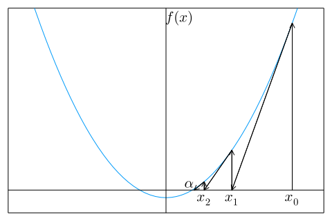

# 第2章　非線形方程式

## 2.1 非線形方程式

### 2.1.1 線形方程式と非線形方程式

$x$ についての方程式

$$
f \left( x \right) = 0 \tag{2.1}
$$

において、　$f(x)$ が1次式 $f(x) = ax + b (a \neq 0)$ ならば、 $(2.1)$ を1次方程式または線形方程式という。
$f(x)$ が1次式でないとき、 $(2.1)$ を非線形方程式という。
線形方程式の解は $x = −b/a$ であり、とくにここでは取り上げる必要はなかろう。
非線形方程式のうちで、とくに $f(x)$ が $n$ 次多項式のとき、 $(2.1)$ を $n$ 次代数方程式という。
1次代数方程式は線形方程式であるが、$n > 1$ のときは非線形方程式である。
無限次代数方程式 $(n = \infty)$ とみなされる非線形方程式は、超越方程式という。

たとえば、$\sin x$ は無限べき級数

$$
\sin x = x - \frac{x^3}{3!} + \frac{x^5}{5!} - \cdots 
+ {(-1)}^n \frac{x^{2n+1}}{(2n+1)!} + \cdots
$$

で表されるから

$$
x − \sin x = 0
$$

は超越方程式である。

この章では、非線形方程式の数値解法について述べる。
次の2.2節では、非線形方程式の実数解を求める数値解法を述べよう。
2.3節では、代数方程式の複素解を求める数値解法について述べよう。

## 2.2 ニュートン法

### 2.2.1 ニュートン法の公式

$f(x)$ を $x$ の関数とするとき、$f(x) = 0$ の解 $\alpha$ を求めるためのニュ－トン法は、
初期値 $x^{(0)}$ をあたえて、順に $x^{(1)}, x^{(2)}, x^{(3)}, ...$ を

$$
\text{ニュートンの公式} \\
x^{(k+1)} = x^{(k)} - \frac{f \left( x^{(k)} \right) }{f' \left( x^{(k)} \right) }
\tag{2.2}
$$

によって求め、次第に解 $\alpha$ に収束させる方法である。
$x^{(k+1)}$ が $x^{(k)}$ にほとんど等しくなったとき、$x^{(k+1)}$ を解 $\alpha$ の近似値として、反復を停止する。

  
図 2.1: ニュートン法

この公式は $x^{(k)}$ が $x^{(k+1)}$ の近くにあり、かつ、$x^{(k+1)}$ が解 $\alpha$ の近くにある、すなわち

$ \left| x^{(k+1)} − x^{(k)} \right| \ll 1$　かつ　$f \left( x^{(k+1)} \right) \simeq f(\alpha) = 0$

として、

$$
f(x^{(k)}) + (x^{(k+1)} − x^{(k)})f'(x^{(k)}) + \cdots \simeq  0
$$

を $x^{(k+1)}$ について解いて得られる。
$(2.2)$ のグラフ (図 2.1) の上での意味は、 $k = 0, 1, 2, \cdots$ の順に、点 $(x^{(k)}, f(x^{(k)}))$ における $y = f(x)$ の接線と $x$ 軸との交点の $x$座標を求めることになっている。
このことは、この接線の勾配は

$$
f'(x^{(k)}) = \frac{f(x^{(k)})}{x^{(k)} − x^{(k+1)}}
$$

であることからもわかる。
<!-- ニュ－トン法の手順を表す PAD を図 2.2 に示す。 -->

### 2.2.2 ニュートン法の収束性

解の近傍での収束性は、誤差

$$
\varepsilon_k = x^{(k)} - \alpha \tag{2.3}
$$

が小さくなっていく様子を調べればわかる。
$f(x^{(k)})$ と $f'(x^{(k)})$ を $x^{(k)} = \alpha$ のまわりにテ－ラ－展開して

$$
f(x^{(k)}) = f(\alpha) + \frac{1}{1!} \varepsilon_k f'(\alpha) + \frac{1}{2!} \varepsilon_k^2 f''(\alpha) + \cdots \tag{2.4}
$$
$$
f'(x^{(k)}) = f'(\alpha) + \frac{1}{1!} \varepsilon_k f''(\alpha) + \frac{1}{2!} \varepsilon_k^2 f'''(\alpha) + \cdots \tag{2.5}
$$

とし、これを $(2.2)$ に代入すれば

$$
\varepsilon_{k + 1} = \frac{f''(\alpha)}{2f'(\alpha)} \varepsilon_k^2 + \cdots \tag{2.6}
$$

を得る。
$k + 1$ 回目の誤差 $\varepsilon_{k + 1}$ が $k$ 回目の誤差 $\varepsilon_k$ の2乗に比例することを2次収束 (または2乗収束) という。
すなわち、ニュ－トン法は2次収束する。

ただし、2次収束は、$f'(\alpha) \neq 0$ の場合、すなわち $\alpha$ が単根の場合である。
一般に $m$ 重解の場合は、$f'(\alpha) = f''(\alpha) = \cdots = f^{(m−1)}(\alpha) = 0$ である (何故か) から、

$$
f(x^{(k)}) = \frac{1}{m!} \varepsilon_k^m f^{(m)}(\alpha) + \frac{1}{(m+1)!} \varepsilon_k^{m+1} f^{(m+1)}(\alpha) + \cdots \tag{2.7}
$$
$$
f'(x^{(k)}) = \frac{1}{(m-1)!} \varepsilon_k^{m-1} f^{(m)}(\alpha) + \frac{1}{m!} \varepsilon_k^m f^{(m+1)}(\alpha) + \cdots \tag{2.8}
$$

を $(2.2)$ に代入して、

$$
\varepsilon_{k + 1} = \frac{m-1}{m} \varepsilon_k + \frac{f^{(m+1)}(\alpha) / f^{(m)}(\alpha)}{m^2 (m+1)} \varepsilon_k^2 \tag{2.9}
$$

であり、$\varepsilon_{k + 1}$ は $\varepsilon_k$ に比例するから1次収束である。

#### ［例 2.1］

$a > 0$ の平方根は $f(x) = x^2 − a = 0$ の解である。
故にニュ－トン法の公式 $(2.2)$ は、$f'(x) = 2x$ であるから、

$$
x^{(k+1)} = x^{(k)} − \frac{x^{(k)2} − a}{2x^{(k)}} 
= \frac{1}{2} \left( x^{(k)} + \frac{a}{x^{(k)}} \right)
\tag{2.10}
$$

初期値を $x^{(0)} = (a + 1)/2$ とすれば、

$$
x^{(0)} > x^{(1)} > x^{(2)} > · · · > \sqrt{a}
$$

であることが証明できる (読者自ら証明して見よ。また \[例 2.4\] 参照)。
いま $a = 2$ として、実際に有効数字10桁の精度で $\sqrt{2}$ を求めてみると、

$$
\begin{aligned}
x^{(0)} &= 1.\underline{5} &\varepsilon_0 = x^{(0)} − \sqrt{2} = 0.0\underline{85786438}\\
x^{(1)} &= 1.41\underline{6666667} &\varepsilon_1 = x^{(1)} − \sqrt{2} = 0.00\underline{2453105}\\
x^{(2)} &= 1.41421\underline{5687} &\varepsilon_2 = x^{(2)} − \sqrt{2} = 0.00000\underline{2125}\\
x^{(3)} &= 1.41421356\underline{3} &\varepsilon_3 = x^{(3)} − \sqrt{2} = 0.00000000\underline{1}\\
x^{(4)} &= 1.414213562 &\varepsilon_4 = x^{(4)} − \sqrt{2} = 0.000000000\\
\end{aligned}
$$

が得られ、たった4回で収束する。
収束の仕方は2次収束であることが確かめられる。

***

#### 例題 2.1
ニュ－トン法 $(2.2)$ は、単根に対しては2次収束するが、2重根以上の多重解に対しては、1 次収束をする。
$(2.2)$ の代わりに

$$
x^{(k+1)} = x^{(k)} − m \frac{f(x^{(k)})}{f'(x^{(k)})} \tag{2.11}
$$

を用いれば $m$ 重解に対して2次収束することを証明せよ。

***

#### ［解］
$(2.7)$ と $(2.8)$ を $(2.11)$ に代入すれば

$$
\varepsilon_{k+1} = \frac{f^{(m+1)}(\alpha)}{f^{(m)}(\alpha)} \varepsilon_k^2 + \cdots \tag{2.12}
$$

が得られる。
$\varepsilon_k$ の最低次の項は $\varepsilon_k^2$ であるから2次収束する。

***

#### ［例 2.2］
$(x − 1)^2 x = 0$ を $x = 1.3$ を初期値として、 $(2.2)$ と $(2.11)$ の2つの方法で解き、収束性を調べよう。
$(2.2)$ を用いたときは、有効数字11桁収束する $(\varepsilon_k < 10^{−10})$ には、32回の反復が必要であった。
以下の結果の数値から誤差は各回ごとに半分になっていることがわかる。
すなわち $\varepsilon_{k+1} \simeq [(m − 1)/m] \varepsilon_k = 0.5 \varepsilon_k$ 。

$$
\begin{aligned}
x^{(0) } &= 1.\underline{3} & ~ & ~ & ~ & \\
x^{(1) } &= 1.\underline{1655172413} & x^{(11)} &= 1.000\underline{1871253} & x^{(21)} &= 1.000000\underline{1827} \\
x^{(2) } &= 1.0\underline{882453800} & x^{(12)} &= 1.0000\underline{935714} & x^{(22)} &= 1.0000000\underline{913} \\
x^{(3) } &= 1.0\underline{458419294} & x^{(13)} &= 1.0000\underline{467879} & x^{(23)} &= 1.0000000\underline{456} \\
x^{(4) } &= 1.0\underline{234125336} & x^{(14)} &= 1.0000\underline{233944} & x^{(24)} &= 1.0000000\underline{228} \\
x^{(5) } &= 1.0\underline{118386542} & x^{(15)} &= 1.0000\underline{116973} & x^{(25)} &= 1.0000000\underline{114} \\
x^{(6) } &= 1.00\underline{59537541} & x^{(16)} &= 1.00000\underline{58487} & x^{(26)} &= 1.00000000\underline{57} \\
x^{(7) } &= 1.00\underline{29856604} & x^{(17)} &= 1.00000\underline{29243} & x^{(27)} &= 1.00000000\underline{28} \\
x^{(8) } &= 1.00\underline{14950488} & x^{(18)} &= 1.00000\underline{14621} & x^{(28)} &= 1.00000000\underline{14} \\
x^{(9) } &= 1.000\underline{7480819} & x^{(19)} &= 1.000000\underline{7310} & x^{(29)} &= 1.000000000\underline{7} \\
x^{(10)} &= 1.000\underline{3741807} & x^{(20)} &= 1.000000\underline{3655} & x^{(30)} &= 1.000000000\underline{3} \\
& ~ & & & x^{(31)} &= 1.000000000\underline{1} \\
& ~ & & & x^{(32)} &= 1.0000000000
\end{aligned}
$$

一方、$m = 2$ として $(2.11)$ を用いたときは、以下の結果のように4回で収束す
る。
この収束は2次収束である。

$$
\begin{aligned}
x^{(0)} &= 1.\underline{3} & & \\
x^{(1)} &= 1.0\underline{310344828} & x^{(3)} &= 1.000000\underline{1058} \\
x^{(2)} &= 1.000\underline{4601488} & x^{(4)} &= 1.0000000000 \\
\end{aligned}
$$

このように $(2.11)$ は重解に対しては、非常に強力である。
ただし、求める解が何重解か、 $m$ がわかっている必要がある。
( $m$ の推定法については 問題 2-3 参照)
